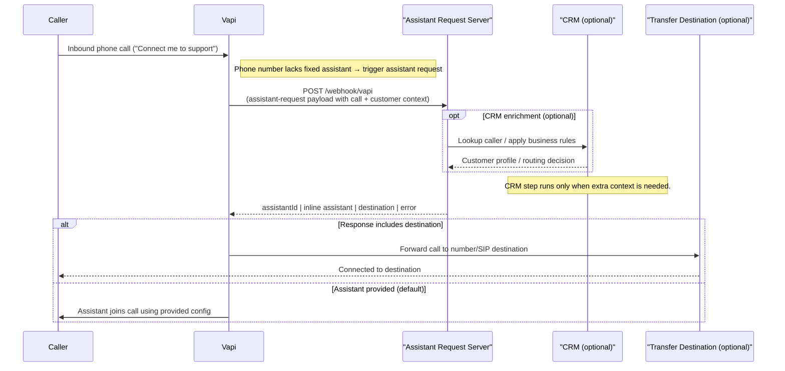

The Assistant Request webhook lets you decide which assistant (or transfer destination) should handle an inbound phone call at runtime. When a phone number or org has a **Server URL** configured, Vapi pauses the call setup, POSTs an `assistant-request` message to your server, and expects you to reply with the assistant configuration to use.

## Prerequisites

1. A phone number imported into your [Vapi Dashboard](https://dashboard.vapi.ai).
2. A publicly reachable HTTPS endpoint (ngrok, Cloudflare tunnel, etc.).
3. Optional: a shared secret or webhook credential to authenticate requests.

## Step 1: Configure the Number

1. Open **Phone Numbers** → select your number.
2. Clear the **Assistant** field (so Vapi relies on the webhook).
3. Under **Server URL**, enter your tunnel URL (e.g., `https://example.ngrok-free.app/webhook/vapi`).
4. Set a **Server Secret** or attach a **Custom Credential** for request verification.
5. Save.

> **Note:** If you leave the phone number’s Server URL blank, Vapi automatically falls back to the org-level server settings (`org.server.url`, secret, headers, etc.). Assistant requests still fire as long as either the number or the org has a Server URL configured.

## Step 2: Build a Webhook Endpoint

Any framework works; here’s a minimal Express server that logs the request and always replies with an existing assistant ID.

```javascript
import express from 'express';

const ASSISTANT_ID = 'your-assistant-id';
const SECRET = process.env.VAPI_SERVER_SECRET ?? 'my-secret';

const app = express();
app.use(express.json({ limit: '1mb' }));

app.post('/webhook/vapi', (req, res) => {
  if (SECRET && req.headers['vapi-secret'] !== SECRET) {
    return res.status(401).json({ error: 'Unauthorized' });
  }

  console.log('Assistant request:', JSON.stringify(req.body, null, 2));
  res.json({ assistantId: ASSISTANT_ID });
});

app.listen(8000, () =>
  console.log('Listening on http://localhost:8000/webhook/vapi'),
);
```

## Step 3: Understand the Request Payload

The POST body always contains a `message` object whose `type` is `assistant-request`. Vapi includes call, phone number, and customer context so you can make routing decisions.

```524:533:libs/core/src/types/message.types.ts
export class AssistantRequestMessage extends OutboundMessageBase {
  @IsIn(['assistant-request'])
  type: 'assistant-request';
}
```

Sample payload (truncated for brevity):

```json
{
  "message": {
    "timestamp": 1723595100000,
    "type": "assistant-request",
    "call": { "id": "call_uuid", "orgId": "org_uuid", "transport": {...} },
    "phoneNumber": { "id": "pn_uuid", "number": "+15551234567" },
    "customer": { "number": "+15559871234" }
  }
}
```

## Step 4: Respond With an Assistant

Your JSON response must follow `AssistantRequestMessageResponse`, which extends the `CallAssistant` schema. That means you can return:

- `assistantId`: use a saved assistant.
- `assistant`: inline assistant definition (same structure as POST `/assistant`).
- `squadId` / `squad` or `workflowId` / `workflow`.
- `assistantOverrides`, `squadOverrides`, or `workflowOverrides`.
- `destination`: transfer immediately to a number or SIP URI.
- `error`: reject the call with a spoken message.

```1679:1750:libs/core/src/types/message.types.ts
export class AssistantRequestMessageResponse extends IntersectionType(
  OutboundMessageResponseBase,
  CallAssistant,
) {
  destination?: TransferDestinationSip | TransferDestinationNumber;
  error?: string;
}
```

Example responses:

```json
{ "assistantId": "2ccabf54-ccd8-4dff-ae93-e830159c8004" }
```

```json
{
  "assistant": {
    "name": "Dynamic Intake",
    "model": { "provider": "openai", "model": "gpt-4o-mini" },
    "voice": { "provider": "11labs", "voiceId": "..." }
  },
  "assistantOverrides": {
    "variables": { "accountId": "12345" }
  }
}
```

```json
{ "destination": { "type": "number", "number": "+15551230000" } }
```

```json
{ "error": "All agents are busy. Please try again later." }
```

## Assistant Request Flow

The diagram below shows the synchronous decision tree: Vapi pauses the call, invokes your Assistant Request Server (ARS), optionally enriches context via CRM, and either transfers the call or resumes it with the returned assistant.



## Testing the Flow

1. Start your webhook server.
2. Ensure its public URL is reachable by Vapi (through your tunnel, reverse proxy, or production host).
3. Place a call to the configured Vapi number.
4. Monitor your server logs to verify the assistant-request payload arrives.
5. Confirm the call proceeds according to the assistant or destination you returned.

## Troubleshooting & Tips

- **Timeouts:** The assistant request times out after ~5 s (`DEFAULT_TIMEOUT_SECOND_ASSISTANT_REQUEST`). Keep logic fast or cache lookups.
- **Missing server URL:** Calls end immediately with `call-start-error-neither-assistant-nor-server-set`.
- **Invalid response:** Vapi records ended reasons such as `assistant-request-returned-error` or `assistant-request-returned-no-assistant`. Check the call log and your server logs.
- **Authentication failures:** Ensure the secret/credential in the phone number matches what you validate in the webhook.
- **Debugging:** Use the ngrok inspector (`http://127.0.0.1:4040`) to inspect payloads, or log the entire request as shown above.

By handling the assistant request webhook, you can dynamically route every inbound interaction—pick the right assistant per customer, run A/B tests, or short-circuit calls to human teams when necessary.