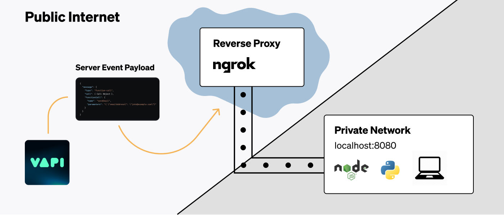
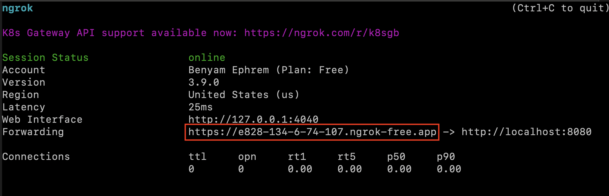
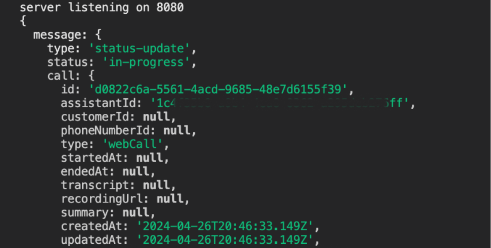

<Frame caption="Routing server URL payloads to a public reverse proxy, which tunnels to our local development server.">
  
</Frame>

## Quick solution: Vapi CLI

The easiest way to test webhooks locally is with the Vapi CLI:

```bash
# Install Vapi CLI
curl -sSL https://vapi.ai/install.sh | bash

# Forward webhooks to your local server
vapi listen --forward-to localhost:3000/webhook
```

This eliminates the need for ngrok or other tunneling services. [Learn more about the Vapi CLI →](/cli/webhook-testing)

## Manual setup with ngrok

If you prefer to use ngrok or need more control over the tunneling process, follow the guide below.

## The Problem

When Vapi dispatches events to a server, it must be able to reach the server via the open Internet.

If your API is already live in production, it will be accessible via a publicly known URL. But, during development, your server will often be running locally on your machine.

<Info>
  `localhost` is an alias for the IP address `127.0.0.1`. This address is called the "loopback"
  address and forwards the network request within the machine itself.
</Info>

To receive server events locally, we will need a public address on the Internet that can receive traffic and forward it to our local machine.

## Tunneling Traffic

We will be using a service called [ngrok](https://ngrok.com/) to create a secure tunnel to our local machine. The flow will look like the following:

<Steps>
  <Step title="Start Our API Locally">
    We will start our server locally so it is listening for http traffic. We will take note of the port our server is running on.
  </Step>
  <Step title="Start Ngrok Agent">
    We will use the `ngrok` command to start the [ngrok agent](https://ngrok.com/docs/agent) on our
    machine. This will establish a connection from your local machine to ngrok's servers.
  </Step>
  <Step title="Copy Ngrok Forwarding URL">
    Ngrok will give us a public forwarding URL that can receive traffic. We will use this as a server URL
    during development.
  </Step>
  <Step title="Trigger Call Events">
    We will conduct normal calls on Vapi to trigger events. These events will go to the Ngrok URL & get tunnelled to our local machine.

    We will see the event payloads come through locally & log them in our terminal.

  </Step>
</Steps>

#### Starting Our API Locally

First, ensure that your API is running locally. This could be a Node.js server, a Python server, or any other server that can receive HTTP requests.

Take note of the port that your server is running on. For example, if your server is running on port `8080`, you should be able to access it at `http://localhost:8080` in your browser.

#### Starting Ngrok Agent

Next we will install & run Ngrok agent to establish the forwarding pathway for Internet traffic:

<Steps>
  <Step title="Install Ngrok Agent CLI">
    Install the Ngrok agent by following Ngrok's [quickstart
    guide](https://ngrok.com/docs/getting-started). Once complete, we will have the `ngrok` command
    available in our terminal.
  </Step>
  <Step title="Start Ngrok Agent">
    Run the command `ngrok http 8080`, this will create the tunnel with Ngrok's servers.
    <Note>Replace `8080` with the port your server is running on.</Note>
  </Step>
</Steps>

#### Copy Ngrok Forwarding URL

You will see an output from the Ngrok Agent CLI that looks like the following:

<Frame caption="Terminal after running the 'ngrok' command forwarding to localhost:8080 — the 'Forwarding' URL is what we want.">
  
</Frame>

Copy this public URL that Ngrok provides. This URL will be accessible from the open Internet and will forward traffic to your local machine.

You can now use this as a server URL in the various places you can [set server URLs](/server-url/setting-server-urls) in Vapi.

<Note>
  This URL will change every time that you run the `ngrok` command. If you'd like this URL to be the
  same every Ngrok session, look into [static domains on
  Ngrok](https://ngrok.com/docs/getting-started#step-4-always-use-the-same-domain).
</Note>

#### Trigger Call Events

We will now be able to see call events come through as `POST` requests, & can log payloads to our terminal.

<Frame caption="Logging call events routed to our local environment.">
  
</Frame>

Feel free to follow any of our [quickstart](/quickstart) guides to get started with building assistants & conducting calls.

## Troubleshooting

Here's a list of a few things to recheck if you face issues seeing payloads:

- Ensure that your local server is running on the port you expect
- Ensure that you input the correct port to the `ngrok http {your_port}` command
- Ensure your route handling server URL events is a `POST` endpoint
- Ensure your path on top of the base forwarding url is set correctly (ex: `/callbacks/vapi`)
