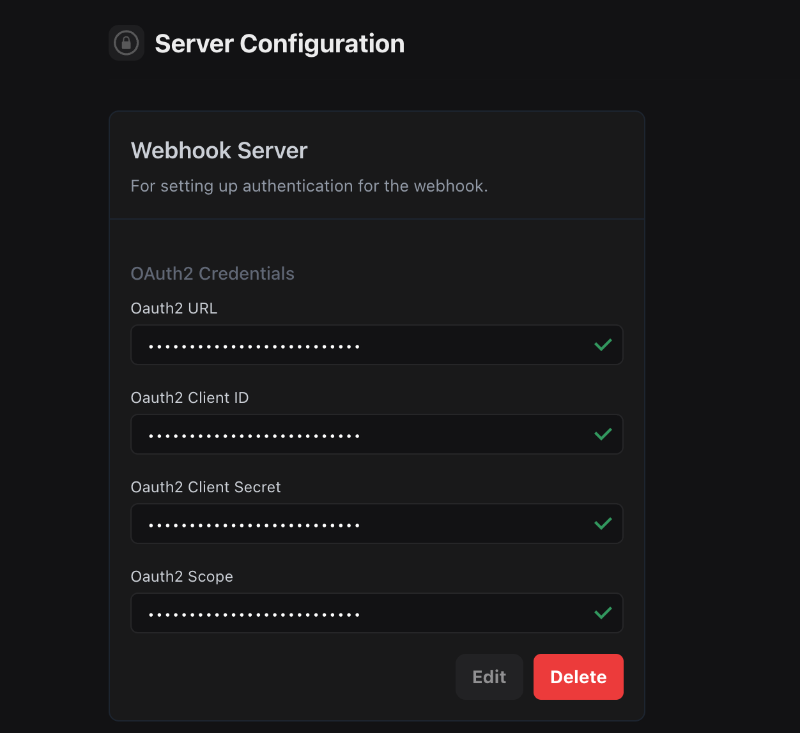

When configuring webhooks for your assistant, you can authenticate your server endpoints using either a secret token, custom headers, or OAuth2. This ensures that only authorized requests from Vapi are processed by your server.

## Credential Configuration

Credentials can be configured at multiple levels:

1. **Tool Call Level**: Create individual credentials for each tool call
2. **Assistant Level**: Set credentials directly in the assistant configuration
3. **Phone Number Level**: Configure credentials for specific phone numbers
4. **Organization Level**: Manage credentials in the [API Keys page](https://dashboard.vapi.ai/keys)

The order of precedence is:
1. Tool call-level credentials
2. Assistant-level credentials
3. Phone number-level credentials
4. Organization-level credentials from the API Keys page

## Authentication Methods

### Secret Token Authentication

The simplest way to authenticate webhook requests is using a secret token. Vapi will include this token in the `X-Vapi-Signature` header of each request.

#### Configuration

```json
{
  "server": {
    "url": "https://your-server.com/webhook",
    "secret": "your-secret-token"
  }
}
```

### Custom Headers Authentication

For more complex authentication scenarios, you can configure custom headers that Vapi will include with each webhook request.

This could include short lived JWTs/API Keys passed along via the Authorization header, or any other header that your server checks for.

#### Configuration

```json
{
  "server": {
    "url": "https://your-server.com/webhook",
    "headers": {
      "Authorization": "Bearer your-api-key",
      "Custom-Header": "custom-value"
    }
  }
}
```

### OAuth2 Authentication

For OAuth2-protected webhook endpoints, you can configure OAuth2 credentials that Vapi will use to obtain and refresh access tokens.

#### Configuration (at the assistant-level)

```json
{
  "server": {
    "url": "https://your-server.com/webhook"
  },
  "credentials": [
    {
      "provider": "webhook",
      "authenticationPlan": {
        "type": "oauth2",
        "url": "https://your-server.com/oauth/token",
        "clientId": "your-client-id",
        "clientSecret": "your-client-secret",
        "scope": "optional, only needed to specify which scopes to request access for"
      }
    }
  ]
}
```

#### Configuration (via our Dashboard)

<Steps>
  <Step title="Visit the API Keys page">
    Go to [https://dashboard.vapi.ai/keys](https://dashboard.vapi.ai/keys) to manage your OAuth2 credentials.
  </Step>
</Steps>

<Frame caption="OAuth2 configuration in the Vapi dashboard">
  
</Frame>

#### OAuth2 Flow

1. Vapi makes a request to your token endpoint with client credentials (Content-Type `application/x-www-form-urlencoded`)
2. Your server validates the credentials and returns an access token
3. Vapi includes the access token in the Authorization header for webhook requests
4. Your server validates the access token before processing the webhook
5. When the token expires, Vapi automatically requests a new one

#### OAuth2 Token Response Format

Your server should return a JSON response with the following format:

```json
{
  "access_token": "eyJhbGciOiJIUzI1NiIsInR5cCI6IkpXVCJ9...",
  "token_type": "Bearer",
  "expires_in": 3600
}
```

Example error response:

```json
{
  "error": "invalid_client",
  "error_description": "Invalid client credentials"
}
```

Common error types:
- `invalid_client`: Invalid client credentials
- `invalid_grant`: Invalid or expired refresh token
- `invalid_scope`: Invalid scope requested
- `unauthorized_client`: Client not authorized for this grant type

<Note> If using the OAuth2 flow for authenticating tool calls, make sure the server for the tool is the URL that should be hit *after* we have completed the token exchange. </Note>