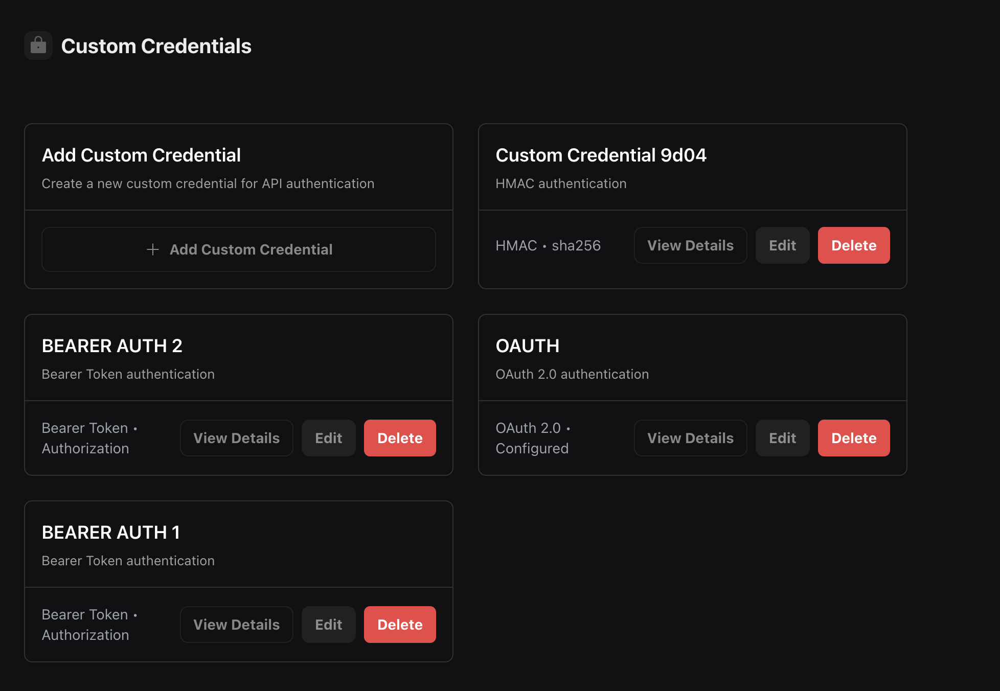
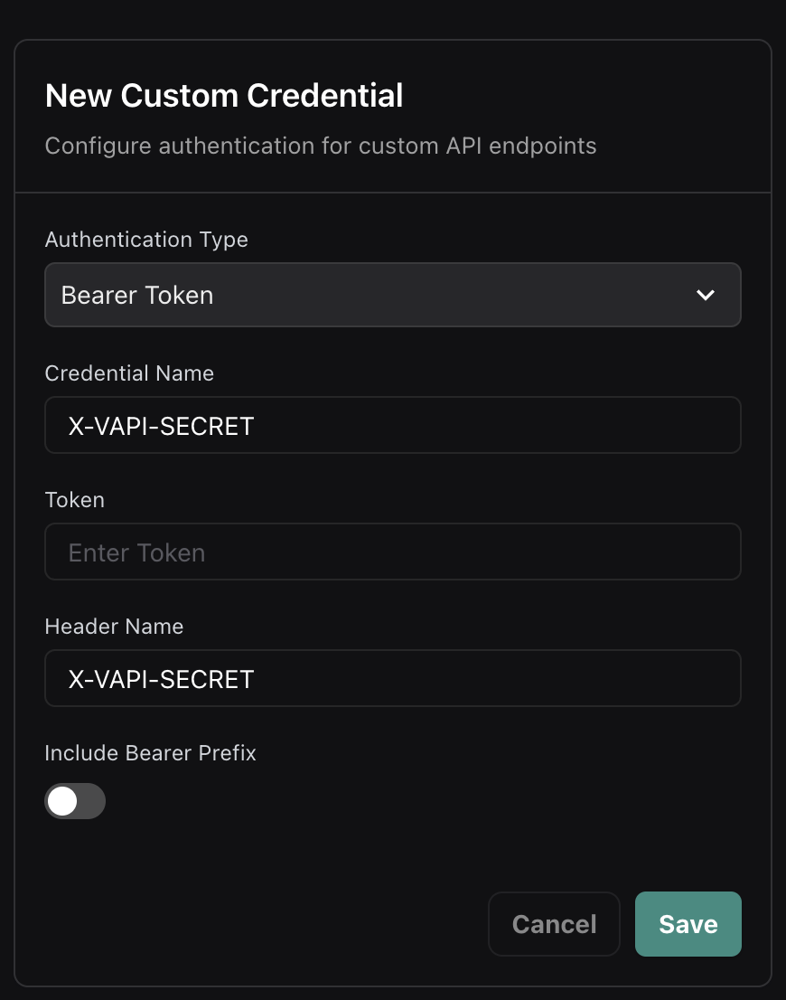
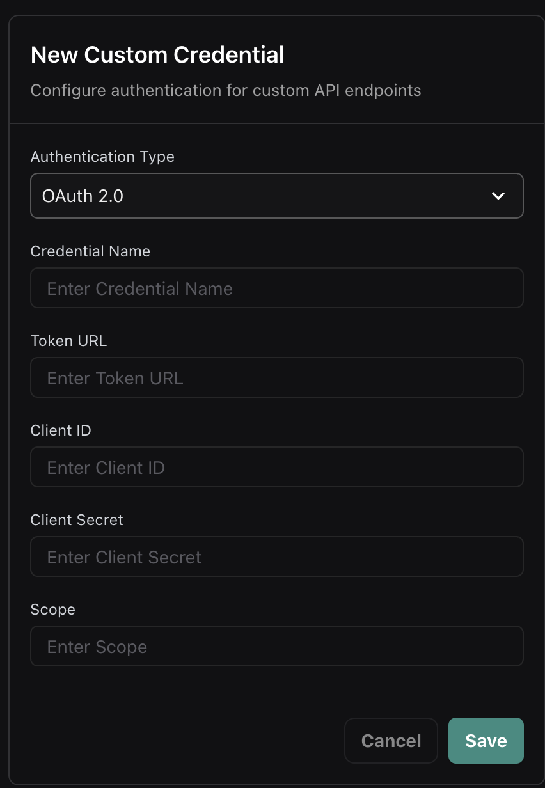
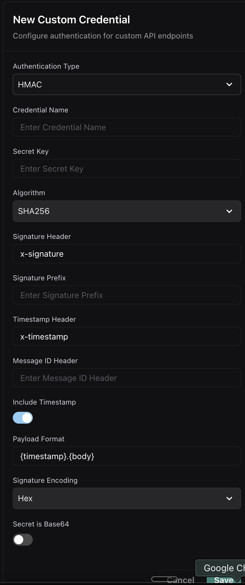
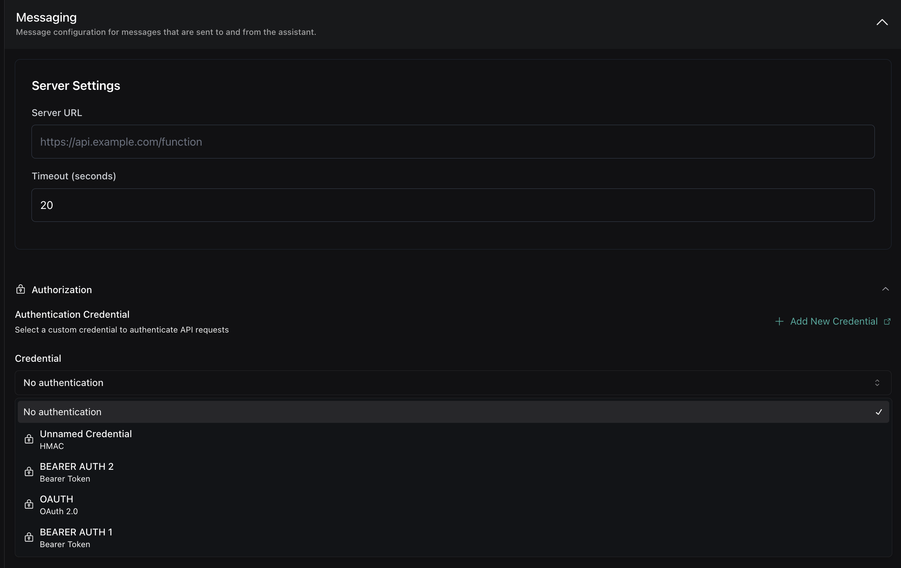
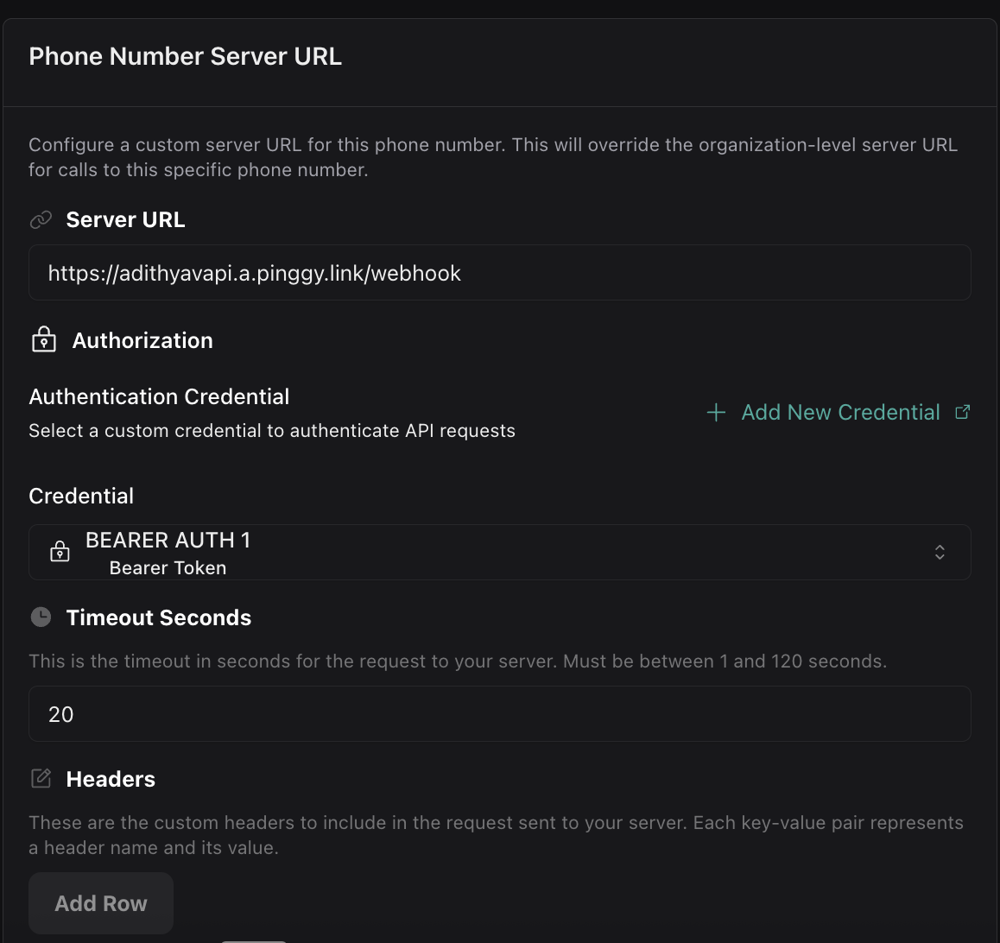
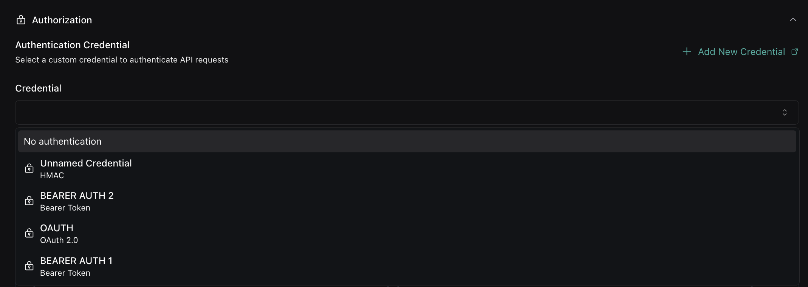

When configuring webhooks for your assistant, you can authenticate your server endpoints by creating **Custom Credentials** and referencing them using a `credentialId`. This approach provides better security, reusability, and centralized management of your authentication credentials.

## Overview

Vapi now uses a **credential-based authentication system** where you:

1. **Create Custom Credentials** through the dashboard
2. **Reference credentials by ID** in your server configurations  
3. **Reuse credentials** across multiple assistants, phone numbers, and tools

This replaces the previous inline authentication approach and provides better security and management capabilities.

## Quick start

<Steps>
  <Step title="Create a Custom Credential">
    In the Vapi dashboard, navigate to Custom Credentials and create a new credential:
    
    - Choose **Bearer Token** for simple API key authentication
    - Enter a descriptive name like "Production API Auth"  
    - Add your API token
    - Save the credential and note the generated ID (e.g., `cred_abc123`)
  </Step>
  
  <Step title="Use the credential in your assistant">
    Reference the credential when configuring server webhooks:
    
    ```json
    {
      "name": "Support Assistant",
      "server": {
        "url": "https://api.yourcompany.com/webhook",
        "credentialId": "cred_abc123"
      },
      "model": {
        "provider": "openai",
        "model": "gpt-4"
      }
    }
    ```
  </Step>
  
  <Step title="Test your webhook">
    Make a test call - Vapi will now authenticate requests to your webhook using the configured credential.
  </Step>
</Steps>

## Creating Custom Credentials

### Dashboard Management

Custom Credentials are managed through the Vapi dashboard. Navigate to your organization settings to create and manage authentication credentials.

<Frame caption="Custom Credentials management dashboard">
  
</Frame>

You can create different types of authentication credentials:

- **Bearer Token**: Simple token-based authentication
- **OAuth 2.0**: OAuth 2.0 client credentials flow
- **HMAC**: HMAC signature-based authentication

## Authentication Types

### Bearer Token Authentication

The most common authentication method using a bearer token in the Authorization header.

<Steps>
  <Step title="Create Bearer Token Credential">
    In the dashboard, select "Bearer Token" as the authentication type and configure:
    
    - **Credential Name**: A descriptive name for the credential
    - **Token**: Your API token or secret
    - **Header Name**: The header to send the token in (default: `Authorization`)
    - **Include Bearer Prefix**: Whether to prefix the token with "Bearer "
  </Step>
  
  <Step title="Use credential in server configuration">
    Reference the credential by its ID in your server configuration:
    
    ```json
    {
      "server": {
        "url": "https://your-server.com/webhook",
        "credentialId": "cred_abc123"
      }
    }
    ```
  </Step>
</Steps>

<Frame caption="Creating a Bearer Token credential">
  
</Frame>

#### Standard Authorization Header

The most common Bearer Token configuration uses the standard `Authorization` header with the Bearer prefix:

<Steps>
  <Step title="Create standard Bearer Token credential">
    Configure a Bearer Token credential with:
    
    - **Header Name**: `Authorization` (default)
    - **Include Bearer Prefix**: Enabled (toggle on)
    - **Token**: Your API token or secret key
  </Step>
  
  <Step title="Use in server configuration">
    Reference this credential in your server setup - Vapi will send your token as `Authorization: Bearer your-token`.
    
    ```json
    {
      "server": {
        "url": "https://api.example.com/webhook",
        "credentialId": "cred_bearer_standard_123"
      }
    }
    ```
  </Step>
  
  <Step title="Handle authentication in your server">
    Your server will receive the standard Authorization header:
    
    ```http
    POST /webhook HTTP/1.1
    Host: api.example.com
    Authorization: Bearer your-api-token-here
    Content-Type: application/json
    ```
  </Step>
</Steps>

This is the recommended approach for modern API authentication and works with most authentication frameworks and libraries.

#### Legacy X-Vapi-Secret Support

For backward compatibility with existing implementations, you can configure a Bearer Token credential to use the `X-Vapi-Secret` header (matching the previous inline `secret` field behavior):

<Steps>
  <Step title="Create X-Vapi-Secret credential">
    Configure a Bearer Token credential with:
    
    - **Header Name**: `X-Vapi-Secret` (instead of `Authorization`)
    - **Include Bearer Prefix**: Disabled (toggle off)
    - **Token**: Your secret token value
  </Step>
  
  <Step title="Use in server configuration">
    Reference this credential in your server setup - Vapi will send your token in the `X-Vapi-Secret` header exactly like the previous inline behavior.
  </Step>
</Steps>

<Frame caption="X-Vapi-Secret Bearer Token credential configuration">
  
</Frame>

### OAuth 2.0 Authentication

For OAuth 2.0 protected endpoints, configure client credentials flow with automatic token refresh.

<Steps>
  <Step title="Create OAuth 2.0 Credential">
    Select "OAuth 2.0" as the authentication type and configure:
    
    - **Credential Name**: A descriptive name for the credential  
    - **Token URL**: Your OAuth token endpoint
    - **Client ID**: OAuth client identifier
    - **Client Secret**: OAuth client secret
    - **Scope**: Optional scopes to request
  </Step>
  
  <Step title="Reference in server configuration">
    Use the credential ID in your server setup:
    
    ```json
    {
      "server": {
        "url": "https://your-server.com/webhook", 
        "credentialId": "cred_oauth_xyz789"
      }
    }
    ```
  </Step>
</Steps>

<Frame caption="OAuth 2.0 credential configuration">
  
</Frame>

#### OAuth 2.0 Flow

1. Vapi makes a token request to your OAuth endpoint with client credentials
2. Your server validates the credentials and returns an access token
3. Vapi includes the access token in the Authorization header for webhook requests
4. When tokens expire, Vapi automatically requests new ones

#### Token Response Format

Your OAuth server should return:

```json
{
  "access_token": "eyJhbGciOiJIUzI1NiIsInR5cCI6IkpXVCJ9...",
  "token_type": "Bearer", 
  "expires_in": 3600
}
```

### HMAC Authentication

For maximum security, use HMAC signature-based authentication to verify request integrity.

<Steps>
  <Step title="Create HMAC Credential">
    Select "HMAC" as the authentication type and configure:
    
    - **Credential Name**: A descriptive name for the credential
    - **Secret Key**: Your HMAC secret key
    - **Algorithm**: Hash algorithm (SHA256, SHA1, etc.)
    - **Signature Header**: Header name for the signature (e.g., `x-signature`)
    - **Timestamp Header**: Optional timestamp header for replay protection
    - **Payload Format**: How to format the payload for signing
  </Step>
  
  <Step title="Use credential in server configuration">
    Reference the HMAC credential:
    
    ```json
    {
      "server": {
        "url": "https://your-server.com/webhook",
        "credentialId": "cred_hmac_456"
      }
    }
    ```
  </Step>
</Steps>

<Frame caption="HMAC credential configuration">
  
</Frame>

## Using Credentials

### In Assistant Configuration

Reference credentials in your assistant's server configuration:

<CodeBlocks>
```json title="API Request"
{
  "server": {
    "url": "https://api.example.com/webhook",
    "credentialId": "cred_bearer_auth_123"
  }
}
```

```typescript title="TypeScript SDK" 
import { VapiClient } from "@vapi-ai/server-sdk";

const client = new VapiClient({ token: process.env.VAPI_API_KEY });

const assistant = await client.assistants.create({
  server: {
    url: "https://api.example.com/webhook",
    credentialId: "cred_bearer_auth_123"
  },
  // ... other assistant config
});
```

```python title="Python SDK"
from vapi import Vapi

client = Vapi(token=os.getenv("VAPI_API_KEY"))

assistant = client.assistants.create(
    server={
        "url": "https://api.example.com/webhook",
        "credentialId": "cred_bearer_auth_123"
    }
    # ... other assistant config
)
```
</CodeBlocks>

<Frame caption="Credential selection in assistant server configuration">
  
</Frame>

### In Phone Number Configuration

Assign credentials to phone numbers for incoming call authentication:

<CodeBlocks>
```json title="API Request"
{
  "phoneNumber": "+1234567890",
  "server": {
    "url": "https://api.example.com/calls",
    "credentialId": "cred_oauth_456"
  }
}
```

```typescript title="TypeScript SDK"
const phoneNumber = await client.phoneNumbers.create({
  phoneNumber: "+1234567890",
  server: {
    url: "https://api.example.com/calls", 
    credentialId: "cred_oauth_456"
  }
});
```
</CodeBlocks>

<Frame caption="Credential selection in phone number server configuration">
  
</Frame>

### In Tool Configuration  

Secure your function tool endpoints with credentials:

<CodeBlocks>
```json title="API Request"
{
  "type": "function",
  "function": {
    "name": "get_weather",
    "description": "Get current weather",
    "parameters": {
      "type": "object",
      "properties": {
        "location": { "type": "string" }
      }
    }
  },
  "server": {
    "url": "https://api.example.com/weather",
    "credentialId": "cred_hmac_789"
  }
}
```

```typescript title="TypeScript SDK"
const tool = await client.tools.create({
  type: "function",
  function: {
    name: "get_weather",
    description: "Get current weather", 
    parameters: {
      type: "object",
      properties: {
        location: { type: "string" }
      }
    }
  },
  server: {
    url: "https://api.example.com/weather",
    credentialId: "cred_hmac_789" 
  }
});
```
</CodeBlocks>

## Credential Management

### Dashboard Features

The Custom Credentials dashboard provides:

- **Credential Creation**: Create new authentication credentials
- **Credential Editing**: Modify existing credential configurations  
- **Credential Deletion**: Remove unused credentials
- **Usage Tracking**: See where credentials are being used

<Frame caption="Credential selection in server configuration">
  
</Frame>

### Best Practices

<Tip>
**Credential Naming**: Use descriptive names like "Production API Key" or "Staging OAuth" to easily identify credentials.
</Tip>

<Tip>
**Credential Rotation**: Regularly rotate credentials for enhanced security. Update the credential in the dashboard without changing your configurations.
</Tip>

<Warning>
**Credential Security**: Store credential secrets securely. Once created, secrets are encrypted and cannot be viewed in the dashboard.
</Warning>

### Migration from Inline Authentication

If you're currently using inline authentication, migrate to the credential system:

<Steps>
  <Step title="Create equivalent credentials">
    For each inline authentication configuration, create a matching Custom Credential in the dashboard:
    
    - **For `secret` field**: Create a Bearer Token credential with header `X-Vapi-Secret` and no Bearer prefix (see [Legacy X-Vapi-Secret Support](#legacy-x-vapi-secret-support))
    - **For `headers` field**: Create a Bearer Token credential with the appropriate header name
    - **For OAuth configurations**: Create an OAuth 2.0 credential
  </Step>
  
  <Step title="Update configurations">  
    Replace inline authentication with `credentialId` references:
    
    **Before (inline secret):**
    ```json
    {
      "server": {
        "url": "https://api.example.com/webhook",
        "secret": "your-secret-token"
      }
    }
    ```
    
    **After (credential reference):**
    ```json
    {
      "server": {
        "url": "https://api.example.com/webhook", 
        "credentialId": "cred_x_vapi_secret_123"
      }
    }
    ```
    
    Your server will continue receiving the same `X-Vapi-Secret` header with identical behavior.
  </Step>
  
  <Step title="Test and deploy">
    Verify that your webhooks continue working with the new credential system. The authentication behavior should be identical to your previous inline configuration.
  </Step>
</Steps>

## Common Use Cases

### Single Credential for Multiple Resources

Reuse the same credential across different components:

<CodeBlocks>
```json title="Shared Credential Usage"
{
  "assistant": {
    "server": {
      "url": "https://api.yourcompany.com/assistant-webhook",
      "credentialId": "cred_production_api_123"
    }
  },
  "phoneNumber": {
    "server": {
      "url": "https://api.yourcompany.com/call-webhook", 
      "credentialId": "cred_production_api_123"
    }
  },
  "tools": [
    {
      "type": "function",
      "function": {
        "name": "get_user_info"
      },
      "server": {
        "url": "https://api.yourcompany.com/user-info",
        "credentialId": "cred_production_api_123"
      }
    }
  ]
}
```
</CodeBlocks>

### Environment-Specific Credentials

Use different credentials for staging and production:

<CodeBlocks>
```json title="Staging Environment"
{
  "server": {
    "url": "https://staging-api.yourcompany.com/webhook",
    "credentialId": "cred_staging_api_456"
  }
}
```

```json title="Production Environment" 
{
  "server": {
    "url": "https://api.yourcompany.com/webhook",
    "credentialId": "cred_production_api_123"
  }
}
```
</CodeBlocks>

### Service-Specific Credentials

Use different credentials for different services:

<CodeBlocks>
```json title="Multiple Service Credentials"
{
  "assistant": {
    "server": {
      "url": "https://auth.yourcompany.com/webhook",
      "credentialId": "cred_auth_service_789"
    }
  },
  "tools": [
    {
      "type": "function", 
      "function": {
        "name": "payment_processing"
      },
      "server": {
        "url": "https://payments.yourcompany.com/process",
        "credentialId": "cred_payment_service_321"
      }
    },
    {
      "type": "function",
      "function": {
        "name": "user_management"
      },
      "server": {
        "url": "https://users.yourcompany.com/manage", 
        "credentialId": "cred_user_service_654"
      }
    }
  ]
}
```
</CodeBlocks>

## Next steps

Now that you have authentication configured:

- **[Setting server URLs](./setting-server-urls):** Learn where server URLs can be configured
- **[Server events](./events):** Understand what webhook events Vapi sends
- **[Local development](./developing-locally):** Set up local webhook testing