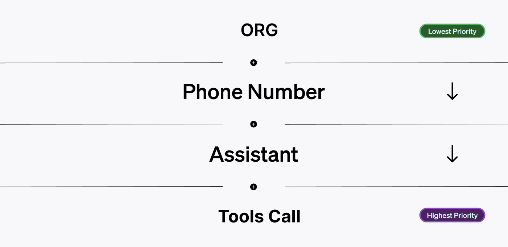
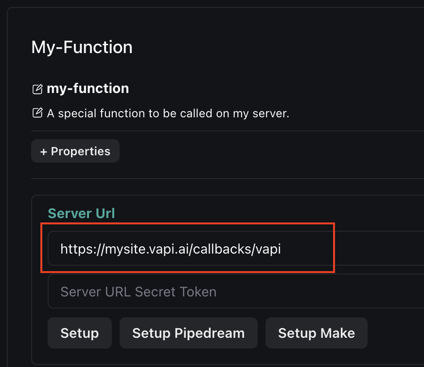

<Frame caption="Server URLs can be set at multiple levels in Vapi.">
  
</Frame>

Server URLs can be set in multiple places in Vapi. Each level has a different priority.

The server URL with the highest priority for a relevant event will be the one that Vapi uses to send the event to.

Server URLs can be set at **4 levels** in Vapi:

- **Account-wide:** you can set a server URL for your broader account
- **Phone Number:** server URLs can be attached to phone numbers themselves
- **Assistant:** assistants can be configured with a server URL
- **Function:** function calls themselves (under an assistant) can have a corresponding server URL

## Setting Server URLs

Here's a breakdown of where you can set server URLs in Vapi:

<AccordionGroup>
  <Accordion title="Organization" icon="table-columns" iconType="solid">
    You can set an organization-wide server URL in the [organization section](https://dashboard.vapi.ai/vapi-api) of your dashboard.

    <Frame caption="Setting your organization-wide server URL.">
      
    </Frame>

    If no other server URL is set, Vapi will use this one.

  </Accordion>
  <Accordion title="Phone Number" icon="phone-volume" iconType="solid">
    Phone numbers can have a server URL attached to them via the [phone number API](/api-reference/phone-numbers).

    The server URL for phone numbers can be set **3 ways**:
    - **At Time of Purchase:** when you [create a number](/api-reference/phone-numbers/create) through Vapi
    - **At Import:** when you [import from Twilio](/api-reference/phone-numbers/import-twilio-number) or [Vonage](/api-reference/phone-numbers/import-vonage-number)
    - **Via Update:** you can [update a number](/api-reference/phone-numbers/update-phone-number) already in your account

    The field `phoneNumber.serverUrl` will contain the server URL for the phone number.

  </Accordion>
  <Accordion title="Assistant" icon="robot" iconType="solid">
    Assistants themselves can have a server URL attached to them.
    
    There are **2 ways** this can be done:

    <AccordionGroup>
      <Accordion title="In the Dashboard" icon="browsers" iconType="solid">
        If you go to the [assistant section](https://dashboard.vapi.ai/assistants) of your dashboard, in the **"Advanced"** tab you will see a setting to set the assistant's server URL:

        <Frame caption="Setting server URL at the assistant level.">
          
        </Frame>
      </Accordion>
      <Accordion title="Via the API" icon="code" iconType="solid">
        At [assistant creation](/api-reference/assistants/create-assistant) (or via an [update](/api-reference/assistants/update-assistant)) you can set the assistant's server URL.

        The server URL for an assistant is stored in the `assistant.serverUrl` field.
      </Accordion>
    </AccordionGroup>

  </Accordion>
  <Accordion title="Function Call" icon="function" iconType="solid">
    The most granular level server URLs can be set is at the function call level. This can also be done either in the dashboard, or via code.

    <AccordionGroup>
      <Accordion title="In the Dashboard" icon="browsers" iconType="solid">
        In the [assistant section](https://dashboard.vapi.ai/assistants) of your dashboard, in the **"Functions"** tab you can add function calls & optionally give each a specific server URL:

        <Frame caption="Setting server URL at the function call level.">
          
        </Frame>
      </Accordion>
      <Accordion title="Via the API" icon="code" iconType="solid">
        The server URL for a function call can be found on an assistant at `assistant.model.functions[].serverUrl`.

        You can either set the URL for a function call at [assistant creation](/api-reference/assistants/create-assistant), or in an [assistant update](/api-reference/assistants/update-assistant).
      </Accordion>
    </AccordionGroup>

  </Accordion>
</AccordionGroup>

## URL Priority

Events are only sent/assigned to 1 server URL in the priority stack. Here's the order of priority:

1. **Function:** if a function call has a server URL, the function call event will be sent to that URL
2. **Assistant:** assistant server URLs are the next highest priority
3. **Phone Number:** if a phone number has a server URL, it will be used over the account-wide URL
4. **Account-wide:** Default / "lowest" importance. It will be used if no other server URL is set.

You will most commonly set a server URL on your account, and/or on specific assistants.
