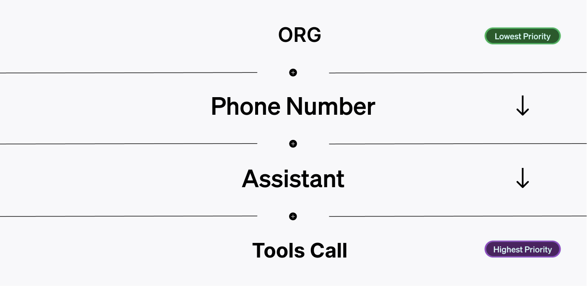
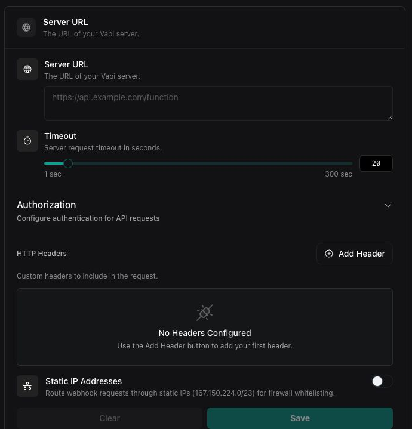
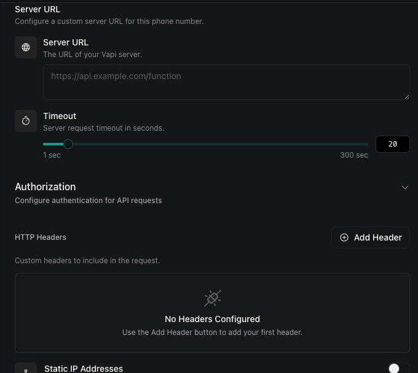
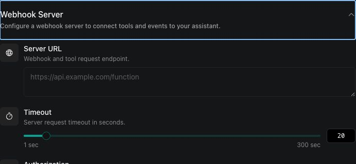
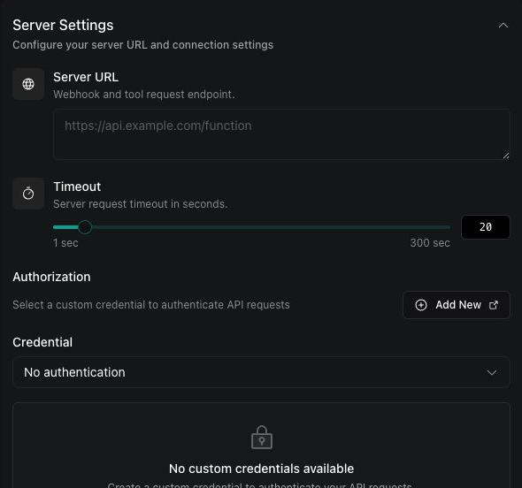

<Frame caption="Server URLs can be set at multiple levels in Vapi.">
  
</Frame>

Server URLs can be set in multiple places in Vapi. Each level has a different priority.

The server URL with the highest priority for a relevant event will be the one that Vapi uses to send the event to.

Server URLs can be set at **4 levels** in Vapi:

- **Account-wide:** you can set a server URL for your broader account
- **Phone Number:** server URLs can be attached to phone numbers themselves
- **Assistant:** assistants can be configured with a server URL
- **Custom Tool:** custom tools can have their own server URL

## Setting Server URLs

Here's a breakdown of where you can set server URLs in Vapi:

<AccordionGroup>
  <Accordion title="Organization" icon="table-columns" iconType="solid">
    If your server requires authentication, create a [custom credential](/server-url/server-authentication) before configuring the server URL.

    <Steps>
      <Step title="Open General Settings">
        Open the [Dashboard](https://dashboard.vapi.ai/settings/organization). Select **General Settings**.
      </Step>
      <Step title="Configure the server URL">
        Enter your endpoint in **Server URL**, then set the request **Timeout**.
      </Step>
      <Step title="Choose a credential">
        Expand **Authorization**, then choose the **Credential** you created. If your server does not require authentication, keep **No authentication** selected.
      </Step>
      <Step title="Add HTTP headers">
        If your server requires additional headers, select **Add Header** under **HTTP Headers**, then enter the required header.
      </Step>
      <Step title="Save the server settings">
        Select **Save**.
      </Step>
    </Steps>

    <Frame caption="Configure an organization-level server URL in General Settings.">
      
    </Frame>

    If no other server URL is set, Vapi will use this one.

  </Accordion>
  <Accordion title="Phone Number" icon="phone-volume" iconType="solid">
    Phone numbers can have a server URL attached to them in the Dashboard or via the [phone number API](/api-reference/phone-numbers).

    <AccordionGroup>
      <Accordion title="In the Dashboard" icon="browsers" iconType="solid">
        If your server requires authentication, create a [custom credential](/server-url/server-authentication) before configuring the server URL.

        <Steps>
          <Step title="Select a phone number">
            Open the [Dashboard](https://dashboard.vapi.ai/phone-numbers). Select **Phone Numbers**, then select the phone number you want to configure.
          </Step>
          <Step title="Configure the server URL">
            Under **Server URL**, enter your endpoint and set the request **Timeout**.
          </Step>
          <Step title="Choose a credential">
            Expand **Authorization**, then choose the **Credential** you created. If your server does not require authentication, keep **No authentication** selected.
          </Step>
          <Step title="Add HTTP headers">
            If your server requires additional headers, select **Add Header** under **HTTP Headers**, then enter the required header.
          </Step>
          <Step title="Save the phone number">
            Select **Save**.
          </Step>
        </Steps>

        <Frame caption="Configure a server URL for a phone number.">
          
        </Frame>
      </Accordion>
      <Accordion title="Via the API" icon="code" iconType="solid">
        The server URL for phone numbers can be set **3 ways**:
        - **At Time of Creation:** when you [create a free number](/api-reference/phone-numbers/create) through Vapi
        - **At Import:** when you [import from Twilio](/api-reference/phone-numbers/import-twilio-number) or create a [Vonage phone number](/api-reference/phone-numbers/create)
        - **Via Update:** you can [update a number](/api-reference/phone-numbers/update-phone-number) already in your account

        The phone number's server configuration includes both the URL and optional authentication:
        - `phoneNumber.server.url`: The webhook endpoint URL
        - `phoneNumber.server.credentialId`: Authentication credential ID (optional)

        <Tip>
        For secured webhooks, create [Custom Credentials](./server-authentication) and reference them using `credentialId`.
        </Tip>
      </Accordion>
    </AccordionGroup>

  </Accordion>
  <Accordion title="Assistant" icon="robot" iconType="solid">
    Assistants themselves can have a server URL attached to them.
    
    There are **2 ways** this can be done:

    <AccordionGroup>
      <Accordion title="In the Dashboard" icon="browsers" iconType="solid">
        If your server requires authentication, create a [custom credential](/server-url/server-authentication) before configuring the server URL.

        <Steps>
          <Step title="Select an assistant">
            Open the [Dashboard](https://dashboard.vapi.ai/assistants). Select **Assistants**, then select the assistant you want to configure.
          </Step>
          <Step title="Open Webhook Server settings">
            Select the **Advanced** tab, then locate **Webhook Server**.
          </Step>
          <Step title="Configure the server URL">
            Enter your endpoint in **Server URL**, then set the request **Timeout**.
          </Step>
          <Step title="Choose a credential">
            Under **Authorization**, choose the **Credential** you created. If your server does not require authentication, keep **No authentication** selected.
          </Step>
          <Step title="Add HTTP headers">
            If your server requires additional headers, select **Add Header** under **HTTP Headers**, then enter the required header.
          </Step>
          <Step title="Publish the assistant">
            Select **publish** in the unsaved-changes message to apply the update.
          </Step>
        </Steps>

        <Frame caption="Setting server URL at the assistant level.">
          
        </Frame>
      </Accordion>
      <Accordion title="Via the API" icon="code" iconType="solid">
        At [assistant creation](/api-reference/assistants/create-assistant) (or via an [update](/api-reference/assistants/update-assistant)) you can set the assistant's server configuration.

        The assistant's server configuration includes:
        - `assistant.server.url`: The webhook endpoint URL
        - `assistant.server.credentialId`: Authentication credential ID (optional)
        
        <Note>
        For secured webhooks, use [Custom Credentials](./server-authentication) with `credentialId` instead of inline authentication.
        </Note>
      </Accordion>
    </AccordionGroup>

  </Accordion>
  <Accordion title="Custom Tool" icon="function" iconType="solid">
    The most granular server URL can be set on a custom tool. This can be done either in the Dashboard or via code.

    <AccordionGroup>
      <Accordion title="In the Dashboard" icon="browsers" iconType="solid">
        If your server requires authentication, create a [custom credential](/server-url/server-authentication) before configuring the server URL.

        <Steps>
          <Step title="Create a custom tool">
            Open the [Dashboard](https://dashboard.vapi.ai/tools). Select **Tools**, select **Create Tool**, then select **Custom Tool**.
          </Step>
          <Step title="Configure the server URL">
            Under **Server Settings**, enter your endpoint in **Server URL**, then set the request **Timeout**.
          </Step>
          <Step title="Choose a credential">
            Under **Authorization**, choose the **Credential** you created. If your server does not require authentication, keep **No authentication** selected.
          </Step>
          <Step title="Add HTTP headers">
            If your server requires additional headers, select **Add Header** under **HTTP Headers**, then enter the required header.
          </Step>
          <Step title="Save the custom tool">
            Select the **Saved** control at the top of the tool editor to save the configuration.
          </Step>
        </Steps>

        <Frame caption="Configure server settings for a custom tool.">
          
        </Frame>
      </Accordion>
      <Accordion title="Via the API" icon="code" iconType="solid">
        Function tools can be configured with server endpoints via the [tools API](/api-reference/tools) or within assistant configurations.

        The server configuration for function tools includes:
        - `tool.server.url`: The function endpoint URL  
        - `tool.server.credentialId`: Authentication credential ID (optional)

        You can configure function tool servers at [tool creation](/api-reference/tools/create), [assistant creation](/api-reference/assistants/create-assistant), or in updates.
        
        <Tip>
        Use [Custom Credentials](./server-authentication) to secure your function endpoints with `credentialId`.
        </Tip>
      </Accordion>
    </AccordionGroup>

  </Accordion>
</AccordionGroup>

## URL Priority

Events are only sent/assigned to 1 server URL in the priority stack. Here's the order of priority:

1. **Custom Tool:** if a custom tool has a server URL, the tool request will be sent to that URL
2. **Assistant:** assistant server URLs are the next highest priority
3. **Phone Number:** if a phone number has a server URL, it will be used over the account-wide URL
4. **Account-wide:** Default / "lowest" importance. It will be used if no other server URL is set.

You will most commonly set a server URL on your account, and/or on specific assistants.
