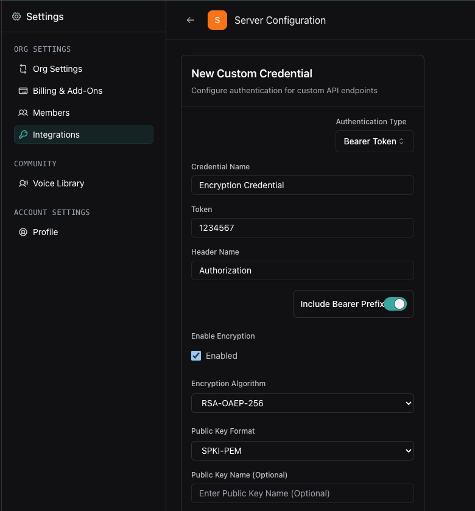
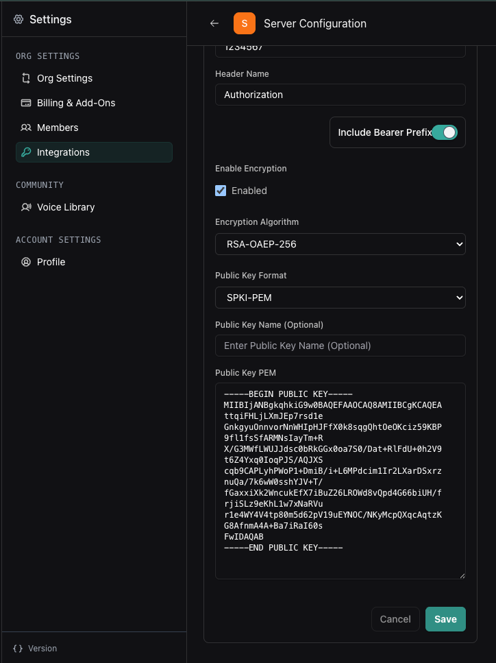
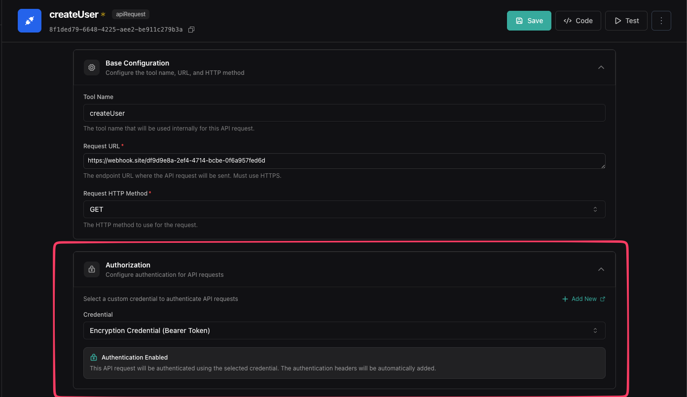
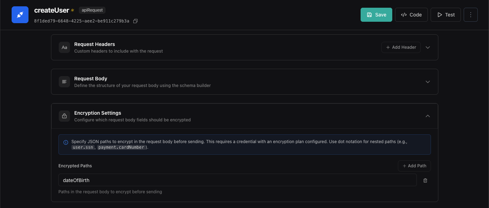

## Overview

Tool argument encryption protects sensitive data like Social Security Numbers, Credit Card Numbers, and other PII by encrypting specific fields before they're sent to your server.

**In this guide, you'll learn to:**
- Create and configure a custom credential with encryption enabled
- Generate RSA public/private key pairs
- Configure tools to encrypt specific argument fields
- Decrypt encrypted data on your server

## Prerequisites

- A Vapi account with access to the dashboard
- OpenSSL or a similar tool for generating RSA keys
- A server endpoint that can receive and decrypt encrypted data

<Steps>
  <Step title="Create a custom credential with encryption">
    Navigate to the custom credentials page and enable encryption settings.

    1. Go to [https://dashboard.vapi.ai/settings/integrations/custom-credential](https://dashboard.vapi.ai/settings/integrations/custom-credential) and click "Add Custom Credential"
    2. Check **Enable Encryption**
    3. Select **RSA-OAEP-256** as the algorithm
    4. Select **SPKI-PEM** as the format

    <Frame caption="Enable encryption in custom credential settings">
      
    </Frame>
  </Step>

  <Step title="Generate RSA key pair">
    Use OpenSSL to generate a public/private key pair in PEM format.

    Run this command in your terminal to generate both keys:

```bash
# Generate a 2048-bit RSA private key
openssl genrsa -out private-key.pem 2048

# Extract the public key in SPKI format
openssl rsa -in private-key.pem -pubout -out public-key.pem
```

    This creates two files:
    - `private-key.pem` - Keep this secure on your server for decryption
    - `public-key.pem` - Copy this to Vapi for encryption

    <Warning>
    Never share or commit your private key. Store it securely in your server's environment variables.
    </Warning>
  </Step>

  <Step title="Add public key to credential">
    Copy and paste your public key into the Vapi dashboard.

    1. Open `public-key.pem` and copy the entire contents
    2. Paste the public key PEM into the **Public Key PEM** field
    3. Click **Save**

    <Frame caption="Paste the public key into the credential">
      
    </Frame>

    Your credential is now ready to use with encrypted tool arguments.
  </Step>

  <Step title="Select a tool to configure">
    Navigate to your tools and choose which tool should use encryption.

    1. Go to the [Tools page](https://dashboard.vapi.ai/tools)
    2. Select an existing **Custom Tool** or **API Request Tool**
    3. Alternatively, create a new tool if needed
  </Step>

  <Step title="Configure credential and encryption settings">
    Link your encryption credential and specify which fields to encrypt.

    1. In the tool settings, find the **Credential** dropdown
    2. Select the credential you created in Step 1
    3. Scroll to **Encryption Settings**
    4. Add the exact JSON paths to the arguments you want encrypted

    **Example JSON paths:**
    - `ssn` - Encrypts the `ssn` field
    - `payment.cardNumber` - Encrypts nested fields

    <Note>
    JSON paths are relative to the tool's argument structure. Only specified fields will be encrypted.
    </Note>

    <Frame caption="Configure credential">
      
    </Frame>

    <Frame caption="Configure encryption settings">
      
    </Frame>
  </Step>

  <Step title="Save and test the configuration">
    Save your tool configuration and verify encryption works with a test call.

    1. Click **Save** to apply your changes
    2. Make a test call using an assistant with this tool
    3. Trigger the tool during the call
    4. Check your server logs to confirm encrypted data arrives

    When your server receives the webhook, encrypted fields will appear as base64-encoded strings:

```json
{
    "fullName": "John Doe",
    "dateOfBirth": "ZCT0EvFkJRHShBd06Ldu7ImHgl7YCuX8l8IF/7xuQSydafVWRR2eCGqTeXK7HyMaXyDc3hHyaTwTKyd0kJH0TCgQEJwviTLSlt7IzH4BIVXIadYcmCUbcSN77R6HoYtGE/De8hEYZ0t+bfuKnDY1IyiQXViI1oE+A2hiscrl4x9Or+n3CUSvxXQ3fJREsCHVN4Y4jbLtQOh0bhlsKLol7GEXBGnOG+oBlXvIzEgyco/peusg7Vzeq42F9odQyZZop9u8+ynwz3DOCm9JBZdOuf7iCKKos0NU+VeWanUHvJ2aJfGPck7qleFWDFsCb+F6QcIcn3fkiKTqoYa44vQ+NA=="
}
```
  </Step>

  <Step title="Decrypt data on your server">
    Use your private key to decrypt the base64-encoded encrypted values.

    Here's how to decrypt the data in your server code:

<CodeBlocks>
```typescript title="TypeScript (Node.js)"
import crypto from 'crypto';
import fs from 'fs';

function decryptToolArgument(encryptedBase64: string): string {
  // Load your private key
  const privateKey = fs.readFileSync('private-key.pem', 'utf8');
  
  // Decode from base64
  const encryptedBuffer = Buffer.from(encryptedBase64, 'base64');
  
  // Decrypt using RSA-OAEP with SHA-256
  const decrypted = crypto.privateDecrypt(
    {
      key: privateKey,
      padding: crypto.constants.RSA_PKCS1_OAEP_PADDING,
      oaepHash: 'sha256',
    },
    encryptedBuffer
  );
  
  return decrypted.toString('utf8');
}

// Example usage
const encryptedDateOfBirth = "ZW5jcnlwdGVkX2RhdGFfaGVyZQ==...";
const decryptedDateOfBirth = decryptToolArgument(encryptedDateOfBirth);
console.log(decryptedDateOfBirth); // Original value
```
```python title="Python"
from cryptography.hazmat.primitives import serialization, hashes
from cryptography.hazmat.primitives.asymmetric import padding
from cryptography.hazmat.backends import default_backend
import base64

def decrypt_tool_argument(encrypted_base64: str) -> str:
    # Load your private key
    with open('private-key.pem', 'rb') as key_file:
        private_key = serialization.load_pem_private_key(
            key_file.read(),
            password=None,
            backend=default_backend()
        )
    
    # Decode from base64
    encrypted_data = base64.b64decode(encrypted_base64)
    
    # Decrypt using RSA-OAEP with SHA-256
    decrypted = private_key.decrypt(
        encrypted_data,
        padding.OAEP(
            mgf=padding.MGF1(algorithm=hashes.SHA256()),
            algorithm=hashes.SHA256(),
            label=None
        )
    )
    
    return decrypted.decode('utf-8')

# Example usage
encrypted_date_of_birth = "ZW5jcnlwdGVkX2RhdGFfaGVyZQ==..."
decrypted_date_of_birth = decrypt_tool_argument(encrypted_date_of_birth)
print(decrypted_date_of_birth)  # Original value
```
</CodeBlocks>

    <Tip>
    Store your private key in environment variables rather than hardcoding the file path. Use `process.env.PRIVATE_KEY` or `os.getenv("PRIVATE_KEY")`.
    </Tip>
  </Step>
</Steps>

## Security best practices

Follow these guidelines to maintain secure encryption:

- **Never commit private keys** - Use environment variables or secret management systems
- **Rotate keys periodically** - Generate new key pairs and update credentials regularly
- **Encrypt selectively** - Only encrypt fields that contain sensitive data to minimize overhead
- **Validate decrypted data** - Always validate and sanitize decrypted values before use
- **Use HTTPS** - Ensure your server endpoint uses HTTPS for transport security

## Next steps

Now that you have tool argument encryption configured:

- **[Custom tools](mdc:fern/tools/custom-tools):** Learn more about creating custom tools
- **[API request tools](mdc:fern/tools/api-request):** Configure API request tools with encrypted arguments
- **[Server URLs](mdc:fern/server-url):** Set up secure server endpoints for receiving encrypted data
