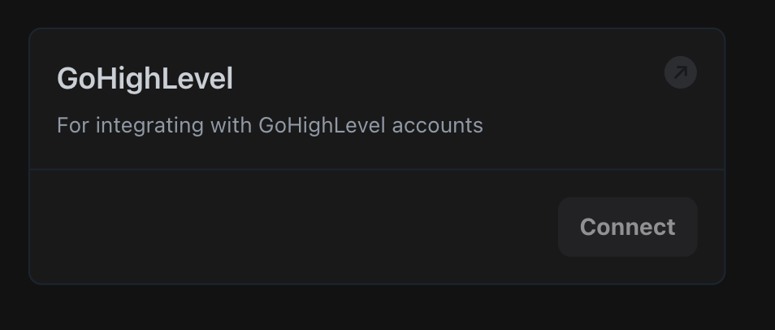
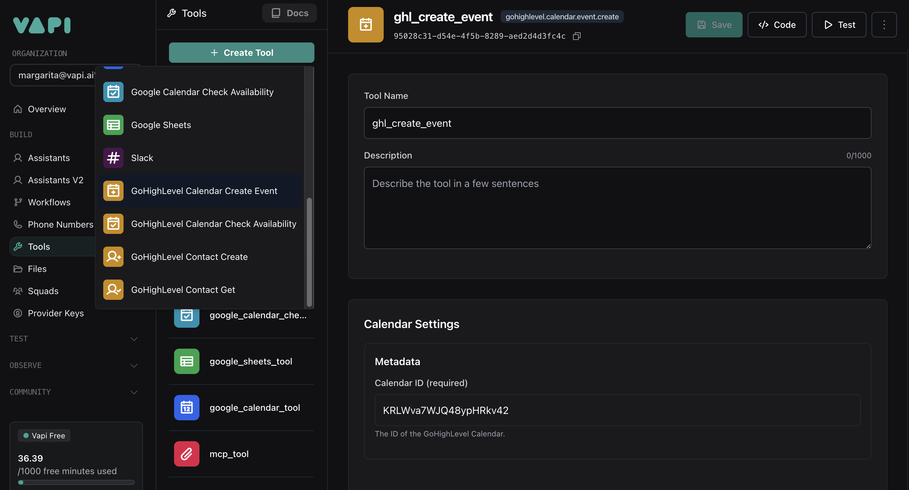
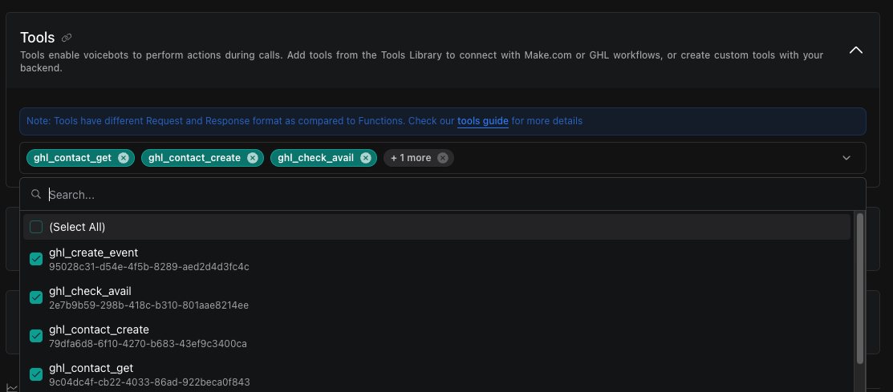

The GoHighLevel integration empowers your Vapi voice agents to directly interact with your clients\' GoHighLevel calendars. Your agents can utilize a suite of tools to manage the appointment lifecycle: check if a contact already exists using the **Get Contact** tool, create new leads or clients with the **Create Contact** tool, query specific GHL calendars for open slots via the **Check Availability** tool, and secure appointments associated with a contact using the **Create Event** tool. This enables your voice agent to handle the entire booking process seamlessly within the GHL calendar that your agency or client already uses.

## Prerequisites

Before you can use the GoHighLevel integration, you need to:

1. Have a GoHighLevel account.
2. Have a calendar in GoHighLevel to which you have permission to create and edit events.
3. Have access to the Vapi Dashboard.

## Setup Steps

### 1. Connect GoHighLevel Account

First, you need to connect your GoHighLevel account to Vapi:

1. Navigate to the Vapi Dashboard.
2. Go to **Providers Keys** > **Tools Provider** > **GoHighLevel**.
3. Click the **Connect** button.
4. A GoHighLevel authorization popup will appear.
5. Follow the prompts to authorize Vapi to access your GoHighLevel account.

<Note>
  The authorization process will request access to your GoHighLevel account to
  manage contacts, calendars, and appointments.
</Note>

<Frame caption="Connect GoHighLevel Account">
  
</Frame>

### 2. Create GoHighLevel Tools

After connecting your GoHighLevel account, create the tools:

1. Go to **Dashboard** > **Tools** page.
2. Click the **Create Tool** button.
3. Select **GoHighLevel** from the available options.
4. Choose which tool(s) you want to create (e.g., Get Contact, Create Contact, Check Availability, Create Event).
5. For each tool, provide a name.
6. For the **Check Availability** and **Create Event** tools, ensure you provide a valid `calendarId`. You can find the `calendarId` for each of your calendars in GoHighLevel by navigating to **Settings** > **Calendars**. Each calendar listed will display its unique ID.

<Note>
  When creating an event in GoHighLevel, a `contactId` is required. Therefore,
  if you plan to use the **Create Event** tool, you **must** also add the **Get
  Contact** and **Create Contact** tools. This allows the assistant to first
  retrieve an existing contact\'s ID or create a new contact, and then use that
  ID to schedule the event.
</Note>

<Frame caption="Create GoHighLevel Tools">
  
</Frame>

### 3. Add Tools to Assistant

Now, add your chosen GoHighLevel tool(s) to your assistant. For an example scenario where you want your assistant to book appointments, including finding a suitable time and managing contact information, you would add all four tools: Get Contact, Create Contact, Check Availability, and Create Event.

1. Navigate to **Dashboard** > **Assistants** page.
2. Select your assistant.
3. Go to the **Tools** tab.
4. In the tools dropdown, select the GoHighLevel tool(s) you want to use.
5. Click **Publish** to save your changes.

<Frame caption="Add GHL Tools to Assistant">
  
</Frame>

### 4. Configure Assistant System Prompt

After adding the GoHighLevel tools to your assistant, it\'s crucial to provide a clear system prompt. This prompt guides the assistant on how and when to use each tool to achieve the desired workflow. For a typical appointment booking scenario, your system prompt instructs the AI on the sequence of operations and conditions for using each tool.

Here\'s an example system prompt to guide your assistant. Remember to replace `ghl_contact_get`, `ghl_contact_create`, `ghl_check_availability`, and `ghl_create_event` with the exact names you gave your tools if they are different.

```text
You are a helpful and efficient scheduling assistant. Your primary goal is to book appointments for users. Follow these steps carefully:

1.  **Gather Information**: Start by asking for the caller\'s full name and email address.
2.  **Check Existing Contact**: Use the `ghl_contact_get` tool to see if a contact already exists with the provided email.
3.  **Create Contact (if needed)**: If no contact is found, use the `ghl_contact_create` tool to create a new contact with their name and email.
4.  **Discuss Appointment Time**: Once you have a contact ID (either from an existing contact or a newly created one), ask the user for their preferred date and time for the appointment.
5.  **Check Availability**: Use the `ghl_check_availability` tool to check for open slots. It\'s a good idea to check for the entire preferred day to offer alternatives if their initial request isn\'t available.
6.  **Confirm Time**: Discuss the available options with the user and agree on a suitable time.
7.  **Book Appointment**: Finally, use the `ghl_create_event` tool to book the appointment, ensuring you use the correct contact ID.

**Important Guidelines:**
*   Always use `ghl_contact_get` to check for an existing contact *before* attempting to create one with `ghl_contact_create`.
*   You *must* have a contact ID (from `ghl_contact_get` or `ghl_contact_create`) *before* you can book an appointment with `ghl_create_event`.
*   Always confirm availability with `ghl_check_availability` *before* attempting to book an appointment with `ghl_create_event`.
```

## Tool Configurations

### GoHighLevel Get Contact Tool

This tool uses both or one of the following fields to retrieve an existing contact:

- `email`: The email address of the contact to search for.
- `phone`: The phone number of the contact to search for.

### GoHighLevel Create Contact Tool

This tool uses the following fields to create a new contact:

- `firstName`: The first name of the contact.
- `lastName`: The last name of the contact.
- `email`: The email address of the contact.
- `phone`: The phone number of the contact.

### GoHighLevel Check Availability Tool

This tool uses the following fields to check for open appointment slots:

- `calendarId`: The ID of the GoHighLevel calendar to check.
- `startDateTime`: The start of the time range to check for availability (epoch time in milliseconds).
- `endDateTime`: The end of the time range to check for availability (epoch time in milliseconds).
- `timezone`: The timezone for the availability check (e.g., "America/New_York").

<Info>
  For the GoHighLevel Check Availability Tool, `startDateTime` and `endDateTime` must be provided in epoch time (milliseconds).
</Info>

### GoHighLevel Create Event Tool

This tool uses the following fields to book an appointment:

- `calendarId`: The ID of the GoHighLevel calendar in which to create the event.
- `contactId`: The ID of the GoHighLevel contact to associate with the event.
- `title`: The title or summary for the calendar event.
- `startDateTime`: The start date and time for the event.
- `endDateTime`: The end date and time for the event.

<Info>
  For the GoHighLevel Create Event Tool, `startDateTime` and `endDateTime` fields should be provided in ISO 8601 format (e.g., `2024-07-31T14:30:00-04:00` or `2024-08-01T10:00:00Z`).
</Info>

## Example Usage

Here's how the tools can be configured in your assistant's JSON setup:

```json
{
  "model": {
    "provider": "openai",
    "model": "gpt-4o",
    "messages": [
      {
        "role": "system",
        "content": "You are a highly efficient scheduling assistant for appointments. Your goal is to seamlessly book appointments into a calendar. Follow this precise workflow:\\n\\n1. **Gather User Info**: Start by politely asking for the caller's full name and email address.\\n2. **Check Existing Contact**: Use the 'getGHLContact' tool to check if a contact already exists with the provided email.\\n3. **Create New Contact (if necessary)**: If no contact is found with the email, use the 'createGHLContact' tool to create a new contact. You will need their name and email for this.\\n4. **Determine Appointment Needs**: Once you have a contact ID (either from an existing or newly created contact), ask the user for their preferred date and time for the appointment, and the purpose of the appointment (e.g., 'dental checkup', 'initial consultation').\\n5. **Check Calendar Availability**: Use the 'checkGHLAvailability' tool to find open slots for the requested period. Check a broad enough range (e.g., the entire day) to offer alternatives if the exact preferred time is unavailable.\\n6. **Confirm Time with User**: Discuss the available options and confirm a suitable appointment time with the user.\\n7. **Book the Appointment**: Use the 'createGHLEvent' tool to schedule the appointment. Use the purpose of the appointment as the event title.\\n\\n**Critical Notes:**\\n- Always use 'getGHLContact' before 'createGHLContact'.\\n- You MUST have a contactId before calling 'createGHLEvent'.\\n- Always use 'checkGHLAvailability' before 'createGHLEvent'.\\n- Assume all appointments are 30 minutes long unless specified otherwise by the user.\\n- Today's date is {{now}}."
      }
    ],
    "tools": [
      {
        "type": "gohighlevel.calendar.availability.check",
        "function": {
          "name": "checkGHLAvailability",
          "description": "Use this tool to check for available appointment slots in the GoHighLevel calendar. Today's date is {{now}}."
        },
        "metadata": {
          "calendarId": "CALENDAR_ID",
          "timeZone": "America/New_York"
        }
      },
      {
          "type": "gohighlevel.calendar.event.create",
          "function": {
              "name": "ghl_create_event",
              "description": "Use this tool to create a new appointment (event) in the GoHighLevel calendar. Today's date is {{now}}. - All appointments are 30 minutes long unless specified otherwise by the user."
          },
          "metadata": {
              "calendarId": "CALENDAR_ID"
          }
      },
      {
          "type": "gohighlevel.contact.get",
          "function": {
              "name": "getGHLContact",
              "description": "Use this tool to retrieve an existing contact from GoHighLevel using the user's email address. This helps avoid duplicate entries."
          }
      },
      {
          "type": "gohighlevel.contact.create",
          "function": {
              "name": "createGHLContact",
              "description": "Use this tool to create a new contact in GoHighLevel."
          }
      }
  ]
  }
}
```

## Best Practices
1. **Clear Instructions**: Provide clear instructions in your assistant's system message about when to use each calendar tool
2. **Error Handling**: Include fallback responses for cases where either calendar tool fails
3. **Time Zone Awareness**: Always specify the correct timezone for events and availability checks
4. **Event Details**: Ensure all required fields are properly filled when creating events
5. **Availability Flow**: Check availability before attempting to schedule events to avoid conflicts
6. **Contact Prerequisite for Events**: Remember that creating an event in GoHighLevel requires a `contactId`. Ensure your assistant\'s logic always fetches or creates a contact (using the `getGHLContact` and `createGHLContact` tools) before attempting to book an appointment with the `createGHLEvent` tool.

<CardGroup cols={2}>
  <Card
    title="Need Help?"
    icon="question-circle"
    href="https://discord.gg/pUFNcf2WmH"
  >
    Join our Discord community for support with GoHighLevel integration
  </Card>
  <Card
    title="API Reference"
    icon="book"
    href="/api-reference/tools/create"
  >
    View the complete API documentation for tools
  </Card>
</CardGroup>