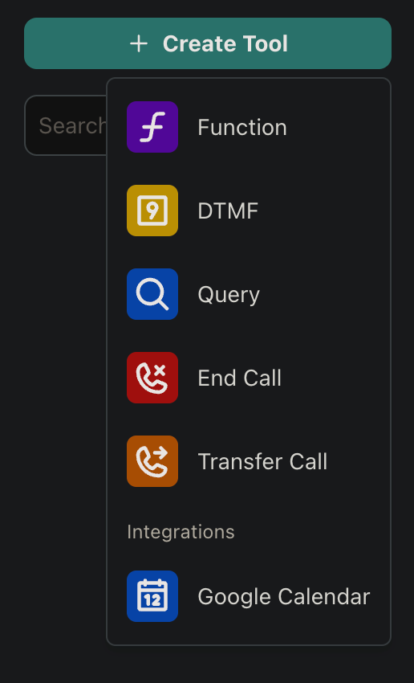
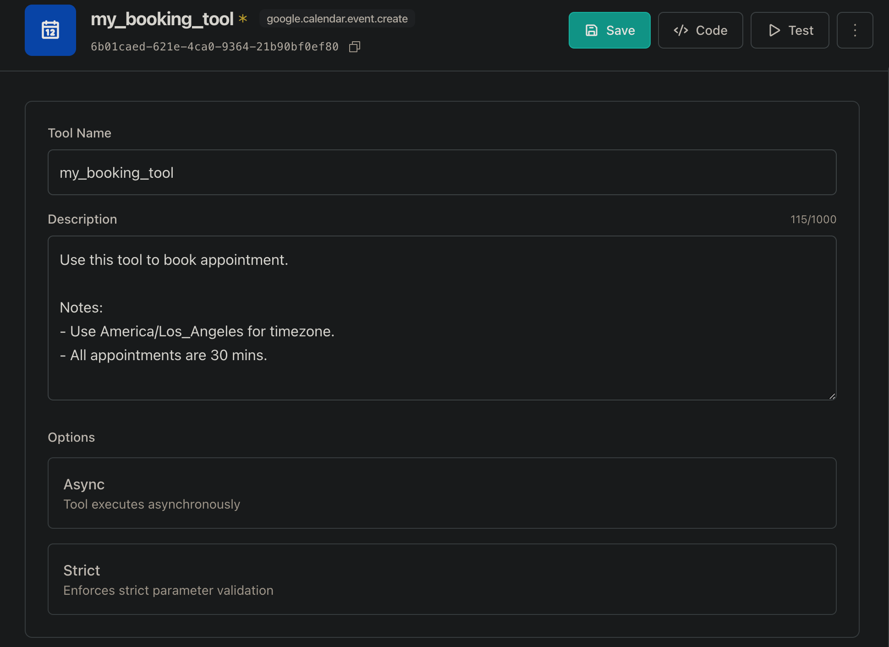

The Google Calendar integration allows your Vapi assistant to create calendar events through voice commands. This enables your assistant to schedule appointments, meetings, and other calendar events directly during phone calls.

## Prerequisites

Before you can use the Google Calendar integration, you need to:
1. Have a Google Calendar account
2. Have access to the Vapi Dashboard
3. Have an assistant created in Vapi

## Setup Steps

### 1. Connect Google Calendar Account

First, you need to connect your Google Calendar account to Vapi:

1. Navigate to the Vapi Dashboard
2. Go to **Providers Keys** > **Tools Provider** > **Google Calendar**
3. Click the **Connect** button
4. A Google authorization popup will appear
5. Follow the prompts to authorize Vapi to access your Google Calendar

<Note>
  The authorization process will request access to your Google Calendar to create and manage events.
</Note>

<Frame caption="Connect Google Calendar">
  
</Frame>

### 2. Create Calendar Tool

After connecting your Google Calendar account, create a new tool:

1. Go to **Dashboard** > **Tools** page
2. Click the **Create Tool** button
3. Select **Google Calendar** from the available options
4. Provide a name for your tool
5. Add a description explaining when this tool should be invoked (e.g., "Use this tool when the user wants to schedule an appointment or create a calendar event")

<Note>
  The description field is crucial as it helps the AI model understand when and how to use the tool. Be specific about the scenarios and conditions when the tool should be invoked.
</Note>

<Frame caption="Create Calendar Tool">
  
  
</Frame>

### 3. Add Tool to Assistant

Now, add the calendar tool to your assistant:

1. Navigate to **Dashboard** > **Assistants** page
2. Select your assistant
3. Go to the **Functions** tab
4. In the tools dropdown, select your newly created calendar tool
5. Click **Publish** to save your changes

<Frame caption="Add Tool to Assistant">
  
</Frame>

## Tool Configuration

The Google Calendar tool uses the following fields to create events:

- `summary`: The title or description of the calendar event
- `startDateTime`: The start date and time of the event
- `endDateTime`: The end date and time of the event
- `timeZone`: The timezone for the event

<Info>
  All datetime fields should be provided in ISO 8601 format.
</Info>

## Example Usage

Here's how the tool can be used in your assistant's configuration:

```json
{
  "model": {
    "provider": "openai",
    "model": "gpt-4o",
    "messages": [
      {
        "role": "system",
        "content": "You are a scheduling assistant. When users want to schedule an appointment, use the Google Calendar tool to create the event."
      }
    ],
    "tools": [
      {
        "type": "google.calendar.event.create",
        "name": "scheduleAppointment",
        "description": "Use this tool to schedule appointments and create calendar events"
      }
    ]
  }
}
```

## Best Practices

1. **Clear Instructions**: Provide clear instructions in your assistant's system message about when to use the calendar tool
2. **Error Handling**: Include fallback responses for cases where the calendar tool fails
3. **Time Zone Awareness**: Always specify the correct timezone for events
4. **Event Details**: Ensure all required fields are properly filled when creating events

<CardGroup cols={2}>
  <Card
    title="Need Help?"
    icon="question-circle"
    href="https://discord.gg/pUFNcf2WmH"
  >
    Join our Discord community for support with Google Calendar integration
  </Card>
  <Card
    title="API Reference"
    icon="book"
    href="/api-reference/tools/create"
  >
    View the complete API documentation for tools
  </Card>
</CardGroup>
