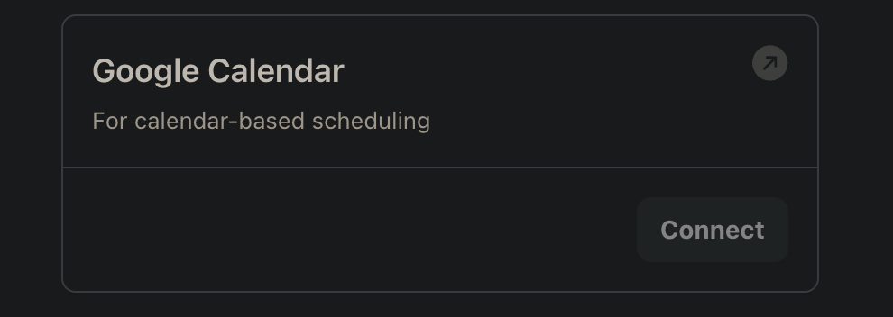
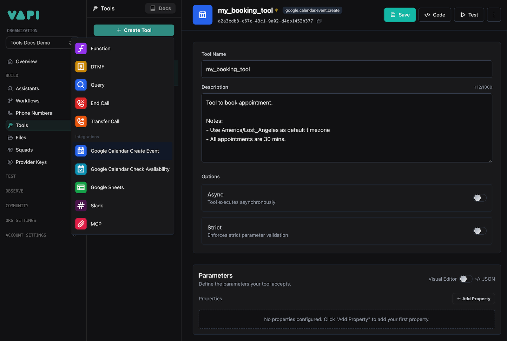
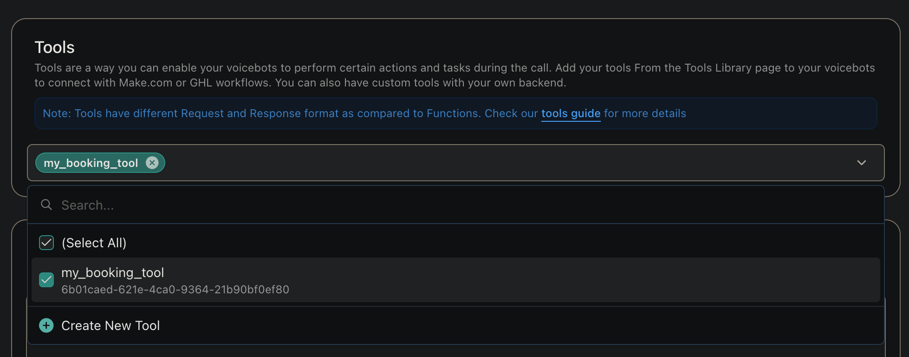

The Google Calendar integration allows your Vapi assistant to interact with Google Calendar in two ways:
1. Create calendar events through voice commands
2. Check calendar availability for scheduling

This enables your assistant to schedule appointments, meetings, and other calendar events directly during phone calls, as well as check when you're available for meetings.

## Prerequisites

Before you can use the Google Calendar integration, you need to:
1. Have a Google Calendar account
2. Have access to the Vapi Dashboard
3. Have an assistant created in Vapi

## Setup Steps

### 1. Connect Google Calendar Account

First, you need to connect your Google Calendar account to Vapi:

1. Navigate to the Vapi Dashboard
2. Go to **Providers Keys** > **Tools Provider** > **Google Calendar**
3. Click the **Connect** button
4. A Google authorization popup will appear
5. Follow the prompts to authorize Vapi to access your Google Calendar

<Note>
  The authorization process will request access to your Google Calendar to create events and check availability.
</Note>

<Frame caption="Connect Google Calendar">
  
</Frame>

### 2. Create Calendar Tools

After connecting your Google Calendar account, create the tools:

1. Go to **Dashboard** > **Tools** page
2. Click the **Create Tool** button
3. Select **Google Calendar** from the available options
4. Choose which tool(s) you want to create:
   - Google Calendar Create Event Tool
   - Google Calendar Check Availability Tool
5. For each tool, provide a name and description explaining when it should be invoked

<Note>
  The description field is crucial as it helps the AI model understand when and how to use each tool. Be specific about the scenarios and conditions when each tool should be invoked.
</Note>

<Frame caption="Create Calendar Tools">
  
</Frame>

### 3. Add Tools to Assistant

Now, add your chosen calendar tool(s) to your assistant:

1. Navigate to **Dashboard** > **Assistants** page
2. Select your assistant
3. Go to the **Tools** tab
4. In the tools dropdown, select the calendar tool(s) you want to use
5. Click **Publish** to save your changes

<Frame caption="Add Tools to Assistant">
  
</Frame>

## Tool Configurations

### Google Calendar Create Event Tool

This tool uses the following fields to create events:

- `summary`: The title or description of the calendar event
- `startDateTime`: The start date and time of the event
- `endDateTime`: The end date and time of the event
- `attendees`: A list of email addresses for people to invite to the event
- `timeZone`: The timezone for the event, defaults to UTC
- `calendarId`: The calendar ID to create the event in, defaults to the primary calendar

### Google Calendar Check Availability Tool

This tool uses the following fields to check availability:

- `startDateTime`: The start of the time range to check
- `endDateTime`: The end of the time range to check
- `timeZone`: The timezone for the availability check, defaults to UTC
- `calendarId`: The calendar ID to check availability in, defaults to the primary calendar

<Info>
  All datetime fields should be provided in ISO 8601 format.
</Info>

## Example Usage

Here's how the tools can be used in your assistant's configuration:

```json
{
  "model": {
    "provider": "openai",
    "model": "gpt-4o",
    "messages": [
      {
        "role": "system",
        "content": "You are a scheduling assistant. When users want to schedule an appointment, first check their availability using the Check Availability tool, then use the Create Event tool to schedule the event if they're available.\n\n- Gather date and time range to check availability.\n- To book an appointment, gather the purpose of the appointment, ex: general checkup, dental cleaning and etc.\n\nNotes\n- Use the purpose as summary for booking appointment.\n- Current date: {{now}}"
      }
    ],
    "tools": [
      {
        "type": "google.calendar.availability.check",
        "name": "checkAvailability",
        "description": "Use this tool to check calendar availability."
      },
      {
        "type": "google.calendar.event.create",
        "name": "scheduleAppointment",
        "description": "Use this tool to schedule appointments and create calendar events. Notes: - All appointments are 30 mins. \n- Current date/time: {{now}}"
      }
    ]
  }
}
```

## Best Practices

1. **Clear Instructions**: Provide clear instructions in your assistant's system message about when to use each calendar tool
2. **Error Handling**: Include fallback responses for cases where either calendar tool fails
3. **Time Zone Awareness**: Always specify the correct timezone for events and availability checks
4. **Event Details**: Ensure all required fields are properly filled when creating events
5. **Availability Flow**: Check availability before attempting to schedule events to avoid conflicts

<CardGroup cols={2}>
  <Card
    title="Need Help?"
    icon="question-circle"
    href="https://discord.gg/pUFNcf2WmH"
  >
    Join our Discord community for support with Google Calendar integration
  </Card>
  <Card
    title="API Reference"
    icon="book"
    href="/api-reference/tools/create"
  >
    View the complete API documentation for tools
  </Card>
</CardGroup>
