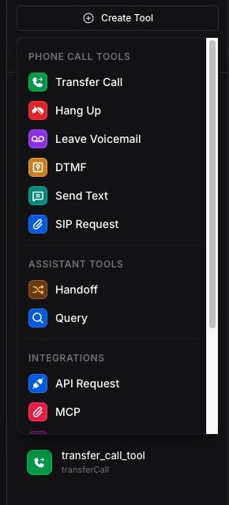
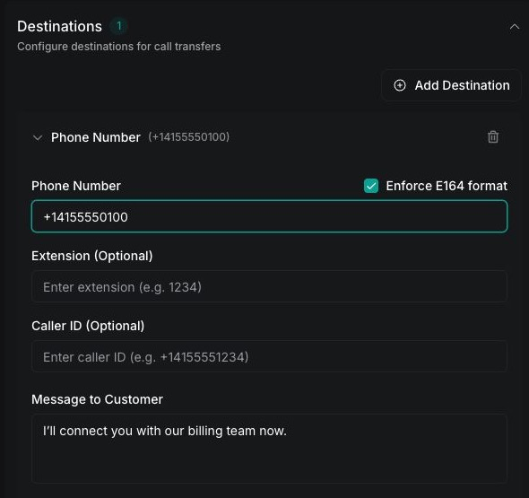
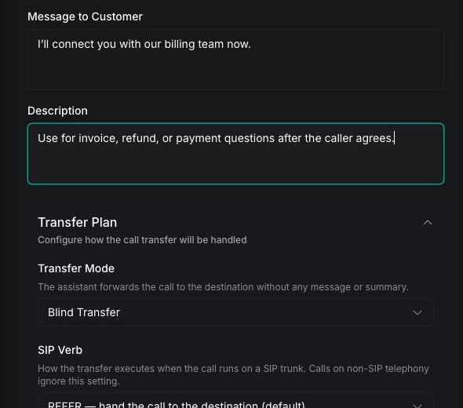
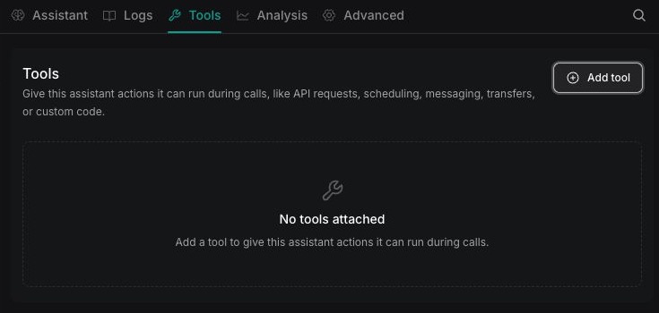

The transfer call tool lets an assistant route an active phone call to a phone number or Session Initiation Protocol (SIP) URI. Use it to connect a caller with a person, department, or external phone system based on the conversation. To move a call between assistants, use the [handoff tool](/squads/handoff) instead; handoff works with standalone assistants and assistants in a Squad.

## Prerequisites

Before you create the tool, prepare:

- A Vapi assistant that handles phone calls
- A reachable destination phone number in E.164 format, for example, `+14155550100`, or a valid SIP URI
- A private Vapi API key for the curl method

## Configure the transfer call tool

Create a reusable transfer call tool, define its destinations, and add it to an assistant.

<Tabs>
  <Tab title="Dashboard">
    <Steps>
      <Step title="Create the tool">
        Open **Tools** in the [Vapi Dashboard](https://dashboard.vapi.ai/tools), click **Create Tool**, and select **Transfer Call**.

        <Frame caption="Select Transfer Call from the Create Tool menu">
          
        </Frame>
      </Step>

      <Step title="Describe when to transfer">
        Under **Tool Settings**, enter a clear **Tool Name** and **Description**. Describe the conditions that should trigger a transfer so the assistant can choose the tool reliably.

        For example:

        ```text title="System prompt"
        Transfer the caller to a billing specialist when they ask about an
        invoice, refund, or payment. Only transfer after the caller agrees.
        ```
      </Step>

      <Step title="Add a destination">
        Under **Destinations**, click **Add Destination**, then select **Phone Number** or **SIP**. Enter the destination and a specific description of when the assistant should use it.

        For a phone number, use E.164 format, including the `+` prefix and country code. If you add multiple destinations, give each one a distinct description so the assistant can route the caller correctly.

        <Frame caption="Configure a phone-number destination">
          
        </Frame>
      </Step>

      <Step title="Configure transfer messages">
        Optionally configure a message for the assistant to say before the transfer. If neither the destination nor the tool defines a message, the assistant says `Transferring the call now` by default. Set the destination message to an empty string for a silent transfer. A message can be at most 1,000 characters.

        Expand **Transfer Plan** to choose how this destination receives the call. Leave **Blind Transfer** selected for an immediate transfer, or follow the mode-specific guides below to configure another behavior.

        <Frame caption="Describe the route and choose its transfer mode">
          
        </Frame>
      </Step>

      <Step title="Add the tool to an assistant">
        Open **Assistants**, select the assistant, and add the new tool from the assistant's **Tools** section. Update the system prompt to state exactly when the assistant should transfer the call, then save the assistant.

        <Frame caption="Open the assistant's Tools tab and click Add tool">
          
        </Frame>
      </Step>
    </Steps>
  </Tab>

  <Tab title="curl">
    <Steps>
      <Step title="Create the tool">
        Send a request to the [Create Tool endpoint](/api-reference/tools/create). Replace `YOUR_API_KEY` with a private Vapi API key and `+14155550100` with the phone number that should receive the call.

        ```bash
        curl --request POST \
          --url https://api.vapi.ai/tool \
          --header 'Authorization: Bearer YOUR_API_KEY' \
          --header 'Content-Type: application/json' \
          --data '{
            "type": "transferCall",
            "destinations": [
              {
                "type": "number",
                "number": "+14155550100",
                "description": "Transfer to billing for invoice, refund, or payment questions"
              }
            ]
          }'
        ```

        The object inside `destinations` sets the transfer target. For a phone number, set `type` to `number` and provide the destination in the `number` field using E.164 format.

        To transfer to a SIP endpoint instead, replace that destination object with:

        ```json
        {
          "type": "sip",
          "sipUri": "sip:support@example.com",
          "description": "Transfer to the support queue for technical issues"
        }
        ```

        You can add more destination objects to the array. Use each destination's `description` to tell the assistant when to select it. To change the default `Transferring the call now` announcement, add `message` to the destination object. Set `message` to an empty string for a silent transfer. The response contains the reusable tool's `id`; save it as `TOOL_ID` for the next request.
      </Step>

      <Step title="Add the tool to an assistant">
        Replace `ASSISTANT_ID` and `TOOL_ID`, then update the assistant with the [Update Assistant endpoint](/api-reference/assistants/update).

        ```bash
        curl --request PATCH \
          --url https://api.vapi.ai/assistant/ASSISTANT_ID \
          --header 'Authorization: Bearer YOUR_API_KEY' \
          --header 'Content-Type: application/json' \
          --data '{
            "model": {
              "provider": "openai",
              "model": "gpt-4o",
              "toolIds": ["EXISTING_TOOL_ID", "TOOL_ID"]
            }
          }'
        ```

        The example uses an OpenAI model. Keep the assistant's current model configuration and include any existing tool IDs in the `toolIds` array. Updating the array replaces its current contents.
      </Step>

      <Step title="Update the assistant prompt">
        In the assistant's system prompt, define when to transfer and require the assistant to invoke the tool in the same response as its spoken acknowledgment.

        ```text
        Transfer the caller to billing only when they ask about an invoice,
        refund, or payment and agree to be transferred. When you decide to
        transfer, acknowledge the request and invoke the transfer call tool in
        the same response.
        ```
      </Step>
    </Steps>
  </Tab>
</Tabs>

## Choose a destination

Use the destination type that matches the system receiving the call.

| Destination | Use it for | Required value |
| --- | --- | --- |
| Phone number | A person, department, or public switched telephone network (PSTN) endpoint | `number` in E.164 format |
| SIP | A SIP trunk, private branch exchange (PBX), or other SIP endpoint | `sipUri` |

For a phone-number destination that uses an extension, set `extension`. Vapi dials the extension after the destination answers.

A destination's `description` tells the assistant when to select it. Keep each description specific to a routing intent, for example, billing, sales, or technical support.

To select or construct a destination at runtime instead of storing it on the tool, follow [Dynamic call transfers](/calls/call-dynamic-transfers).

### Route to multiple destinations

A single transfer call tool can contain multiple phone-number destinations, SIP destinations, or a mix of both. When the assistant invokes the tool, it uses the conversation and each destination's `description` to select one destination; it does not call every destination in the array.

In the Dashboard, click **Add Destination** for each route. Give every destination a distinct description, then add matching routing rules to the assistant's system prompt. For example:

```text title="System prompt"
- Transfer billing questions to the billing phone number.
- Transfer purchase questions to the sales phone number.
- Transfer technical incidents to the support SIP URI.
- If the caller's intent is unclear, ask which team they need before transferring.
```

With the API, add one object for each route to `destinations`. Each object can have its own message and transfer plan. When updating a tool, include every destination that should remain because the new `destinations` array replaces the existing array.

<Note>
To move the conversation to another Vapi assistant, use the [handoff tool](/squads/handoff) instead of a phone or SIP transfer. Handoff works between standalone assistants and between assistants in a Squad, and can carry conversation context into the destination assistant.
</Note>

## Choose a transfer mode

The transfer mode controls what happens on the destination call leg before the customer is connected. The Dashboard displays a readable label; API requests use the corresponding `transferPlan.mode` value.

| Dashboard mode | API value | What it does |
| --- | --- | --- |
| **Blind Transfer** | `blind-transfer` | Connects the customer without speaking to the destination. This is the default. See [Blind transfer](/tools/transfer-call/blind-transfer). |
| **Blind Transfer with Summary in SIP Header** | `blind-transfer-add-summary-to-sip-header` | Adds a generated summary to the `X-Transfer-Summary` SIP header, then transfers immediately. See [Blind transfer](/tools/transfer-call/blind-transfer). |
| **Warm Transfer with Message** | `warm-transfer-say-message` | Speaks a fixed message to the destination before connecting the customer. See [Warm transfer](/tools/transfer-call/warm-transfer). |
| **Warm Transfer with Summary** | `warm-transfer-say-summary` | Speaks a generated conversation summary to the destination before connecting. See [Warm transfer](/tools/transfer-call/warm-transfer). |
| **Warm Transfer with TwiML** | `warm-transfer-twiml` | Executes TwiML on the destination call leg before connecting. See [Warm transfer](/tools/transfer-call/warm-transfer). |
| **Warm Transfer - Wait for Operator, Then Say Message** | `warm-transfer-wait-for-operator-to-speak-first-and-then-say-message` | Waits for destination speech, then delivers a fixed message. See [Warm transfer](/tools/transfer-call/warm-transfer). |
| **Warm Transfer - Wait for Operator, Then Say Summary** | `warm-transfer-wait-for-operator-to-speak-first-and-then-say-summary` | Waits for destination speech, then delivers a generated summary. See [Warm transfer](/tools/transfer-call/warm-transfer). |
| **Warm Transfer - Experimental** | `warm-transfer-experimental` | Places the customer on hold and supports fallback, summaries, custom audio, or a transfer-assistant conversation. See [Assistant-based warm transfer](/calls/assistant-based-warm-transfer). |

Use [Dynamic call transfers](/calls/call-dynamic-transfers) when the destination is selected at runtime. Dynamic destination selection is separate from the transfer mode.

## Verify the transfer

Place a test call and ask for the destination described in the tool. Confirm that the call log contains a `transferCall` tool invocation and that the destination rings or answers.

The `assistant-forwarded-call` ended reason confirms that Vapi initiated the transfer. It does not confirm that the downstream telephony provider completed it, so check the provider's call logs when the destination does not receive the call.

## Troubleshooting

| Symptom | Likely cause | Resolution |
| --- | --- | --- |
| The assistant says it will transfer, but the call remains active | The model generated speech without invoking the tool | Require the acknowledgment and tool invocation in the same response. Check the call log for a `transferCall` invocation. |
| The assistant selects the wrong destination | Destination descriptions overlap or do not state a clear routing intent | Give every destination a distinct description and add matching routing rules to the system prompt. |
| The tool returns a validation or configuration error | The destination is missing or malformed | Confirm that `destinations` is an array and that each item has a valid `type` and required value. Use E.164 format for PSTN phone numbers. |
| The call has `assistant-forwarded-call`, but the destination never rings | Vapi initiated the transfer, but the downstream route did not complete it | Check **Logs → API Logs** for the transfer request and response, then check the provider call detail record and transfer compatibility. For SIP calls, inspect the provider's REFER or dial behavior. |
| The assistant transfers when it should continue helping | The prompt permits broad invocation | Narrow the prompt conditions. For tools configured through the API, you can also add a [tool rejection plan](/tools/tool-rejection-plan). |
| An assistant-to-assistant transfer stalls or behaves like an external call | The transfer call tool is being used for assistant routing | Use the [handoff tool](/squads/handoff) for transfers between standalone assistants or assistants in a Squad. |

For dropped calls, provider diagnostics, and SIP packet checks, follow [Troubleshoot call forwarding drops](/calls/troubleshoot-call-forwarding-drops). The [call ended reasons reference](/calls/call-ended-reason) lists transfer-specific outcomes such as `call.in-progress.error-transfer-failed`.

## API reference

The [Create Tool API reference](/api-reference/tools/create) documents the public transfer call fields, destination types, transfer plans, messages, and rejection settings. The [Update Assistant API reference](/api-reference/assistants/update) documents how to assign reusable tools with `model.toolIds`.

## Related guides

<CardGroup cols={2}>
  <Card title="Blind transfer" icon="fa-light fa-phone" href="/tools/transfer-call/blind-transfer">
    Connect the caller immediately or add a SIP summary header.
  </Card>
  <Card title="Warm transfer" icon="fa-light fa-comments" href="/tools/transfer-call/warm-transfer">
    Introduce the caller with a message, summary, or TwiML.
  </Card>
  <Card title="Dynamic call transfers" icon="fa-light fa-route" href="/calls/call-dynamic-transfers">
    Select a transfer destination at runtime.
  </Card>
  <Card title="Assistant-based warm transfer" icon="fa-light fa-comments" href="/calls/assistant-based-warm-transfer">
    Introduce the caller before connecting the parties.
  </Card>
  <Card title="Handoff tool" icon="fa-light fa-arrow-right-arrow-left" href="/squads/handoff">
    Move the conversation to another assistant or Squad.
  </Card>
  <Card title="Troubleshoot forwarding drops" icon="fa-light fa-phone-slash" href="/calls/troubleshoot-call-forwarding-drops">
    Diagnose provider, SIP, and call-routing failures.
  </Card>
  <Card title="SIP trunking" icon="fa-light fa-network-wired" href="/advanced/sip/sip-trunk">
    Connect Vapi to a SIP provider or PBX.
  </Card>
  <Card title="Server events" icon="fa-light fa-webhook" href="/server-url/events">
    Receive call and transfer lifecycle events.
  </Card>
</CardGroup>
