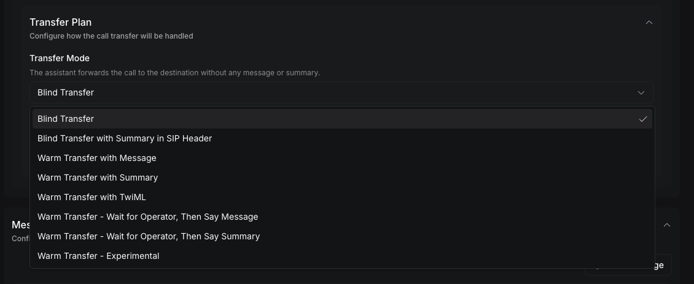

Blind transfer sends the active call to a destination without speaking to the destination first. Use it when the destination can accept the call immediately and does not need a spoken introduction.

This guide starts with an existing transfer call tool. To create the tool, configure destinations, and add it to an assistant, follow [Transfer call tool](/tools/transfer-call).

## Choose a blind transfer mode

Both blind modes transfer the caller immediately. The summary variant adds context for a Session Initiation Protocol (SIP) system without speaking that context aloud.

| Dashboard mode | API value | Destination experience |
| --- | --- | --- |
| **Blind Transfer** | `blind-transfer` | Receives the call without a message or summary |
| **Blind Transfer with Summary in SIP Header** | `blind-transfer-add-summary-to-sip-header` | Receives the call with a generated summary in the `X-Transfer-Summary` SIP header |

Blind transfer is the default. If `transferPlan` is omitted, Vapi uses `blind-transfer`.

## Configure blind transfer

Update the transfer plan on each destination that should use blind transfer.

<Tabs>
  <Tab title="Dashboard">
    <Steps>
      <Step title="Open the transfer destination">
        In the Vapi Dashboard, open **Tools**, select the transfer call tool, and expand **Destinations**. Select the phone-number or SIP destination you want to configure.
      </Step>

      <Step title="Select the transfer mode">
        Expand **Transfer Plan**. Under **Transfer Mode**, select **Blind Transfer** or **Blind Transfer with Summary in SIP Header**.

        <Frame caption="Select a blind transfer mode in the Dashboard">
          
        </Frame>
      </Step>

      <Step title="Choose the SIP behavior for a summary transfer">
        Complete this step only if you selected **Blind Transfer with Summary in SIP Header**. Under **SIP Verb**, select the behavior required by your SIP infrastructure:

        - **REFER — hand the call to the destination (default)** sends a SIP REFER.
        - **Dial — bridge a new outbound leg to the destination** keeps Vapi in the call path while dialing.
        - **Bye — hang up the Vapi leg only; no transfer is placed and the destination is not dialed** is for SIP systems that complete the transfer independently.

        If you select **Dial**, set **Dial Timeout (seconds)** from 1 to 600 seconds. The default is 60 seconds.
      </Step>

      <Step title="Save the tool">
        Click **Save**.
      </Step>
    </Steps>
  </Tab>

  <Tab title="curl">
    <Steps>
      <Step title="Update the destination">
        Replace `YOUR_API_KEY`, `TOOL_ID`, and the destination phone number. This request updates an existing reusable tool with the [Update Tool endpoint](/api-reference/tools/update).

        ```bash
        curl --request PATCH \
          --url https://api.vapi.ai/tool/TOOL_ID \
          --header 'Authorization: Bearer YOUR_API_KEY' \
          --header 'Content-Type: application/json' \
          --data '{
            "destinations": [
              {
                "type": "number",
                "number": "+14155550100",
                "description": "Transfer to the billing team after the customer agrees",
                "transferPlan": {
                  "mode": "blind-transfer",
                  "sipVerb": "refer"
                }
              }
            ]
          }'
        ```

        The `destinations` array replaces the tool's current destinations. Include every destination that should remain on the tool.
      </Step>

      <Step title="Add a summary to the SIP header">
        To generate a summary and send it in `X-Transfer-Summary`, replace the `transferPlan` object with:

        ```json
        {
          "mode": "blind-transfer-add-summary-to-sip-header",
          "sipVerb": "refer",
          "summaryPlan": {
            "enabled": true,
            "timeoutSeconds": 5,
            "messages": [
              {
                "role": "system",
                "content": "Summarize why the caller needs help in two sentences. Return only the summary."
              },
              {
                "role": "user",
                "content": "{{transcript}}"
              }
            ]
          }
        }
        ```

        The summary is carried in a SIP header. It is not spoken to the destination.
      </Step>
    </Steps>
  </Tab>
</Tabs>

## Choose a SIP verb

The SIP verb affects only calls running on SIP telephony. Other telephony providers ignore this setting.

| Value | Behavior | Use it when |
| --- | --- | --- |
| `refer` | Sends a SIP REFER to hand the call to the destination | The connected PBX or provider supports REFER |
| `dial` | Dials and bridges a new outbound call leg | The SIP system cannot complete a REFER or Vapi must bridge the destination |
| `bye` | Ends the Vapi call leg without dialing the configured destination | The SIP system completes the transfer through its own signaling |

Do not use `bye` when you expect Vapi to dial the destination. It intentionally places no destination call.

## Verify the transfer

Place a test call and trigger the transfer. Confirm that the destination rings and that the customer and destination can hear each other.

For `blind-transfer-add-summary-to-sip-header`, inspect the SIP signaling at the receiving private branch exchange (PBX) or provider. Confirm that the destination INVITE or REFER flow contains `X-Transfer-Summary` and that the value contains the expected summary.

An `assistant-forwarded-call` ended reason confirms that Vapi initiated the transfer. It does not confirm that the downstream PBX or provider completed it.

## Troubleshooting

| Symptom | Likely cause | Resolution |
| --- | --- | --- |
| The original call ends, but the destination never rings | The SIP system rejected or did not receive the REFER | Check **Logs → API Logs**, then inspect the provider or PBX SIP logs and packet capture. Confirm required SIP signaling addresses are allowed. |
| The call ends without dialing a destination | `sipVerb` is set to `bye` | Use `refer` or `dial` when Vapi should place or initiate the transfer. |
| A dial transfer stops ringing too soon | `dialTimeout` is too short | Increase `dialTimeout` within the 1–600 second range. |
| The summary header is missing | The standard blind mode is selected or summary generation is disabled | Use `blind-transfer-add-summary-to-sip-header` and enable `summaryPlan`. Inspect the receiving SIP system rather than the audio transcript. |
| The summary contains the wrong information | The summary prompt is broad or uses the wrong template variable | Give `summaryPlan.messages` a focused instruction and include `{{transcript}}` in the user message. |
| Vapi shows `assistant-forwarded-call`, but the transfer failed | Vapi initiated the downstream transfer but did not observe its final result | Use the telephony provider's call detail record and SIP signaling as the source of truth for downstream completion. |

For additional provider diagnostics and packet capture guidance, follow [Troubleshoot call forwarding drops](/calls/troubleshoot-call-forwarding-drops).

## API reference

The [Update Tool API reference](/api-reference/tools/update) documents the transfer destination and transfer-plan fields accepted when updating a reusable tool.

## Related guides

<CardGroup cols={2}>
  <Card title="Transfer call tool" icon="fa-light fa-phone-arrow-right" href="/tools/transfer-call">
    Create a transfer call tool and configure shared behavior.
  </Card>
  <Card title="Warm transfer" icon="fa-light fa-comments" href="/tools/transfer-call/warm-transfer">
    Introduce the caller with a message, summary, or TwiML.
  </Card>
  <Card title="Assistant-based warm transfer" icon="fa-light fa-robot" href="/calls/assistant-based-warm-transfer">
    Let a transfer assistant speak with the destination.
  </Card>
  <Card title="Troubleshoot forwarding drops" icon="fa-light fa-screwdriver-wrench" href="/calls/troubleshoot-call-forwarding-drops">
    Diagnose incomplete transfers and SIP routing failures.
  </Card>
</CardGroup>
