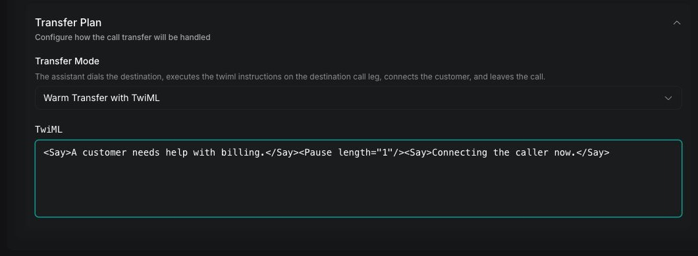

Traditional warm transfer dials the destination, delivers context on the destination call leg, and then connects the customer. Use these modes when the destination needs a fixed message, generated summary, or [Twilio Markup Language (TwiML)](https://www.twilio.com/docs/voice/twiml) instructions before receiving the call.

This guide starts with an existing transfer call tool. To create the tool, configure destinations, and add it to an assistant, follow [Transfer call tool](/tools/transfer-call). For an AI conversation with the destination, use [Assistant-based warm transfer](/calls/assistant-based-warm-transfer).

<Warning>
These five warm-transfer modes are supported on Twilio calls. Vapi uses Twilio while dialing and controlling the separate call to the receiving person, called the destination leg. Test the transfer through the same Twilio phone number and destination you will use in production.
</Warning>

## Choose a warm transfer mode

Choose the mode based on what the destination should hear and whether Vapi should wait for the destination to speak.

| Dashboard mode | API value | Destination experience |
| --- | --- | --- |
| **Warm Transfer with Message** | `warm-transfer-say-message` | Hears a fixed message before connection |
| **Warm Transfer with Summary** | `warm-transfer-say-summary` | Hears a generated conversation summary before connection |
| **Warm Transfer with TwiML** | `warm-transfer-twiml` | Receives the configured TwiML instructions before connection |
| **Warm Transfer - Wait for Operator, Then Say Message** | `warm-transfer-wait-for-operator-to-speak-first-and-then-say-message` | Speaks first, then hears a fixed message |
| **Warm Transfer - Wait for Operator, Then Say Summary** | `warm-transfer-wait-for-operator-to-speak-first-and-then-say-summary` | Speaks first, then hears a generated summary |

The wait-first modes are useful when the destination has an automated greeting or when you want to avoid speaking over the operator. Their `timeout` controls how long Vapi waits before delivering the message or summary.

For more information about **Warm Transfer - Experimental**, including how to configure an AI assistant to speak with the destination before connecting the customer, see [Assistant-based warm transfer](/calls/assistant-based-warm-transfer).

## Configure warm transfer

Update the transfer plan on each destination that should use a traditional warm transfer.

<Tabs>
  <Tab title="Dashboard">
    <Steps>
      <Step title="Open the transfer destination">
        In the Vapi Dashboard, open **Tools**, select the transfer call tool, and expand **Destinations**. Select the phone-number destination you want to configure.
      </Step>

      <Step title="Select the transfer mode">
        Expand **Transfer Plan**. Under **Transfer Mode**, select one of the five warm-transfer modes covered by this guide.

        <Frame caption="Select a warm-transfer mode in the Dashboard">
          
        </Frame>
      </Step>

      <Step title="Configure the destination content">
        For a message mode, enter the fixed introduction under **Message to Operator**.

        For a summary mode, use **Summary Plan** to enable summary generation. Configure the system message, the user message containing `{{transcript}}`, and a summary timeout from 1 to 60 seconds.

        For the TwiML mode, enter valid TwiML in **TwiML**.
      </Step>

      <Step title="Configure wait-first timing">
        For either wait-first mode, set **Wait for Operator Timeout (seconds)** from 1 to 600 seconds. The default is 60 seconds.
      </Step>

      <Step title="Save the tool">
        Click **Save**, then place a test call using the same telephony provider and destination type you will use in production.
      </Step>
    </Steps>
  </Tab>

  <Tab title="curl">
    <Steps>
      <Step title="Update the destination">
        Replace `YOUR_API_KEY`, `TOOL_ID`, and the destination phone number. This example configures **Warm Transfer with Message** through the [Update Tool endpoint](/api-reference/tools/update).

        ```bash
        curl --request PATCH \
          --url https://api.vapi.ai/tool/TOOL_ID \
          --header 'Authorization: Bearer YOUR_API_KEY' \
          --header 'Content-Type: application/json' \
          --data '{
            "destinations": [
              {
                "type": "number",
                "number": "+14155550100",
                "description": "Transfer to an account specialist after the customer agrees",
                "transferPlan": {
                  "mode": "warm-transfer-say-message",
                  "message": "A customer needs help with an account issue. Connecting the caller now."
                }
              }
            ]
          }'
        ```

        The `destinations` array replaces the tool's current destinations. Include every destination that should remain on the tool.
      </Step>

      <Step title="Choose another warm-transfer plan">
        Keep the destination configuration and replace only `transferPlan` with one of the following examples.

        <AccordionGroup>
          <Accordion title="Wait for the operator, then say a message">
            ```json
            {
              "mode": "warm-transfer-wait-for-operator-to-speak-first-and-then-say-message",
              "message": "A customer needs help with an account issue. Connecting the caller now.",
              "timeout": 60
            }
            ```
          </Accordion>

          <Accordion title="Generate and say a summary">
            ```json
            {
              "mode": "warm-transfer-say-summary",
              "summaryPlan": {
                "enabled": true,
                "timeoutSeconds": 5,
                "messages": [
                  {
                    "role": "system",
                    "content": "Summarize why the caller needs help in two sentences. Return only the summary."
                  },
                  {
                    "role": "user",
                    "content": "{{transcript}}"
                  }
                ]
              }
            }
            ```
          </Accordion>

          <Accordion title="Wait for the operator, then say a summary">
            ```json
            {
              "mode": "warm-transfer-wait-for-operator-to-speak-first-and-then-say-summary",
              "timeout": 60,
              "summaryPlan": {
                "enabled": true,
                "timeoutSeconds": 5,
                "messages": [
                  {
                    "role": "system",
                    "content": "Summarize why the caller needs help in two sentences. Return only the summary."
                  },
                  {
                    "role": "user",
                    "content": "{{transcript}}"
                  }
                ]
              }
            }
            ```
          </Accordion>

          <Accordion title="Execute TwiML">
            ```json
            {
              "mode": "warm-transfer-twiml",
              "twiml": "<Say>Hello, a customer needs help with billing.</Say><Pause length=\"1\"/><Say>Connecting the caller now.</Say>"
            }
            ```
          </Accordion>
        </AccordionGroup>
      </Step>
    </Steps>
  </Tab>
</Tabs>

## Configure messages and summaries

A message mode speaks the exact value of `transferPlan.message`. Use it when every call to the destination can use the same introduction.

A summary mode generates destination-specific context with `transferPlan.summaryPlan`. The user message must include `{{transcript}}` if the summary should use the conversation. This is separate from the assistant's end-of-call analysis summary, which runs after the call and is not spoken during transfer.

Keep destination introductions short. The destination is waiting to receive a live caller, so include only the caller's intent and the information needed to accept the call. A `message` value can be at most 1,000 characters.

## Configure TwiML

Use `warm-transfer-twiml` when the destination call leg needs instructions beyond a single message. See Twilio's [TwiML for Programmable Voice reference](https://www.twilio.com/docs/voice/twiml) for the XML format and general behavior. The `twiml` value can contain at most 4,096 characters and supports these verbs in a Vapi transfer:

- `Say`
- `Play`
- `Gather`
- `Pause`
- `Hangup`

The TwiML runs on the destination call leg before the customer is connected. Test menus and `Gather` behavior with the exact destination system used in production.

<Frame caption="Configure TwiML for the destination call leg">
  
</Frame>

## Verify the warm transfer

Place a test call and trigger the configured destination. Confirm that:

1. The destination rings before the customer is connected.
2. The destination hears the configured message, generated summary, or TwiML output.
3. A wait-first mode allows the operator to speak before delivering the content.
4. The customer and destination can hear each other after the introduction.

In **Logs → Call Logs**, inspect the transfer history and destination content. In **Logs → API Logs**, check for validation, summary-generation, and transfer errors.

## Troubleshooting

| Symptom | Likely cause | Resolution |
| --- | --- | --- |
| The call transfers, but the destination hears no introduction | The call is not using supported Twilio telephony or the selected mode does not match the configured field | Confirm the call's telephony provider. Use a message mode with `message`, a summary mode with `summaryPlan`, or TwiML mode with `twiml`. |
| The destination hears no summary | Only the assistant's end-of-call summary is configured | Enable `transferPlan.summaryPlan` on the destination and include `{{transcript}}` in its user message. |
| Summary generation times out | `summaryPlan.timeoutSeconds` is too short for the selected model | Increase the timeout within the 1–60 second range and keep the summary prompt concise. |
| A wait-first transfer pauses too long | The operator or automated system did not produce detectable speech | Reduce `transferPlan.timeout` or use the corresponding non-wait mode. |
| The message talks over the destination greeting | A non-wait mode starts the introduction immediately | Use the corresponding **Wait for Operator** mode and set an appropriate timeout. |
| The API rejects the TwiML | The value is invalid XML, too long, or uses unsupported verbs | Use valid XML under 4,096 characters and limit the instructions to the supported verbs. |
| The TwiML behaves differently from the test | The destination interactive voice response system handles timing or input differently | Test the same TwiML against the production destination and simplify `Gather`, `Pause`, or audio timing. |

If the transfer is initiated but the destination never rings or the call drops, follow [Troubleshoot call forwarding drops](/calls/troubleshoot-call-forwarding-drops).

## API reference

The [Update Tool API reference](/api-reference/tools/update) documents transfer-plan messages, summary plans, timeouts, and TwiML fields.

## Related guides

<CardGroup cols={2}>
  <Card title="Transfer call tool" icon="fa-light fa-phone-arrow-right" href="/tools/transfer-call">
    Create a transfer call tool and configure shared behavior.
  </Card>
  <Card title="Blind transfer" icon="fa-light fa-phone" href="/tools/transfer-call/blind-transfer">
    Connect the caller immediately or add a SIP summary header.
  </Card>
  <Card title="Assistant-based warm transfer" icon="fa-light fa-robot" href="/calls/assistant-based-warm-transfer">
    Let a transfer assistant converse with the destination.
  </Card>
  <Card title="Troubleshoot forwarding drops" icon="fa-light fa-screwdriver-wrench" href="/calls/troubleshoot-call-forwarding-drops">
    Diagnose incomplete transfers and provider routing failures.
  </Card>
</CardGroup>
