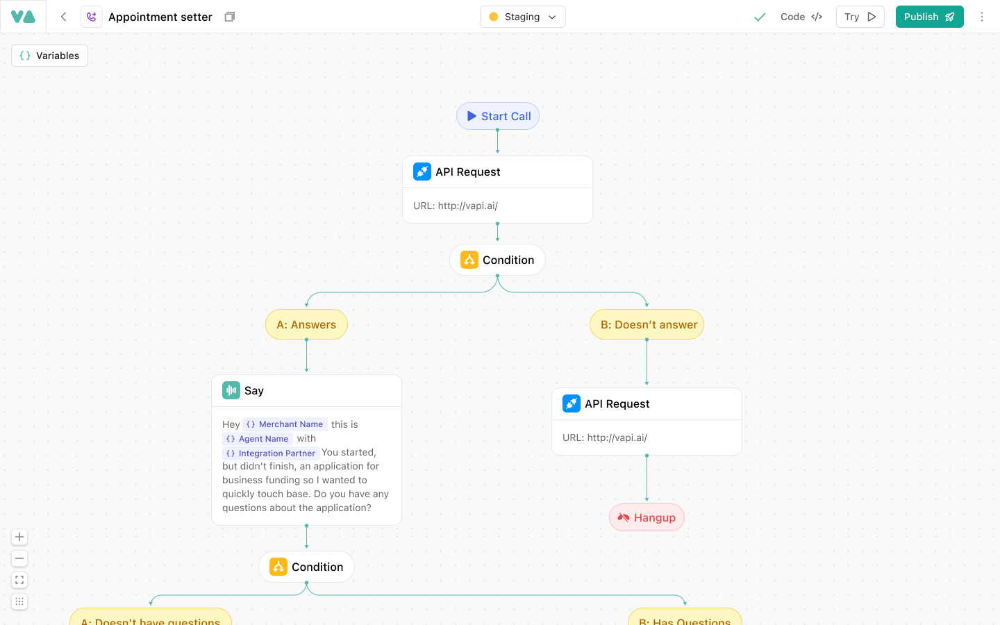

<Success intent="launch">
  Workflows is now available to all Vapi users in Open Beta on [the dashboard here](https://dashboard.vapi.ai/workflows). Start building more reliable and structured conversational AI today. 
</Success>

Workflows is a new way to build conversational AI. It allows you to break down AI conversations into discrete steps, and then orchestrate those steps in a way that is easy to manage and modify.

## Creating Your First Workflow

Begin by creating an assistant on the Assistants page and providing the required information, such as the assistant's name and capabilities. Once your assistant is set up, switch the model provider to VAPI and click "Create Workflow" when prompted. A modal will appear offering you the option to create a new workflow or attach to an existing one. Choose the appropriate option to proceed to the Workflow Builder.

<Steps>
  ### Step 1: Create an Assistant
    Visit the Assistants page. Create a new assistant, give it a name, and select a voice and transcription model of your choice.
  
  ### Step 2: Switch Provider to "vapi"
    Under the "Model" section, switch the "Provider" field to "vapi".
  
  ### Step 3: Create a New Workflow or Attach an Existing One
    Click the "Create Workflow" button. A prompt will appear asking you to create a new workflow by entering a unique title, or attach to an existing workflow.
    
  ### Step 4: Build Your Workflow
    In the Workflow Builder, you will see a "Start" call node. Click the <i className="fa-solid fa-plus"></i> button at the bottom of this node to select your first verb. Use the <i className="fa-solid fa-plus"></i> button to add further steps as needed. 
  
  <Frame background="subtle">
    
  </Frame>

  ### Step 5: Create Connections
    To create new connections between nodes, drag a line from one step's top connection dot to another step's bottom dot, forming the logical flow of the conversation.
</Steps>

## Tips for Building Workflows

- **Deleting Nodes and Edges:** Click on any node or edge and press Backspace to delete it.
- **Attaching Nodes:** Attach a node to another by drawing a line from the top of one node to the bottom of another node.
- **Save Requirements:** A workflow cannot be saved until every node is connected and configured. The system will not allow saving with any dangling nodes.
- **Creating Conditionals:** To create conditionals, first add a condition node. Then, attach nodes for each branch by clicking the "Logic" tag on the connecting edges to set up the conditions.

<Info>
    Please let us know about any bugs you find by [submitting a bug report](https://roadmap.vapi.ai/bug-reports). We also welcome feature requests and suggestions - you can [submit those here](https://roadmap.vapi.ai/feature-requests). For discussions about workflows and our product roadmap, please [join our Discord community](https://discord.com/invite/pUFNcf2WmH) to connect with our team.
</Info>

## Available Verbs

Workflows break down your AI voice agent's behavior into discrete, manageable actions called verbs. Each verb encapsulates a specific function within the conversation flow. Detailed configuration options let you tailor each step to your requirements. The available verbs are:

<CardGroup cols={2}>
  <Card title="Say" icon="message" href="/workflows/verbs/say">
    Outputs a message to the user without expecting a response. Configure this verb by specifying static text or providing a prompt for the LLM to generate dynamic text.
  </Card>
  <Card title="Gather" icon="microphone" href="/workflows/verbs/gather">
    Collects input from the user. Define the variables by specifying a name, a detailed description of the expected input, and the data type (string, number, or boolean). Mark each variable as required or optional.
  </Card>
  <Card title="Ask (Coming Soon)" icon="question-circle">
    Asks a question and uses AI conditions to evaluate the response and determine the next step. This enables natural conversational flow without needing to explicitly gather variables, as the AI interprets the semantic meaning of responses.
  </Card>
  <Card title="API Request" icon="code" href="/workflows/verbs/api-request">
    Makes calls to external APIs using GET or POST methods. Configure request headers and body, and define extraction rules to capture specific data from the JSON response. Optionally, enable asynchronous execution so that the workflow proceeds while awaiting the API response.
  </Card>
  <Card title="Transfer" icon="phone-arrow-right" href="/workflows/verbs/transfer">
    Transfers the active call to an external phone number. Ensure you provide a valid phone number in the configuration.
  </Card>
  <Card title="Hangup" icon="phone-slash" href="/workflows/verbs/hangup">
    Terminates the call, signaling the end of the conversation.
  </Card>
</CardGroup>

## Conditions

Conditions allow you to create branching paths in your workflow based on different types of logic:

<CardGroup cols={2}>
  <Card title="Logical Condition" icon="code-branch" href="/workflows/logical-conditions">
    Introduces branching logic based on conditions. Set up logical comparisons using data previously gathered or returned from API requests. This node allows you to define different paths for the conversation. Future updates will support AI-driven branching decisions.
  </Card>
  <Card title="AI Condition (Coming Soon)" icon="code-branch">
    Introduces AI-driven branching logic. The AI will evaluate the conversation context and select the most appropriate branch.
  </Card>
</CardGroup>

For detailed configuration instructions and advanced settings, please refer to our dedicated documentation pages for each verb.
