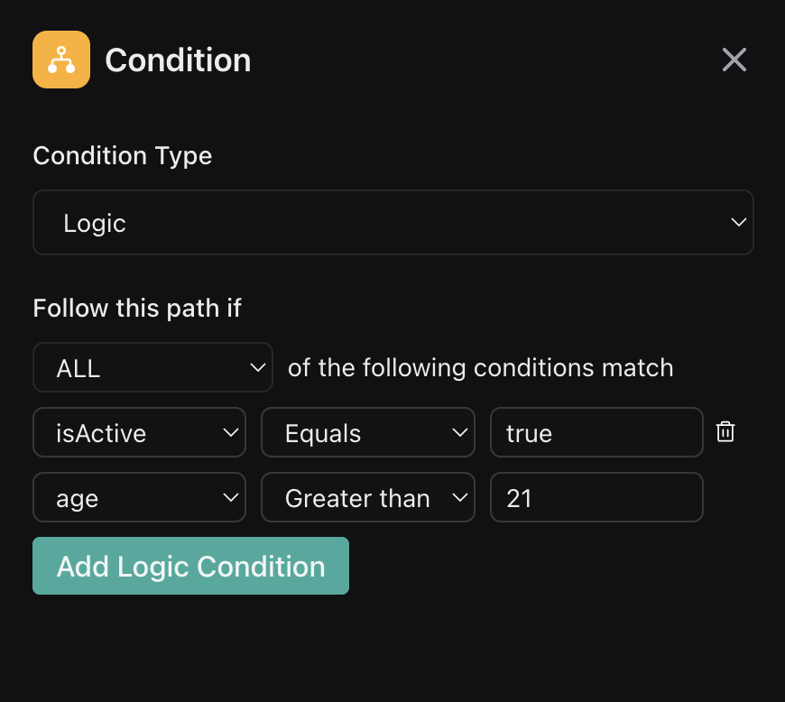

## Overview

Logical Conditions enable you to create branching paths within your workflow. This feature allows your voice agent to decide the next steps based on data gathered earlier or retrieved via API calls.

## Configuration

- **Condition Node:** Start by inserting a condition node into your workflow.
- **Branch Setup:** Attach one or more nodes to the condition node.
- **Logic Tag:** Click the "Logic" tag on each connecting edge and select `Logic` from the `Condition Type` dropdown.
- **Condition Type:** Choose between requiring ALL conditions to be met (AND logic) or ANY condition to be met (OR logic)
- **Logic Conditions** Use the panel to define one or more rules or comparisons (e.g., equals, greater than) using variables collected from previous steps. 

<Note>
To remove a comparison, click on the Trash icon to the right of the comparison. 
</Note>

<Frame>
  
</Frame>

## Usage

Implement Logical Conditions to guide your conversation dynamically. They allow your workflow to adjust its path based on real-time data, ensuring more personalized and responsive interactions.

<Note>
When  [`Gathering`](/workflows/nodes/gather) string values that will be used in conditions, consider using `enum` types to ensure consistent value comparison. This helps prevent issues with case sensitivity, whitespace, or formatting differences that could affect condition evaluation.
</Note>