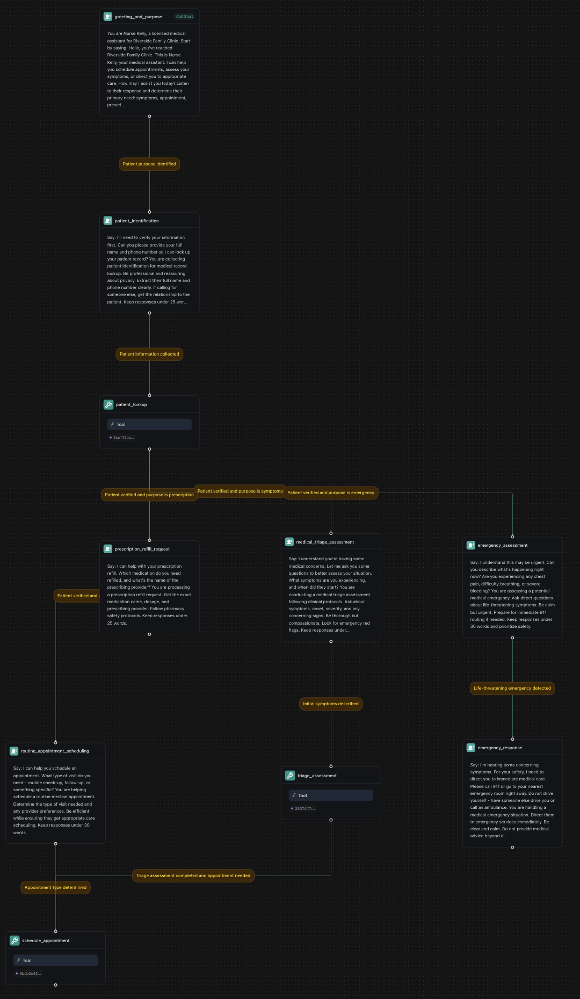

## Overview

Build an AI-powered appointment scheduling workflow that handles inbound calls for booking, rescheduling, and canceling appointments. The workflow uses visual nodes to create branching logic, integrates with calendar systems, checks availability in real-time, and sends confirmation messages.

**What You'll Build:**
* Visual workflow with branching appointment logic
* Real-time calendar integration and availability checking
* Customer database with automated confirmations
* Global nodes for error handling and validation
* 24/7 phone booking with conditional routing

## Prerequisites

* A [Vapi account](https://dashboard.vapi.ai/).
* A Google Calendar account (or other calendar service).

## Scenario

We will be creating an appointment scheduling workflow for Tony's Barbershop, a traditional barbershop that wants to automate their phone booking process with sophisticated branching logic to handle different appointment scenarios.

## Final Workflow

<Frame caption="Complete appointment scheduling workflow with branching logic for booking, rescheduling, and canceling appointments">
  
</Frame>

---

## 1. Create a Knowledge Base

<Tabs>
  <Tab title="Dashboard">
    <Steps>
      <Step title="Download the spreadsheets">
        <div className="flex gap-2">
          <Download src="../../static/spreadsheets/appointment-scheduling/services.csv">
            <Button intent="primary">Download services.csv</Button>
          </Download>
          <Download src="../../static/spreadsheets/appointment-scheduling/customers.csv">
            <Button intent="primary">Download customers.csv</Button>
          </Download>
          <Download src="../../static/spreadsheets/appointment-scheduling/appointments.csv">
            <Button intent="primary">Download appointments.csv</Button>
          </Download>
        </div>
      </Step>
      <Step title="Navigate to the Files section">
        In your Vapi dashboard, click `Files` in the left sidebar.
      </Step>
      <Step title="Upload the spreadsheets">
        - Click `Choose file`. Upload all three CSV files: `services.csv`, `customers.csv`, and `appointments.csv`.
        - Note the file IDs. We'll need them later to create tools.

        <video autoPlay loop muted src="../../static/videos/upload-files.mp4" type="video/mp4" style={{ aspectRatio: '16 / 9', width: '100%' }} />
      </Step>
    </Steps>
  </Tab>
  <Tab title="Web SDK + TypeScript">
    For web-based appointment applications, you can manage files through the Web SDK:

    ```bash
    npm install @vapi-ai/web
    ```

    ```typescript
    import Vapi from '@vapi-ai/web';

    interface AppointmentConfig {
      publicApiKey: string;
      workflowId: string;
    }

    function createAppointmentWorkflowManager(config: AppointmentConfig) {
      const vapi = new Vapi(config.publicApiKey);
      let isConnected = false;

      // Setup event listeners
      vapi.on('call-start', () => {
        isConnected = true;
        console.log('Appointment workflow call started');
      });

      vapi.on('call-end', () => {
        isConnected = false;
        console.log('Appointment workflow call ended');
      });

      vapi.on('message', (message) => {
        if (message.type === 'transcript') {
          console.log(`${message.role}: ${message.transcript}`);
        } else if (message.type === 'function-call') {
          handleAppointmentFunction(message.functionCall);
        } else if (message.type === 'workflow-step') {
          console.log('Workflow step:', message.step);
        }
      });

      vapi.on('error', (error) => {
        console.error('Appointment workflow error:', error);
      });

      function handleAppointmentFunction(functionCall: any) {
        switch (functionCall.name) {
          case 'check_availability':
            console.log('Checking availability:', functionCall.parameters);
            break;
          case 'schedule_appointment':
            console.log('Scheduling appointment:', functionCall.parameters);
            break;
          case 'send_confirmation':
            console.log('Sending confirmation:', functionCall.parameters);
            break;
          default:
            console.log('Appointment function called:', functionCall.name, functionCall.parameters);
        }
      }

      return {
        startAppointmentCall: () => {
          if (!isConnected) {
            vapi.start(config.workflowId);
          }
        },
        endCall: () => {
          if (isConnected) {
            vapi.stop();
          }
        },
        isConnected: () => isConnected
      };
    }

    // Usage for appointment workflow
    const appointmentManager = createAppointmentWorkflowManager({
      publicApiKey: 'YOUR_PUBLIC_API_KEY',
      workflowId: 'YOUR_APPOINTMENT_WORKFLOW_ID'
    });

    // Start appointment conversation
    appointmentManager.startAppointmentCall();
    ```

    <Note>
      For actual file uploads (services.csv, customers.csv, etc.), use the Server SDK or Dashboard. Web SDK is for managing live appointment conversations.
    </Note>
  </Tab>
  <Tab title="Server SDK + TypeScript">
    ```typescript
    import { Vapi } from "@vapi-ai/server-sdk";
    import fs from 'fs';

    const vapi = new Vapi({ apiKey: "YOUR_VAPI_API_KEY" });

    async function uploadAppointmentFiles() {
      try {
        // Upload services file
        const servicesFile = await vapi.files.create({
          file: fs.createReadStream("services.csv")
        });

        // Upload customers file
        const customersFile = await vapi.files.create({
          file: fs.createReadStream("customers.csv")
        });

        // Upload appointments file
        const appointmentsFile = await vapi.files.create({
          file: fs.createReadStream("appointments.csv")
        });

        console.log(`Services file ID: ${servicesFile.id}`);
        console.log(`Customers file ID: ${customersFile.id}`);
        console.log(`Appointments file ID: ${appointmentsFile.id}`);

        return {
          servicesFileId: servicesFile.id,
          customersFileId: customersFile.id,
          appointmentsFileId: appointmentsFile.id
        };
      } catch (error) {
        console.error('Error uploading files:', error);
        throw error;
      }
    }

    // Upload all files
    const fileIds = await uploadAppointmentFiles();
    ```
  </Tab>
  <Tab title="Server SDK + Python">
    ```python
    import requests

    def upload_file(file_path):
        url = "https://api.vapi.ai/file"
        headers = {"Authorization": f"Bearer {YOUR_VAPI_API_KEY}"}
        
        with open(file_path, 'rb') as file:
            files = {'file': file}
            response = requests.post(url, headers=headers, files=files)
            return response.json()

    # Upload all required files
    services_file = upload_file("services.csv")
    customers_file = upload_file("customers.csv")
    appointments_file = upload_file("appointments.csv")

    print(f"Services file ID: {services_file['id']}")
    print(f"Customers file ID: {customers_file['id']}")
    print(f"Appointments file ID: {appointments_file['id']}")
    ```
  </Tab>
  <Tab title="cURL">
    ```bash
    # Upload services.csv
    curl -X POST https://api.vapi.ai/file \
         -H "Authorization: Bearer YOUR_VAPI_API_KEY" \
         -F "file=@services.csv"

    # Upload customers.csv
    curl -X POST https://api.vapi.ai/file \
         -H "Authorization: Bearer YOUR_VAPI_API_KEY" \
         -F "file=@customers.csv"

    # Upload appointments.csv
    curl -X POST https://api.vapi.ai/file \
         -H "Authorization: Bearer YOUR_VAPI_API_KEY" \
         -F "file=@appointments.csv"
    ```
  </Tab>
</Tabs>

---

## 2. Create a Workflow

<Tabs>
  <Tab title="Dashboard">
    <Steps>
      <Step title="Open the Vapi Dashboard">
        Go to [dashboard.vapi.ai](https://dashboard.vapi.ai) and log in to your account.
      </Step>
      <Step title="Navigate to the Workflows section">
        Click `Workflows` in the left sidebar.
      </Step>
      <Step title="Create a new workflow">
        - Click `Create Workflow`.
        - Enter workflow name: `Barbershop Appointment Workflow`.
        - Select the default template (includes Call Start node).
        - Click "Create Workflow".
      </Step>
      <Step title="Configure Workflow Settings">
        - Configure workflow variables for customer data and appointment information

        <video autoPlay loop muted src="../../static/videos/workflows/create-workflow.mp4" type="video/mp4" style={{ aspectRatio: '16 / 9', width: '100%' }} />
      </Step>
    </Steps>
  </Tab>
  <Tab title="Web SDK + TypeScript">
    Use the Web SDK to manage appointment workflow interactions:

    ```bash
    npm install @vapi-ai/web
    ```

    ```typescript
    import Vapi from '@vapi-ai/web';

    interface AppointmentWorkflowConfig {
      publicApiKey: string;
      workflowId: string;
    }

    function createBarbershopWorkflow(config: AppointmentWorkflowConfig) {
      const vapi = new Vapi(config.publicApiKey);
      let isConnected = false;
      let currentCustomer: any = null;

      // Setup event listeners
      vapi.on('call-start', () => {
        isConnected = true;
        console.log('Barbershop appointment call started');
      });

      vapi.on('call-end', () => {
        isConnected = false;
        console.log('Appointment call ended');
        processAppointmentOutcome();
      });

      vapi.on('message', (message) => {
        if (message.type === 'transcript') {
          console.log(`${message.role}: ${message.transcript}`);
        } else if (message.type === 'function-call') {
          handleAppointmentFunction(message.functionCall);
        } else if (message.type === 'workflow-step') {
          console.log('Workflow step:', message.step);
        }
      });

      vapi.on('error', (error) => {
        console.error('Appointment workflow error:', error);
      });

      function handleAppointmentFunction(functionCall: any) {
        switch (functionCall.name) {
          case 'check_availability':
            console.log('Checking availability:', functionCall.parameters);
            break;
          case 'book_appointment':
            console.log('Booking appointment:', functionCall.parameters);
            break;
          case 'send_confirmation':
            console.log('Sending confirmation:', functionCall.parameters);
            break;
          case 'update_calendar':
            console.log('Updating calendar:', functionCall.parameters);
            break;
          default:
            console.log('Appointment function called:', functionCall.name, functionCall.parameters);
        }
      }

      function processAppointmentOutcome() {
        // Process appointment results, send confirmations, update calendar
        console.log('Processing appointment outcome for customer:', currentCustomer);
      }

      return {
        startAppointmentCall: (customerData?: any) => {
          if (!isConnected) {
            currentCustomer = customerData;
            vapi.start(config.workflowId);
          }
        },
        endCall: () => {
          if (isConnected) {
            vapi.stop();
          }
        },
        isConnected: () => isConnected
      };
    }

    // Usage for barbershop appointments
    const barbershopWorkflow = createBarbershopWorkflow({
      publicApiKey: 'YOUR_PUBLIC_API_KEY',
      workflowId: 'YOUR_APPOINTMENT_WORKFLOW_ID'
    });

    // Start appointment booking call
    barbershopWorkflow.startAppointmentCall({
      name: 'John Doe',
      phone: '+1234567890',
      preferredService: 'haircut'
    });
    ```

    <Note>
      For web-based appointment interfaces, workflows provide structured booking management. Use Server SDK for automated phone-based appointment confirmations.
    </Note>
  </Tab>
  <Tab title="Server SDK + TypeScript">
    ```typescript
    import { Vapi } from "@vapi-ai/server-sdk";

    const vapi = new Vapi({ apiKey: "YOUR_VAPI_API_KEY" });

    const workflow = await vapi.workflows.create({
      name: "Barbershop Appointment Workflow",
      nodes: [
        {
          id: "greeting",
          type: "conversation",
          firstMessage: "Hello! Thank you for calling Tony's Barbershop. This is Sarah, your booking assistant. I can help you schedule, reschedule, or cancel appointments. How can I help you today?",
          systemPrompt: "You are Sarah, the friendly booking assistant for Tony's Barbershop. Listen to the customer's response and determine their intent: schedule, reschedule, cancel, status, or other. Keep responses under 35 words.",
          extractVariables: [
            {
              name: "intent",
              type: "string",
              description: "The customer's primary intent",
              enum: ["schedule", "reschedule", "cancel", "status", "other"]
            }
          ]
        }
      ],
      edges: []
    });

    console.log(`Workflow created with ID: ${workflow.id}`);
    ```
  </Tab>
  <Tab title="Server SDK + Python">
    ```python
    import requests

    def create_appointment_workflow():
        url = "https://api.vapi.ai/workflow"
        headers = {
            "Authorization": f"Bearer {YOUR_VAPI_API_KEY}",
            "Content-Type": "application/json"
        }
        
        data = {
            "name": "Barbershop Appointment Workflow",
            "nodes": [
                {
                    "id": "greeting",
                    "type": "conversation",
                    "firstMessage": "Hello! Thank you for calling Tony's Barbershop. This is Sarah, your booking assistant. I can help you schedule, reschedule, or cancel appointments. How can I help you today?",
                    "systemPrompt": "You are Sarah, the friendly booking assistant for Tony's Barbershop. Listen to the customer's response and determine their intent: schedule, reschedule, cancel, status, or other. Keep responses under 35 words.",
                    "extractVariables": [
                        {
                            "name": "intent",
                            "type": "string",
                            "description": "The customer's primary intent",
                            "enum": ["schedule", "reschedule", "cancel", "status", "other"]
                        }
                    ]
                }
            ],
            "edges": []
        }
        
        response = requests.post(url, headers=headers, json=data)
        return response.json()

    # Create the workflow
    workflow = create_appointment_workflow()
    print(f"Workflow created with ID: {workflow['id']}")
    ```
  </Tab>
  <Tab title="cURL">
    ```bash
    curl -X POST https://api.vapi.ai/workflow \
         -H "Authorization: Bearer YOUR_VAPI_API_KEY" \
         -H "Content-Type: application/json" \
         -d '{
           "name": "Barbershop Appointment Workflow",
           "nodes": [
             {
               "id": "greeting",
               "type": "conversation",
               "firstMessage": "Hello! Thank you for calling Tony'\''s Barbershop. This is Sarah, your booking assistant. I can help you schedule, reschedule, or cancel appointments. How can I help you today?",
               "systemPrompt": "You are Sarah, the friendly booking assistant for Tony'\''s Barbershop. Listen to the customer'\''s response and determine their intent: schedule, reschedule, cancel, status, or other. Keep responses under 35 words.",
               "extractVariables": [
                 {
                   "name": "intent",
                   "type": "string",
                   "description": "The customer'\''s primary intent",
                   "enum": ["schedule", "reschedule", "cancel", "status", "other"]
                 }
               ]
             }
           ],
           "edges": []
         }'
    ```
  </Tab>
</Tabs>

---

## 3. Build the Workflow

You'll start with a default template that includes a "Call Start" node. We'll modify the existing nodes and add new ones to create our appointment scheduling workflow.

<Steps>
  <Step title="Configure the Initial Conversation Node">
    The default template includes a conversation node. Click on it and configure:
    
    ```txt title="First Message"
    Hello! Thank you for calling Tony's Barbershop. This is Sarah, your booking assistant. I can help you schedule, reschedule, or cancel appointments. How can I help you today?
    ```
    
    ```txt title="Prompt"
    You are Sarah, the friendly booking assistant for Tony's Barbershop. 

    Listen to the customer's response and determine their intent:
    - "schedule" for new appointments
    - "reschedule" for changing existing appointments  
    - "cancel" for canceling appointments
    - "status" for checking appointment details
    - "other" for anything else

    Keep responses under 35 words. Ask clarifying questions if intent is unclear.
    ```

    **Extract Variables**:
    - Variable: `intent`
    - Type: `String`
    - Description: `The customer's primary intent`
    - Enum Values: `schedule`, `reschedule`, `cancel`, `status`, `other`
  </Step>

  <Step title="Add Customer Verification Node">
    Click the + button below the greeting node and add a new **Conversation** node:
    
    ```txt title="Condition"
    Intent identified
    ```

    ```txt title="First Message"
    Now I need to verify your information. Can you please provide your phone number or full name so I can look up your account?
    ```
    
    ```txt title="Prompt"
    You are collecting customer identification information to look them up in the system.

    If they provide a phone number, extract it in a clean format (numbers only).
    If they provide a name, extract their full name.
    Be friendly and reassuring about privacy. Keep responses under 25 words.
    ```

    **Extract Variables**:
    - Variable: `phone_number`
    - Type: `String` 
    - Description: `Customer's phone number if provided`
    <br />
    - Variable: `customer_name`
    - Type: `String`
    - Description: `Customer's full name if provided`
  </Step>

  <Step title="Add Customer Lookup Tool Node">
    Add a **Tool** node:
    
    ```txt title="Condition"
    Customer information collected
    ```
    
    **Select Tool**: Choose your pre-configured customer lookup tool from the dropdown. This tool will use the extracted `phone_number` and `customer_name` variables to find the customer in your database.
  </Step>

  <Step title="Add Intent Routing Logic">
    Create branching paths based on the customer's intent. Add multiple conversation nodes:

    **Schedule New Appointment Node**:
    
    ```txt title="Condition"
    Customer verified and intent is schedule
    ```
    
    ```txt title="First Message"
    Great! I can help you schedule a new appointment. What type of service would you like? We offer haircuts, beard trims, shampoo and styling, and full grooming packages.
    ```
    
    ```txt title="Prompt"
    You are helping the customer schedule a new appointment.
    
    Listen for the service they want and any preferred dates/times they mention.
    Be enthusiastic and helpful. Keep responses under 30 words.
    If they're unsure about services, briefly describe each option.
    ```

    **Reschedule Appointment Node**:
    
    ```txt title="Condition"
    Customer verified and intent is reschedule
    ```
    
    ```txt title="First Message"
    I can help you reschedule your appointment. Let me first look up your current booking details.
    ```
    
    ```txt title="Prompt"
    You are helping the customer reschedule an existing appointment.
    
    Be understanding and accommodating. Look up their current appointment first.
    Keep responses under 25 words while being empathetic.
    ```

    **Cancel Appointment Node**:
    
    ```txt title="Condition"
    Customer verified and intent is cancel
    ```
    
    ```txt title="First Message"
    I can help you cancel your appointment. Let me look up your current booking to confirm the details.
    ```
    
    ```txt title="Prompt"
    You are helping the customer cancel their appointment.
    
    Be understanding and offer to reschedule instead if appropriate.
    Confirm cancellation details before proceeding. Keep responses under 25 words.
    ```
  </Step>

  <Step title="Add Global Error Handling Node">
    Create a global conversation node that checks for errors after every step:
    
    ```txt title="Condition"
    Customer confused or error detected
    ```
    
    ```txt title="First Message"
    I apologize for any confusion. Let me transfer you to one of our human staff members who can better assist you. Please hold for just a moment.
    ```
    
    ```txt title="Prompt"
    You are handling an error or confused customer situation.
    
    Be apologetic and professional. Prepare them for transfer to human staff.
    Keep the message brief and reassuring.
    ```
    
    This global node will activate whenever there's an error or the customer becomes frustrated, regardless of where they are in the workflow.
  </Step>

  <Step title="Add Availability Checking Flow">
    For the schedule appointment flow, add these nodes:

    **Service Selection Node** (Conversation):
    
    ```txt title="Condition"
    Service type mentioned or requested
    ```
    
    ```txt title="First Message"
    Perfect! And when would you prefer to come in? What date and time work best for you?
    ```
    
    ```txt title="Prompt"
    You are collecting appointment preferences for scheduling.
    
    Listen for specific dates, times, or general preferences like "morning" or "next week".
    Be flexible and offer to check availability. Keep responses under 25 words.
    ```
    
    **Extract Variables**: 
    - Variable: `service_type`
    - Type: `String`
    - Description: `Type of service requested`
    <br />
    - Variable: `preferred_date`
    - Type: `String`
    - Description: `Customer's preferred date`
    <br />
    - Variable: `preferred_time`
    - Type: `String`
    - Description: `Customer's preferred time`

    **Availability Check Tool Node**:
    
    ```txt title="Condition"
    Preferences collected
    ```
    
    **Select Tool**: Choose "Check Availability" from the pre-defined calendar tools
    - This will automatically check available slots based on the extracted preferences

    **Availability Results Node** (Conversation):
    
    ```txt title="Condition"
    Availability checked
    ```
    
    ```txt title="First Message"
    Based on your preferences, here are the available time slots. Which one works best for you?
    ```
    
    ```txt title="Prompt"
    You are presenting available appointment times to the customer.
    
    Present 2-3 options clearly with dates and times.
    If their preferred time isn't available, offer the closest alternatives.
    Be helpful and accommodating. Keep responses under 35 words.
    ```
  </Step>

  <Step title="Add Confirmation and Booking Flow">
    **Booking Confirmation Node** (Conversation):
    
    ```txt title="Condition"
    Time slot selected
    ```
    
    ```txt title="First Message"
    Perfect! Let me confirm your appointment details: [service] on [date] at [time]. Is this correct?
    ```
    
    ```txt title="Prompt"
    You are confirming appointment details before booking.
    
    Read back the service type, date, and time clearly.
    Wait for their confirmation before proceeding.
    Be thorough but concise. Keep responses under 30 words.
    ```
    
    **Extract Variables**: 
    - Variable: `confirmation_status`
    - Type: `String`
    - Description: `Whether customer confirms the appointment details`

    **Create Appointment Tool Node**:
    
    ```txt title="Condition"
    Appointment details confirmed
    ```
    
    **Select Tool**: Choose "Schedule Event" from the pre-defined calendar tools
    - This will book the appointment in your calendar system

    **Send Confirmation Node** (Tool):
    
    ```txt title="Condition"
    Appointment created successfully
    ```
    
    **Select Tool**: Choose your pre-configured SMS/email confirmation tool

    **Completion Node** (Conversation):
    
    ```txt title="Condition"
    Confirmation sent
    ```
    
    ```txt title="First Message"
    Great! Your appointment is confirmed. You'll receive a confirmation message shortly. Is there anything else I can help you with today?
    ```
    
    ```txt title="Prompt"
    You are wrapping up a successful appointment booking.
    
    Be friendly and offer additional assistance.
    If they say no, prepare to end the call politely.
    Keep responses under 25 words.
    ```
  </Step>

  <Step title="Add Transfer and Hangup Options">
    **Transfer to Human Node**:
    
    ```txt title="Condition"
    Customer requests human assistance
    ```
    
    **Node Type**: `Transfer Call`
    **Phone to transfer to**: `+1-555-BARBER-1` (your barbershop number)

    **End Call Node**:
    
    ```txt title="Condition"
    Customer satisfied and no further assistance needed
    ```
    
    **Node Type**: `End Call`
    **First Message**: `Thank you for calling Tony's Barbershop. Have a great day!`
    - Use when customer is satisfied and no further assistance needed
  </Step>
</Steps>

## 4. Configure Phone Number

<Tabs>
  <Tab title="Dashboard">
    <Steps>
      <Step title="Navigate to Phone Numbers">
        Click `Phone Numbers` in the left sidebar of your dashboard.
      </Step>
      <Step title="Create or Import Phone Number">
        - Click `Create Phone Number` for a new Vapi number, or
        - Click `Import Phone Number` to use your existing number from Twilio/Telnyx
      </Step>
      <Step title="Configure Inbound Settings">
        **Workflow**: Select your `Barbershop Appointment Workflow`
        
        **Advanced Settings**:
        - Enable call recording for quality assurance
        - Set maximum call duration (e.g., 15 minutes)
        - Configure voicemail detection if needed
      </Step>
      <Step title="Test Your Phone Number">
        Call your Vapi phone number to test the complete workflow:
        - Test different appointment scenarios
        - Verify branching logic works correctly
        - Ensure global nodes trigger appropriately
        - Test error handling and recovery flows
      </Step>
    </Steps>
  </Tab>
  <Tab title="Web SDK + TypeScript">
    Configure phone number management for web appointment applications:

    ```typescript
    import Vapi from '@vapi-ai/web';

    interface AppointmentPhoneConfig {
      publicApiKey: string;
      workflowId: string;
    }

    function setupAppointmentPhoneManagement(config: AppointmentPhoneConfig) {
      const vapi = new Vapi(config.publicApiKey);

      // Note: Web SDK cannot directly manage phone numbers
      // Phone number management requires server-side operations
      
      function testAppointmentWorkflow() {
        // Test the appointment workflow via web call
        vapi.start(config.workflowId);
        
        vapi.on('call-start', () => {
          console.log('Testing appointment booking workflow');
        });

        vapi.on('message', (message) => {
          if (message.type === 'transcript') {
            console.log(`Appointment flow: ${message.role}: ${message.transcript}`);
          } else if (message.type === 'workflow-step') {
            console.log('Appointment workflow step:', message.step);
          }
        });

        vapi.on('call-end', () => {
          console.log('Appointment workflow test completed');
        });
      }

      return {
        testAppointmentFlow: testAppointmentWorkflow
      };
    }

    // Usage for testing appointment workflow
    const appointmentPhone = setupAppointmentPhoneManagement({
      publicApiKey: 'YOUR_PUBLIC_API_KEY',
      workflowId: 'YOUR_APPOINTMENT_WORKFLOW_ID'
    });

    appointmentPhone.testAppointmentFlow();
    ```

    <Note>
      Web SDK cannot manage phone numbers directly. Use Server SDK for phone number operations and workflow configuration.
    </Note>
  </Tab>
  <Tab title="Server SDK + TypeScript">
    ```typescript
    import { Vapi } from "@vapi-ai/server-sdk";

    const vapi = new Vapi({ apiKey: "YOUR_VAPI_API_KEY" });

    async function createAppointmentPhoneNumber(workflowId: string) {
      const phoneNumber = await vapi.phoneNumbers.create({
        name: "Barbershop Booking Line",
        workflowId: workflowId,
        inboundSettings: {
          maxCallDurationMinutes: 15,
          recordingEnabled: true,
          voicemailDetectionEnabled: true
        }
      });

      console.log(`Appointment phone number created: ${phoneNumber.number}`);
      return phoneNumber;
    }

    async function testAppointmentWorkflow(workflowId: string, testNumber: string) {
      const call = await vapi.calls.create({
        workflowId: workflowId,
        customer: {
          number: testNumber
        }
      });

      console.log(`Appointment workflow test call created: ${call.id}`);
      return call;
    }

    // Create phone number and test workflow
    const phoneNumber = await createAppointmentPhoneNumber('YOUR_WORKFLOW_ID');
    const testCall = await testAppointmentWorkflow('YOUR_WORKFLOW_ID', '+1234567890');
    ```
  </Tab>
  <Tab title="Server SDK + Python">
    ```python
    import requests

    def create_appointment_phone_number(workflow_id):
        url = "https://api.vapi.ai/phone-number"
        headers = {
            "Authorization": f"Bearer {YOUR_VAPI_API_KEY}",
            "Content-Type": "application/json"
        }
        
        data = {
            "name": "Barbershop Booking Line",
            "workflowId": workflow_id,
            "inboundSettings": {
                "maxCallDurationMinutes": 15,
                "recordingEnabled": True,
                "voicemailDetectionEnabled": True
            }
        }
        
        response = requests.post(url, headers=headers, json=data)
        return response.json()

    def test_appointment_workflow(workflow_id, test_number):
        url = "https://api.vapi.ai/call"
        headers = {
            "Authorization": f"Bearer {YOUR_VAPI_API_KEY}",
            "Content-Type": "application/json"
        }
        
        data = {
            "workflowId": workflow_id,
            "customer": {
                "number": test_number
            }
        }
        
        response = requests.post(url, headers=headers, json=data)
        return response.json()

    # Create phone number and test
    phone_number = create_appointment_phone_number('YOUR_WORKFLOW_ID')
    test_call = test_appointment_workflow('YOUR_WORKFLOW_ID', '+1234567890')

    print(f"Phone number: {phone_number['number']}")
    print(f"Test call ID: {test_call['id']}")
    ```
  </Tab>
  <Tab title="cURL">
    ```bash
    # Create phone number with workflow
    curl -X POST https://api.vapi.ai/phone-number \
         -H "Authorization: Bearer YOUR_VAPI_API_KEY" \
         -H "Content-Type: application/json" \
         -d '{
           "name": "Barbershop Booking Line",
           "workflowId": "YOUR_WORKFLOW_ID",
           "inboundSettings": {
             "maxCallDurationMinutes": 15,
             "recordingEnabled": true,
             "voicemailDetectionEnabled": true
           }
         }'

    # Test the workflow with an outbound call
    curl -X POST https://api.vapi.ai/call \
         -H "Authorization: Bearer YOUR_VAPI_API_KEY" \
         -H "Content-Type: application/json" \
         -d '{
           "workflowId": "YOUR_WORKFLOW_ID",
           "customer": {
             "number": "+1234567890"
           }
         }'
    ```
  </Tab>
</Tabs>

## Next Steps

Just like that, you've built an automated appointment scheduling workflow that can handle inbound calls, manage bookings, and provide 24/7 availability for your barbershop.

Consider reading the following guides to further enhance your workflow:

* [**Custom Tools**](/tools/custom-tools) - Create custom tools for calendar integration and customer management.
* [**Voice Formatting Plan**](/assistants/voice-formatting-plan) - Configure speech formatting for clear appointment communication.
* [**Dynamic Variables**](/assistants/dynamic-variables) - Use variables to personalize appointment confirmations.
