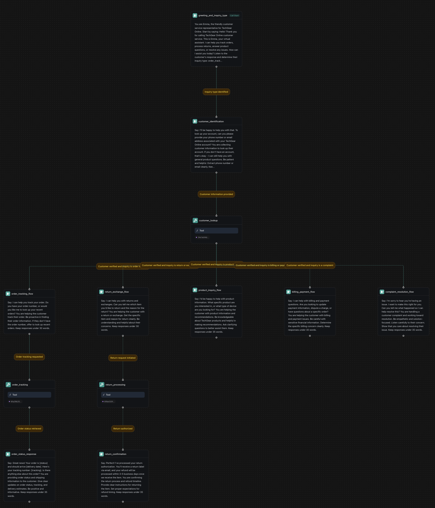

## Overview

Build an AI-powered clinic receptionist workflow that handles patient triage, appointment scheduling, and emergency routing using Vapi workflows with medical protocol compliance and safety monitoring.

**What You'll Build:**
* Medical triage assessment with symptom-based routing
* Emergency detection with global safety protocols
* Provider scheduling with urgency prioritization
* Prescription refill processing with safety checks

## Prerequisites

* A [Vapi account](https://dashboard.vapi.ai/).
* Medical triage protocols and guidelines.
* Healthcare provider scheduling system.

## Scenario

We will be creating a triage and scheduling workflow for Riverside Family Clinic, a primary care practice that wants to improve patient access while ensuring appropriate care routing and emergency response through sophisticated workflow automation.

## Final Workflow

<Frame caption="Complete medical triage and scheduling workflow with emergency detection, symptom assessment, and clinical routing">
  
</Frame>

---

## 1. Create a Knowledge Base

<Tabs>
  <Tab title="Dashboard">
    <Steps>
      <Step title="Download the spreadsheets">
        <div className="flex gap-2">
          <Download src="../../static/spreadsheets/clinic/patients.csv">
            <Button intent="primary">Download patients.csv</Button>
          </Download>
          <Download src="../../static/spreadsheets/clinic/providers.csv">
            <Button intent="primary">Download providers.csv</Button>
          </Download>
          <Download src="../../static/spreadsheets/clinic/triage_protocols.csv">
            <Button intent="primary">Download triage_protocols.csv</Button>
          </Download>
          <Download src="../../static/spreadsheets/clinic/appointments.csv">
            <Button intent="primary">Download appointments.csv</Button>
          </Download>
        </div>
      </Step>
      <Step title="Navigate to the Files section">
        In your Vapi dashboard, click `Files` in the left sidebar.
      </Step>
      <Step title="Upload the spreadsheets">
        - Click `Choose file`. Upload all four CSV files: `patients.csv`, `providers.csv`, `triage_protocols.csv`, and `appointments.csv`.
        - Note the file IDs. We'll need them later to create tools.

        <video autoPlay loop muted src="../../static/videos/upload-files.mp4" type="video/mp4" style={{ aspectRatio: '16 / 9', width: '100%' }} />
      </Step>
    </Steps>
  </Tab>
  <Tab title="TypeScript (Server SDK)">
    ```typescript
    import { Vapi } from "@vapi-ai/server-sdk";
    import fs from 'fs';

    const vapi = new Vapi({ apiKey: "YOUR_VAPI_API_KEY" });

    async function uploadClinicFiles() {
      try {
        // Upload patients file
        const patientsFile = await vapi.files.create({
          file: fs.createReadStream("patients.csv")
        });

        // Upload providers file
        const providersFile = await vapi.files.create({
          file: fs.createReadStream("providers.csv")
        });

        // Upload triage protocols file
        const triageProtocolsFile = await vapi.files.create({
          file: fs.createReadStream("triage_protocols.csv")
        });

        // Upload appointments file
        const appointmentsFile = await vapi.files.create({
          file: fs.createReadStream("appointments.csv")
        });

        console.log(`Patients file ID: ${patientsFile.id}`);
        console.log(`Providers file ID: ${providersFile.id}`);
        console.log(`Triage protocols file ID: ${triageProtocolsFile.id}`);
        console.log(`Appointments file ID: ${appointmentsFile.id}`);

        return {
          patientsFileId: patientsFile.id,
          providersFileId: providersFile.id,
          triageProtocolsFileId: triageProtocolsFile.id,
          appointmentsFileId: appointmentsFile.id
        };
      } catch (error) {
        console.error('Error uploading clinic files:', error);
        throw error;
      }
    }

    // Upload all files for clinic workflow
    const fileIds = await uploadClinicFiles();
    ```
  </Tab>
  <Tab title="Python (Server SDK)">
    ```python
    import requests

    def upload_clinic_file(file_path):
        """Upload a CSV file for clinic workflow data"""
        url = "https://api.vapi.ai/file"
        headers = {"Authorization": f"Bearer {YOUR_VAPI_API_KEY}"}
        
        try:
            with open(file_path, 'rb') as file:
                files = {'file': file}
                response = requests.post(url, headers=headers, files=files)
                response.raise_for_status()
                return response.json()
        except requests.exceptions.RequestException as error:
            print(f"Error uploading {file_path}: {error}")
            raise

    # Upload all required files for clinic workflow
    patients_file = upload_clinic_file("patients.csv")
    providers_file = upload_clinic_file("providers.csv")
    triage_protocols_file = upload_clinic_file("triage_protocols.csv")
    appointments_file = upload_clinic_file("appointments.csv")

    print(f"Patients file ID: {patients_file['id']}")
    print(f"Providers file ID: {providers_file['id']}")
    print(f"Triage protocols file ID: {triage_protocols_file['id']}")
    print(f"Appointments file ID: {appointments_file['id']}")
    ```
  </Tab>
  <Tab title="cURL">
    ```bash
    # Upload patients.csv
    curl -X POST https://api.vapi.ai/file \
         -H "Authorization: Bearer YOUR_VAPI_API_KEY" \
         -F "file=@patients.csv"

    # Upload providers.csv
    curl -X POST https://api.vapi.ai/file \
         -H "Authorization: Bearer YOUR_VAPI_API_KEY" \
         -F "file=@providers.csv"

    # Upload triage_protocols.csv
    curl -X POST https://api.vapi.ai/file \
         -H "Authorization: Bearer YOUR_VAPI_API_KEY" \
         -F "file=@triage_protocols.csv"

    # Upload appointments.csv
    curl -X POST https://api.vapi.ai/file \
         -H "Authorization: Bearer YOUR_VAPI_API_KEY" \
         -F "file=@appointments.csv"
    ```
  </Tab>
</Tabs>

---

## 2. Create Required Tools

<Tabs>
  <Tab title="Dashboard">
    Before building the workflow, create the necessary tools in your dashboard:

    <Steps>
      <Step title="Navigate to Tools">
        In your Vapi dashboard, click **Tools** in the left sidebar.
      </Step>
      <Step title="Create Patient Lookup Tool">
        Click **Create Tool** and configure:
        - **Tool Name**: "Patient Lookup"
        - **Tool Type**: "Function"
        - **Function Name**: `lookup_patient`
        - **Description**: "Look up patient record by ID"
        - **Parameters**:
          - `patient_id` (string, required): Patient's ID number
        - **Server URL**: `https://jsonplaceholder.typicode.com/users`
        
        <Note>
          This example uses JSONPlaceholder for demonstration. In production, replace with your EHR system API (Epic, Cerner, etc.).
        </Note>
      </Step>
      <Step title="Create Triage Assessment Tool">
        Create another tool:
        - **Tool Name**: "Triage Assessment"
        - **Function Name**: `conduct_triage`
        - **Description**: "Assess patient symptoms and determine urgency level"
        - **Parameters**:
          - `symptoms` (string): Description of patient symptoms
          - `onset` (string): When symptoms started
          - `severity` (string): Severity level (1-10)
        - **Server URL**: `https://jsonplaceholder.typicode.com/posts`
        
        <Note>
          This example uses JSONPlaceholder for demonstration. Replace with your medical triage system in production.
        </Note>
      </Step>
      <Step title="Create Appointment Scheduling Tool">
        Create a third tool:
        - **Tool Name**: "Schedule Appointment"
        - **Function Name**: `schedule_appointment`
        - **Description**: "Schedule patient appointments based on availability"
        - **Parameters**:
          - `patient_id` (string): Patient identifier
          - `appointment_type` (string): Type of appointment needed
          - `urgency_level` (string): Urgency classification
        - **Server URL**: `https://jsonplaceholder.typicode.com/posts`
        
        <Note>
          This example uses JSONPlaceholder for demonstration. In production, integrate with your appointment scheduling system.
        </Note>
      </Step>
    </Steps>
  </Tab>
  <Tab title="TypeScript (Server SDK)">
    ```typescript
    import { Vapi } from "@vapi-ai/server-sdk";

    const vapi = new Vapi({ apiKey: "YOUR_VAPI_API_KEY" });

    async function createPatientLookupTool() {
      try {
        // Create patient lookup tool for medical records
        const patientLookupTool = await vapi.tools.create({
          type: "function",
          function: {
            name: "lookup_patient",
            description: "Look up patient record by ID",
            parameters: {
              type: "object",
              properties: {
                patient_id: {
                  type: "string",
                  description: "Patient ID number"
                }
              },
              required: ["patient_id"]
            }
          },
          serverUrl: "https://jsonplaceholder.typicode.com/users"
        });

        console.log(`Patient lookup tool created: ${patientLookupTool.id}`);
        return patientLookupTool;
      } catch (error) {
        console.error('Error creating patient lookup tool:', error);
        throw error;
      }
    }

    async function createTriageAssessmentTool() {
      try {
        // Create triage assessment tool for symptom evaluation
        const triageAssessmentTool = await vapi.tools.create({
          type: "function",
          function: {
            name: "conduct_triage",
            description: "Assess patient symptoms and determine urgency level",
            parameters: {
              type: "object",
              properties: {
                symptoms: {
                  type: "string",
                  description: "Description of patient symptoms"
                },
                onset: {
                  type: "string",
                  description: "When symptoms started"
                },
                severity: {
                  type: "string",
                  description: "Severity level (1-10)"
                }
              },
              required: ["symptoms"]
            }
          },
          serverUrl: "https://jsonplaceholder.typicode.com/posts"
        });

        console.log(`Triage assessment tool created: ${triageAssessmentTool.id}`);
        return triageAssessmentTool;
      } catch (error) {
        console.error('Error creating triage assessment tool:', error);
        throw error;
      }
    }

    async function createAppointmentSchedulingTool() {
      try {
        // Create appointment scheduling tool
        const appointmentSchedulingTool = await vapi.tools.create({
          type: "function",
          function: {
            name: "schedule_appointment",
            description: "Schedule patient appointments based on availability",
            parameters: {
              type: "object",
              properties: {
                patient_id: {
                  type: "string",
                  description: "Patient identifier"
                },
                appointment_type: {
                  type: "string",
                  description: "Type of appointment needed"
                },
                urgency_level: {
                  type: "string",
                  description: "Urgency classification"
                }
              },
              required: ["patient_id", "appointment_type"]
            }
          },
          serverUrl: "https://jsonplaceholder.typicode.com/posts"
        });

        console.log(`Appointment scheduling tool created: ${appointmentSchedulingTool.id}`);
        return appointmentSchedulingTool;
      } catch (error) {
        console.error('Error creating appointment scheduling tool:', error);
        throw error;
      }
    }

    // Create all medical tools
    const patientLookupTool = await createPatientLookupTool();
    const triageAssessmentTool = await createTriageAssessmentTool();
    const appointmentSchedulingTool = await createAppointmentSchedulingTool();
    ```
  </Tab>
  <Tab title="Python (Server SDK)">
    ```python
    import requests

    def create_medical_tool(name, function_name, description, parameters, server_url):
        """Create a medical workflow tool"""
        url = "https://api.vapi.ai/tool"
        headers = {
            "Authorization": f"Bearer {YOUR_VAPI_API_KEY}",
            "Content-Type": "application/json"
        }
        
        data = {
            "type": "function",
            "function": {
                "name": function_name,
                "description": description,
                "parameters": parameters
            },
            "serverUrl": server_url
        }
        
        try:
            response = requests.post(url, headers=headers, json=data)
            response.raise_for_status()
            tool = response.json()
            print(f"{name} tool created: {tool['id']}")
            return tool
        except requests.exceptions.RequestException as error:
            print(f"Error creating {name} tool: {error}")
            raise

    # Create patient lookup tool
    patient_lookup_tool = create_medical_tool(
        name="Patient Lookup",
        function_name="lookup_patient",
        description="Look up patient record by ID",
        parameters={
            "type": "object",
            "properties": {
                "patient_id": {
                    "type": "string",
                    "description": "Patient ID number"
                }
            },
            "required": ["patient_id"]
        },
        server_url="https://jsonplaceholder.typicode.com/users"
    )

    # Create triage assessment tool
    triage_assessment_tool = create_medical_tool(
        name="Triage Assessment",
        function_name="conduct_triage",
        description="Assess patient symptoms and determine urgency level",
        parameters={
            "type": "object",
            "properties": {
                "symptoms": {
                    "type": "string",
                    "description": "Description of patient symptoms"
                },
                "onset": {
                    "type": "string",
                    "description": "When symptoms started"
                },
                "severity": {
                    "type": "string",
                    "description": "Severity level (1-10)"
                }
            },
            "required": ["symptoms"]
        },
        server_url="https://jsonplaceholder.typicode.com/posts"
    )

    # Create appointment scheduling tool
    appointment_scheduling_tool = create_medical_tool(
        name="Schedule Appointment",
        function_name="schedule_appointment",
        description="Schedule patient appointments based on availability",
        parameters={
            "type": "object",
            "properties": {
                "patient_id": {
                    "type": "string",
                    "description": "Patient identifier"
                },
                "appointment_type": {
                    "type": "string",
                    "description": "Type of appointment needed"
                },
                "urgency_level": {
                    "type": "string",
                    "description": "Urgency classification"
                }
            },
            "required": ["patient_id", "appointment_type"]
        },
        server_url="https://jsonplaceholder.typicode.com/posts"
    )
    ```
  </Tab>
  <Tab title="cURL">
    ```bash
    # Create Patient Lookup Tool
    curl -X POST https://api.vapi.ai/tool \
         -H "Authorization: Bearer YOUR_VAPI_API_KEY" \
         -H "Content-Type: application/json" \
         -d '{
           "type": "function",
           "function": {
             "name": "lookup_patient",
             "description": "Look up patient record by ID",
             "parameters": {
               "type": "object",
               "properties": {
                 "patient_id": {
                   "type": "string",
                   "description": "Patient ID number"
                 }
               },
               "required": ["patient_id"]
             }
           },
           "serverUrl": "https://jsonplaceholder.typicode.com/users"
         }'

    # Create Triage Assessment Tool
    curl -X POST https://api.vapi.ai/tool \
         -H "Authorization: Bearer YOUR_VAPI_API_KEY" \
         -H "Content-Type: application/json" \
         -d '{
           "type": "function",
           "function": {
             "name": "conduct_triage",
             "description": "Assess patient symptoms and determine urgency level",
             "parameters": {
               "type": "object",
               "properties": {
                 "symptoms": {
                   "type": "string",
                   "description": "Description of patient symptoms"
                 },
                 "onset": {
                   "type": "string",
                   "description": "When symptoms started"
                 },
                 "severity": {
                   "type": "string",
                   "description": "Severity level (1-10)"
                 }
               },
               "required": ["symptoms"]
             }
           },
           "serverUrl": "https://jsonplaceholder.typicode.com/posts"
         }'

    # Create Appointment Scheduling Tool
    curl -X POST https://api.vapi.ai/tool \
         -H "Authorization: Bearer YOUR_VAPI_API_KEY" \
         -H "Content-Type: application/json" \
         -d '{
           "type": "function",
           "function": {
             "name": "schedule_appointment",
             "description": "Schedule patient appointments based on availability",
             "parameters": {
               "type": "object",
               "properties": {
                 "patient_id": {
                   "type": "string",
                   "description": "Patient identifier"
                 },
                 "appointment_type": {
                   "type": "string",
                   "description": "Type of appointment needed"
                 },
                 "urgency_level": {
                   "type": "string",
                   "description": "Urgency classification"
                 }
               },
               "required": ["patient_id", "appointment_type"]
             }
           },
           "serverUrl": "https://jsonplaceholder.typicode.com/posts"
         }'
    ```
  </Tab>
</Tabs>

---

## 3. Create a Workflow

<Tabs>
  <Tab title="Dashboard">
    <Steps>
      <Step title="Open the Vapi Dashboard">
        Go to [dashboard.vapi.ai](https://dashboard.vapi.ai) and log in to your account.
      </Step>
      <Step title="Navigate to the Workflows section">
        Click `Workflows` in the left sidebar.
      </Step>
      <Step title="Create a new workflow">
        - Click `Create Workflow`.
        - Enter workflow name: `Clinic Triage & Scheduling Workflow`.
        - Select the default template (includes Call Start node).
        - Click "Create Workflow".
      </Step>
      <Step title="Configure Medical Workflow Settings">
        - Configure workflow variables for patient data and medical information
        - Set up emergency routing capabilities
        - Enable HIPAA-compliant settings if required

        <video autoPlay loop muted src="../../static/videos/workflows/create-workflow.mp4" type="video/mp4" style={{ aspectRatio: '16 / 9', width: '100%' }} />
      </Step>
    </Steps>
  </Tab>
  <Tab title="TypeScript (Server SDK)">
    ```typescript
    import { Vapi } from "@vapi-ai/server-sdk";

    const vapi = new Vapi({ apiKey: "YOUR_VAPI_API_KEY" });

    async function createClinicTriageWorkflow() {
      try {
        // Create medical triage workflow with initial greeting node
        const workflow = await vapi.workflows.create({
          name: "Clinic Triage & Scheduling Workflow",
          nodes: [
            {
              id: "greeting",
              type: "conversation",
              firstMessage: "Thank you for calling Riverside Family Clinic. This is your virtual assistant. I can help you schedule appointments, address medical concerns, or direct you to emergency care. How can I help you today?",
              systemPrompt: "You are a professional medical assistant for Riverside Family Clinic. Listen carefully to determine the caller's purpose: emergency, medical triage, appointment scheduling, prescription refills, or general questions. Always prioritize patient safety and follow medical protocols.",
              extractVariables: [
                {
                  name: "call_purpose",
                  type: "string",
                  description: "Primary purpose of the patient's call",
                  enum: ["emergency", "medical_triage", "appointment", "prescription", "general"]
                }
              ]
            }
          ],
          edges: []
        });

        console.log(`Medical workflow created with ID: ${workflow.id}`);
        return workflow;
      } catch (error) {
        console.error('Error creating medical workflow:', error);
        throw error;
      }
    }

    // Create the clinic triage workflow
    const workflow = await createClinicTriageWorkflow();
    ```
  </Tab>
  <Tab title="Python (Server SDK)">
    ```python
    import requests

    def create_clinic_triage_workflow():
        """Create a new medical triage and scheduling workflow"""
        url = "https://api.vapi.ai/workflow"
        headers = {
            "Authorization": f"Bearer {YOUR_VAPI_API_KEY}",
            "Content-Type": "application/json"
        }
        
        data = {
            "name": "Clinic Triage & Scheduling Workflow",
            "nodes": [
                {
                    "id": "greeting",
                    "type": "conversation",
                    "firstMessage": "Thank you for calling Riverside Family Clinic. This is your virtual assistant. I can help you schedule appointments, address medical concerns, or direct you to emergency care. How can I help you today?",
                    "systemPrompt": "You are a professional medical assistant for Riverside Family Clinic. Listen carefully to determine the caller's purpose: emergency, medical triage, appointment scheduling, prescription refills, or general questions. Always prioritize patient safety and follow medical protocols.",
                    "extractVariables": [
                        {
                            "name": "call_purpose",
                            "type": "string",
                            "description": "Primary purpose of the patient's call",
                            "enum": ["emergency", "medical_triage", "appointment", "prescription", "general"]
                        }
                    ]
                }
            ],
            "edges": []
        }
        
        try:
            response = requests.post(url, headers=headers, json=data)
            response.raise_for_status()
            workflow = response.json()
            print(f"Medical workflow created with ID: {workflow['id']}")
            return workflow
        except requests.exceptions.RequestException as error:
            print(f"Error creating medical workflow: {error}")
            raise

    # Create the clinic triage workflow
    workflow = create_clinic_triage_workflow()
    ```
  </Tab>
  <Tab title="cURL">
    ```bash
    curl -X POST https://api.vapi.ai/workflow \
         -H "Authorization: Bearer YOUR_VAPI_API_KEY" \
         -H "Content-Type: application/json" \
         -d '{
           "name": "Clinic Triage & Scheduling Workflow",
           "nodes": [
             {
               "id": "greeting",
               "type": "conversation",
               "firstMessage": "Thank you for calling Riverside Family Clinic. This is your virtual assistant. I can help you schedule appointments, address medical concerns, or direct you to emergency care. How can I help you today?",
               "systemPrompt": "You are a professional medical assistant for Riverside Family Clinic. Listen carefully to determine the caller'\''s purpose: emergency, medical triage, appointment scheduling, prescription refills, or general questions. Always prioritize patient safety and follow medical protocols.",
               "extractVariables": [
                 {
                   "name": "call_purpose",
                   "type": "string",
                   "description": "Primary purpose of the patient'\''s call",
                   "enum": ["emergency", "medical_triage", "appointment", "prescription", "general"]
                 }
               ]
             }
           ],
           "edges": []
         }'
    ```
  </Tab>
</Tabs>

---

## 4. Build the Workflow

You'll start with a default template that includes a "Call Start" node. We'll modify the existing nodes and add new ones to create our medical triage and scheduling workflow.

<Steps>
  <Step title="Configure the Initial Conversation Node">
    The default template includes a conversation node. Click on it and configure:
    
    ```txt title="First Message"
    Thank you for calling Riverside Family Clinic. This is your virtual assistant. I can help you schedule appointments, address medical concerns, or direct you to emergency care. How can I help you today?
    ```
    
    ```txt title="Prompt"
    You are a professional medical assistant for Riverside Family Clinic.

    Listen carefully to determine the caller's purpose:
    - "emergency" for life-threatening situations
    - "medical_triage" for symptom assessment
    - "appointment" for scheduling needs
    - "prescription" for refill requests
    - "general" for other inquiries

    Always prioritize patient safety and follow medical protocols. Keep responses under 35 words.
    ```

    **Extract Variables**:
    - Variable: `call_purpose`
    - Type: `String`
    - Description: `Primary purpose of the patient's call`
    - Enum Values: `emergency`, `medical_triage`, `appointment`, `prescription`, `general`
  </Step>

  <Step title="Add Patient Verification Node">
    Click the + button below the greeting node and add a new **Conversation** node:
    
    ```txt title="Condition"
    Call purpose identified
    ```

    ```txt title="First Message"
    I'll need to verify your information first. Please provide your patient ID, date of birth, or full name so I can access your medical record.
    ```
    
    ```txt title="Prompt"
    You are collecting patient identification for medical record access.

    Get patient ID, date of birth, or full name for verification.
    Be professional and reassuring about medical privacy.
    Follow HIPAA protocols. Keep responses under 25 words.
    ```

    **Extract Variables**:
    - Variable: `patient_id`
    - Type: `String` 
    - Description: `Patient's ID number if provided`
    <br />
    - Variable: `patient_name`
    - Type: `String`
    - Description: `Patient's full name if provided`
    <br />
    - Variable: `date_of_birth`
    - Type: `String`
    - Description: `Patient's date of birth if provided`
  </Step>

  <Step title="Add Patient Lookup Tool Node">
    Add a **Tool** node:
    
    ```txt title="Condition"
    Patient information collected
    ```
    
    **Select Tool**: Choose your pre-configured patient lookup tool from the dropdown. This tool will use the extracted patient information to find their medical record.
  </Step>

  <Step title="Add Call Purpose Routing Logic">
    Create branching paths based on the patient's call purpose. Add multiple conversation nodes:

    **Emergency Routing Node**:
    
    ```txt title="Condition"
    Patient verified and purpose is emergency
    ```
    
    ```txt title="First Message"
    I understand this is an emergency. For immediate life-threatening situations, please hang up and call 911 now. For urgent medical needs, I'm connecting you to our triage nurse immediately.
    ```
    
    ```txt title="Prompt"
    You are handling a medical emergency call.
    
    Direct to 911 for life-threatening emergencies.
    Transfer to triage nurse for urgent medical situations.
    Be calm, clear, and immediate in your response.
    ```

    **Medical Triage Node**:
    
    ```txt title="Condition"
    Patient verified and purpose is medical_triage
    ```
    
    ```txt title="First Message"
    I'll help assess your medical concerns. Please describe your main symptoms, when they started, and how severe they are on a scale of 1 to 10.
    ```
    
    ```txt title="Prompt"
    You are conducting initial medical triage assessment.
    
    Collect symptoms, onset time, severity, and related factors.
    Follow medical assessment protocols. Be thorough but efficient.
    Keep responses under 30 words.
    ```

    **Appointment Scheduling Node**:
    
    ```txt title="Condition"
    Patient verified and purpose is appointment
    ```
    
    ```txt title="First Message"
    I'll help you schedule an appointment. What type of visit do you need - routine check-up, follow-up, or consultation for a specific concern?
    ```
    
    ```txt title="Prompt"
    You are helping schedule a medical appointment.
    
    Determine appointment type, urgency, and preferred timing.
    Be helpful and accommodating. Keep responses under 25 words.
    ```
  </Step>

  <Step title="Add Global Emergency Detection Node">
    Create a global node that monitors for emergency keywords throughout the call:
    
    ```txt title="Condition"
    Emergency keywords detected or life-threatening symptoms mentioned
    ```
    
    **Node Name**: `emergency_detector`
    **Global Node**: `enabled = true`
    **Enter Condition**: `{{ emergency_keywords_detected == true or red_flag_symptoms == true }}`
    
    ```txt title="First Message"
    I'm hearing some concerning symptoms. For your safety, I need to direct you to immediate medical care. Please call 911 or go to your nearest emergency room right away. Do not drive yourself - have someone else drive you or call an ambulance.
    ```
    
    ```txt title="Prompt"
    You are handling a medical emergency situation.
    
    Direct them to emergency services immediately. Be clear and calm.
    Do not provide medical advice beyond directing to emergency care.
    Keep the message brief but urgent.
    ```
    
    This global node will activate whenever emergency keywords are detected, regardless of where they are in the workflow.
  </Step>

  <Step title="Add Triage Assessment Flow">
    For the medical triage path, add these nodes:

    **Symptom Collection Node**:
    
    ```txt title="Condition"
    Initial symptoms described
    ```
    
    **Node Name**: `collect_symptoms`
    
    ```txt title="First Message"
    Thank you for that information. On a scale of 1 to 10, how would you rate your pain or discomfort? And have you tried anything to help with these symptoms?
    ```
    
    ```txt title="Prompt"
    You are collecting detailed symptom information for medical triage.
    
    Get pain scale, duration, what makes it better/worse, and any self-treatment.
    Follow medical assessment protocols. Keep responses under 30 words.
    ```
    
    **Extract Variables**:
    - Variable: `symptom_details`
    - Type: `String`
    - Description: `Detailed symptom description`
    <br />
    - Variable: `pain_scale`
    - Type: `String`
    - Description: `Pain level 1-10`
    <br />
    - Variable: `symptom_duration`
    - Type: `String`
    - Description: `How long symptoms have been present`

    **Triage Protocol Tool Node**:
    
    ```txt title="Condition"
    Comprehensive symptoms collected
    ```
    
    - Add a **Tool** node that calls triage protocol API with symptom data

    **Urgency Classification Node**:
    
    ```txt title="Condition"
    Triage assessment completed
    ```
    
    **Node Name**: `classify_urgency`
    
    ```txt title="First Message"
    Based on your symptoms, I'm going to classify this as [urgency level] and connect you with the appropriate care level.
    ```
    
    ```txt title="Prompt"
    You are communicating the triage classification results to the patient.
    
    Explain the urgency level and next steps clearly.
    Be reassuring while maintaining clinical accuracy.
    Keep responses under 35 words.
    ```
    
    - Determine urgency level: emergency, urgent, semi-urgent, routine
    - Route to appropriate care level
  </Step>

  <Step title="Add Provider Availability Flow">
    **Provider Lookup Tool Node**:
    
    ```txt title="Condition"
    Urgency level determined and provider needed
    ```
    
    - Add a **Tool** node that checks available appointments based on urgency and specialty

    **Appointment Options Node**:
    
    ```txt title="Condition"
    Provider availability checked
    ```
    
    **Node Name**: `present_appointment_options`
    
    ```txt title="First Message"
    Based on your needs, I have these available appointment times with Dr. [Provider Name]. Which option works best for your schedule?
    ```
    
    ```txt title="Prompt"
    You are presenting available medical appointments to the patient.
    
    Present 2-3 time options clearly with provider names.
    Consider urgency when offering times. Keep responses under 35 words.
    ```
    
    - Present available time slots to patient
    - Use conditional logic based on urgency level

    **Appointment Confirmation Node**:
    
    ```txt title="Condition"
    Appointment time selected
    ```
    
    **Node Name**: `confirm_appointment`
    
    ```txt title="First Message"
    Perfect! Let me confirm your appointment with Dr. [Provider] on [date] at [time]. Please arrive 15 minutes early for check-in.
    ```
    
    ```txt title="Prompt"
    You are confirming medical appointment details.
    
    Confirm provider, date, time, and location.
    Provide pre-appointment instructions if needed.
    Keep responses under 30 words.
    ```
    
    - Confirm appointment details and provide instructions
  </Step>

  <Step title="Add Emergency Routing Options">
    **911 Routing Node**:
    
    ```txt title="Condition"
    Life-threatening emergency detected
    ```
    
    **Node Type**: `Transfer`
    **Destination**: `911`
    - Use for life-threatening emergencies

    **Urgent Care Transfer Node**:
    
    ```txt title="Condition"
    Urgent but not life-threatening situation
    ```
    
    **Node Type**: `Transfer`
    **Destination**: `+1-555-URGENT-1` (urgent care line)

    **Nurse Line Transfer Node**:
    
    ```txt title="Condition"
    Clinical consultation needed
    ```
    
    **Node Type**: `Transfer`
    **Destination**: `+1-555-NURSE-1` (triage nurse line)

    **End Call Node**:
    
    ```txt title="Condition"
    Patient needs resolved or transferred appropriately
    ```
    
    **Node Type**: `Hangup`
    - Use when patient needs are resolved
  </Step>
</Steps>

---

## 5. Configure Phone Number

<Tabs>
  <Tab title="Dashboard">
    <Steps>
      <Step title="Navigate to Phone Numbers">
        Click `Phone Numbers` in the left sidebar of your dashboard.
      </Step>
      <Step title="Create or Import Phone Number">
        - Click `Create Phone Number` for a new Vapi number, or
        - Click `Import Phone Number` to use your existing clinic number
      </Step>
      <Step title="Configure Inbound Settings">
        **Workflow**: Select your `Clinic Triage & Scheduling Workflow`
        
        **Medical Configuration**:
        - Enable call recording for medical documentation
        - Set maximum call duration (e.g., 20 minutes for complex cases)
        - Configure voicemail for after-hours calls
        - Enable emergency transfer capabilities
      </Step>
      <Step title="Test Medical Scenarios">
        Test the workflow with various medical scenarios:
        - Routine appointment requests
        - Urgent symptom assessments
        - Emergency situations (test routing only)
        - Prescription refill requests
        - After-hours calls
      </Step>
    </Steps>
  </Tab>
  <Tab title="TypeScript (Server SDK)">
    ```typescript
    import { Vapi } from "@vapi-ai/server-sdk";

    const vapi = new Vapi({ apiKey: "YOUR_VAPI_API_KEY" });

    async function createClinicPhoneNumber(workflowId: string) {
      try {
        // Create phone number for medical clinic workflow
        const phoneNumber = await vapi.phoneNumbers.create({
          name: "Riverside Family Clinic Line",
          workflowId: workflowId,
          inboundSettings: {
            maxCallDurationMinutes: 20,
            recordingEnabled: true,
            voicemailDetectionEnabled: true,
            emergencyTransferEnabled: true
          }
        });

        console.log(`Clinic phone number created: ${phoneNumber.number}`);
        return phoneNumber;
      } catch (error) {
        console.error('Error creating clinic phone number:', error);
        throw error;
      }
    }

    async function testMedicalScenarios(workflowId: string) {
      try {
        const scenarios = [
          { customer: { number: "+1234567890", name: "Routine Appointment Patient" }},
          { customer: { number: "+1234567891", name: "Urgent Symptom Patient" }},
          { customer: { number: "+1234567892", name: "Prescription Refill Patient" }}
        ];

        for (const scenario of scenarios) {
          // Test medical workflow with different patient scenarios
          const call = await vapi.calls.create({
            workflowId: workflowId,
            ...scenario
          });
          
          console.log(`Test call for ${scenario.customer.name}: ${call.id}`);
        }
      } catch (error) {
        console.error('Error testing medical scenarios:', error);
        throw error;
      }
    }

    // Create phone number and test scenarios
    const phoneNumber = await createClinicPhoneNumber('YOUR_WORKFLOW_ID');
    await testMedicalScenarios('YOUR_WORKFLOW_ID');
    ```
  </Tab>
  <Tab title="Python (Server SDK)">
    ```python
    import requests

    def create_clinic_phone_number(workflow_id):
        """Create phone number for medical clinic workflow"""
        url = "https://api.vapi.ai/phone-number"
        headers = {
            "Authorization": f"Bearer {YOUR_VAPI_API_KEY}",
            "Content-Type": "application/json"
        }
        
        data = {
            "name": "Riverside Family Clinic Line",
            "workflowId": workflow_id,
            "inboundSettings": {
                "maxCallDurationMinutes": 20,
                "recordingEnabled": True,
                "voicemailDetectionEnabled": True,
                "emergencyTransferEnabled": True
            }
        }
        
        try:
            response = requests.post(url, headers=headers, json=data)
            response.raise_for_status()
            phone_number = response.json()
            print(f"Clinic phone number created: {phone_number['number']}")
            return phone_number
        except requests.exceptions.RequestException as error:
            print(f"Error creating clinic phone number: {error}")
            raise

    def test_medical_scenarios(workflow_id):
        """Test medical workflow with different patient scenarios"""
        scenarios = [
            {"customer": {"number": "+1234567890", "name": "Routine Appointment Patient"}},
            {"customer": {"number": "+1234567891", "name": "Urgent Symptom Patient"}},
            {"customer": {"number": "+1234567892", "name": "Prescription Refill Patient"}}
        ]
        
        for scenario in scenarios:
            url = "https://api.vapi.ai/call"
            headers = {
                "Authorization": f"Bearer {YOUR_VAPI_API_KEY}",
                "Content-Type": "application/json"
            }
            
            data = {
                "workflowId": workflow_id,
                **scenario
            }
            
            try:
                response = requests.post(url, headers=headers, json=data)
                response.raise_for_status()
                result = response.json()
                print(f"Test call for {scenario['customer']['name']}: {result['id']}")
            except requests.exceptions.RequestException as error:
                print(f"Error testing scenario {scenario['customer']['name']}: {error}")

    # Create phone number and test scenarios
    phone_number = create_clinic_phone_number('YOUR_WORKFLOW_ID')
    test_medical_scenarios('YOUR_WORKFLOW_ID')
    ```
  </Tab>
  <Tab title="cURL">
    ```bash
    # Create phone number with medical workflow
    curl -X POST https://api.vapi.ai/phone-number \
         -H "Authorization: Bearer YOUR_VAPI_API_KEY" \
         -H "Content-Type: application/json" \
         -d '{
           "name": "Riverside Family Clinic Line",
           "workflowId": "YOUR_WORKFLOW_ID",
           "inboundSettings": {
             "maxCallDurationMinutes": 20,
             "recordingEnabled": true,
             "voicemailDetectionEnabled": true,
             "emergencyTransferEnabled": true
           }
         }'

    # Test routine appointment scenario
    curl -X POST https://api.vapi.ai/call \
         -H "Authorization: Bearer YOUR_VAPI_API_KEY" \
         -H "Content-Type: application/json" \
         -d '{
           "workflowId": "YOUR_WORKFLOW_ID",
           "customer": {
             "number": "+1234567890",
             "name": "Test Patient"
           }
         }'
    ```
  </Tab>
</Tabs>

## Integrating with Real Systems

This example uses JSONPlaceholder for demonstration purposes. To integrate with your actual healthcare systems:

### EHR System Integration
- **Epic**: Use [Epic on FHIR](https://fhir.epic.com/) APIs for patient data
- **Cerner**: Use [Cerner SMART on FHIR](https://fhir.cerner.com/) APIs
- **Allscripts**: Use [Allscripts Developer Program](https://developer.allscripts.com/) APIs

### Appointment Scheduling
- **Epic MyChart**: [Epic APIs](https://fhir.epic.com/Documentation?docId=scheduling)
- **Cerner PowerChart**: [Cerner Scheduling APIs](https://fhir.cerner.com/millennium/r4/scheduling/)
- **athenahealth**: [athenaCollector API](https://docs.athenahealth.com/api/)

### Medical Decision Support
- **IBM Watson Health**: [Watson for Oncology](https://www.ibm.com/watson-health)
- **Microsoft Healthcare Bot**: [Healthcare Bot Service](https://docs.microsoft.com/en-us/healthbot/)
- **Infermedica**: [Symptom Checker API](https://developer.infermedica.com/)

<Warning>
**HIPAA Compliance**: When integrating with real healthcare systems, ensure all integrations comply with HIPAA regulations and your organization's privacy policies.
</Warning>

## Next Steps

Just like that, you've built a medical triage and scheduling workflow that can handle patient calls, assess symptoms, and route to appropriate care levels with 24/7 availability.

Consider reading the following guides to further enhance your workflow:

* [**Custom Tools**](/tools/custom-tools) - Create custom tools for EHR integration and medical protocols.
* [**Custom Voices**](/customization/custom-voices/custom-voice) - Customize your assistant's voice for medical professionalism.
* [**HIPAA Compliance**](/security-and-privacy/hipaa) - Ensure your medical workflows meet HIPAA requirements.
