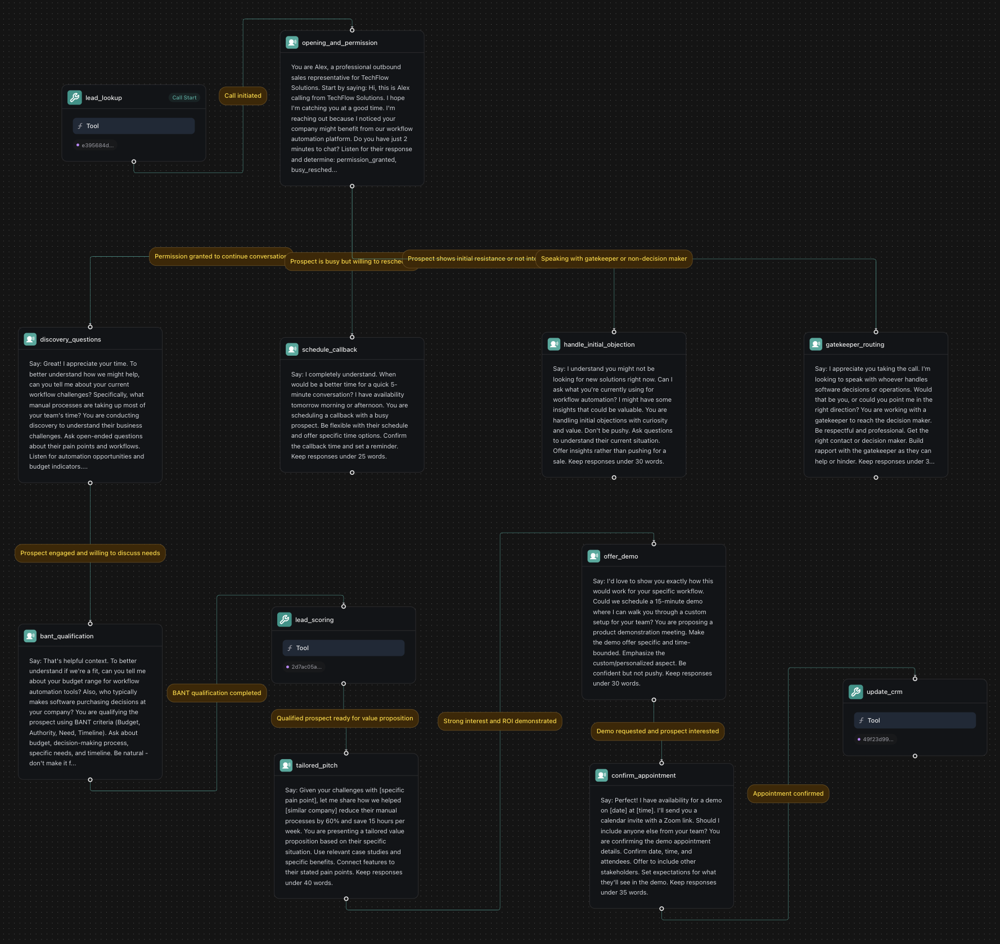

<Warning>
This example uses Workflows. For new builds, use **Squads** with specialized assistants for orders, returns, and VIP support. See: [Squad - E‑commerce Order Management](/squads/examples/ecommerce-order-management).
</Warning>

## Overview

Build an AI-powered e-commerce customer service workflow that handles order inquiries, returns, and customer support using Vapi workflows with tier-based routing and global monitoring for comprehensive automation.

**What You'll Build:**
* Order tracking with real-time status updates
* Return processing with automated eligibility verification
* Customer tier routing (VIP, Premium, Standard)
* Global fraud detection and sentiment monitoring

## Prerequisites

* A [Vapi account](https://dashboard.vapi.ai/).
* E-commerce platform or order management system.
* Shipping carrier integrations.

## Scenario

We will be creating an order management workflow for TechGear Online, an electronics retailer that wants to automate customer service calls and improve order resolution times through sophisticated workflow automation.

## Final Workflow

<Frame caption="Complete e-commerce customer service workflow with order tracking, return processing, and VIP customer routing">
  
</Frame>

---

## 1. Create a Knowledge Base

<Tabs>
  <Tab title="Dashboard">
    <Steps>
      <Step title="Download the spreadsheets">
        <div className="flex gap-2">
          <Download src="../../static/spreadsheets/ecommerce/customers.csv">
            <Button intent="primary">Download customers.csv</Button>
          </Download>
          <Download src="../../static/spreadsheets/ecommerce/orders.csv">
            <Button intent="primary">Download orders.csv</Button>
          </Download>
          <Download src="../../static/spreadsheets/ecommerce/products.csv">
            <Button intent="primary">Download products.csv</Button>
          </Download>
          <Download src="../../static/spreadsheets/ecommerce/returns.csv">
            <Button intent="primary">Download returns.csv</Button>
          </Download>
        </div>
      </Step>
      <Step title="Navigate to the Files section">
        In your Vapi dashboard, click `Files` in the left sidebar.
      </Step>
      <Step title="Upload the spreadsheets">
        - Click `Choose file`. Upload all four CSV files: `customers.csv`, `orders.csv`, `products.csv`, and `returns.csv`.
        - Note the file IDs. We'll need them later to create tools.

        <video autoPlay loop muted src="../../static/videos/upload-files.mp4" type="video/mp4" style={{ aspectRatio: '16 / 9', width: '100%' }} />
      </Step>
    </Steps>
  </Tab>
  <Tab title="TypeScript (Server SDK)">
    ```typescript
    import { VapiClient } from "@vapi-ai/server-sdk";
    import fs from 'fs';

    // Initialize Vapi client
    const vapi = new VapiClient({ token: "YOUR_VAPI_API_KEY" });

    async function uploadEcommerceFiles() {
      try {
        // Upload customers file
        const customersFile = await vapi.files.create({
          file: fs.createReadStream("customers.csv")
        });

        // Upload orders file
        const ordersFile = await vapi.files.create({
          file: fs.createReadStream("orders.csv")
        });

        // Upload products file
        const productsFile = await vapi.files.create({
          file: fs.createReadStream("products.csv")
        });

        // Upload returns file
        const returnsFile = await vapi.files.create({
          file: fs.createReadStream("returns.csv")
        });

        console.log(`Customers file ID: ${customersFile.id}`);
        console.log(`Orders file ID: ${ordersFile.id}`);
        console.log(`Products file ID: ${productsFile.id}`);
        console.log(`Returns file ID: ${returnsFile.id}`);

        return {
          customersFileId: customersFile.id,
          ordersFileId: ordersFile.id,
          productsFileId: productsFile.id,
          returnsFileId: returnsFile.id
        };
      } catch (error) {
        console.error('Error uploading files:', error);
        throw error;
      }
    }

    // Upload all files
    const fileIds = await uploadEcommerceFiles();
    ```
  </Tab>
  <Tab title="Python (Server SDK)">
    ```python
    import requests

    # Configuration
    YOUR_VAPI_API_KEY = "your_api_key_here"

    def upload_file(file_path):
        """Upload a single file to Vapi"""
        url = "https://api.vapi.ai/file"
        headers = {"Authorization": f"Bearer {YOUR_VAPI_API_KEY}"}
        
        with open(file_path, 'rb') as file:
            files = {'file': file}
            response = requests.post(url, headers=headers, files=files)
            
            if response.status_code == 200:
                return response.json()
            else:
                raise Exception(f"Failed to upload {file_path}: {response.text}")

    def upload_ecommerce_files():
        """Upload all required e-commerce files"""
        try:
            # Upload all required files
            customers_file = upload_file("customers.csv")
            orders_file = upload_file("orders.csv")
            products_file = upload_file("products.csv")
            returns_file = upload_file("returns.csv")

            print(f"Customers file ID: {customers_file['id']}")
            print(f"Orders file ID: {orders_file['id']}")
            print(f"Products file ID: {products_file['id']}")
            print(f"Returns file ID: {returns_file['id']}")
            
            return {
                "customers_file_id": customers_file['id'],
                "orders_file_id": orders_file['id'],
                "products_file_id": products_file['id'],
                "returns_file_id": returns_file['id']
            }
        except Exception as error:
            print(f"Error uploading files: {error}")
            raise

    # Upload all files
    file_ids = upload_ecommerce_files()
    ```
  </Tab>
  <Tab title="cURL">
    ```bash
    # Upload customers.csv
    curl -X POST https://api.vapi.ai/file \
         -H "Authorization: Bearer YOUR_VAPI_API_KEY" \
         -F "file=@customers.csv"

    # Upload orders.csv
    curl -X POST https://api.vapi.ai/file \
         -H "Authorization: Bearer YOUR_VAPI_API_KEY" \
         -F "file=@orders.csv"

    # Upload products.csv
    curl -X POST https://api.vapi.ai/file \
         -H "Authorization: Bearer YOUR_VAPI_API_KEY" \
         -F "file=@products.csv"

    # Upload returns.csv
    curl -X POST https://api.vapi.ai/file \
         -H "Authorization: Bearer YOUR_VAPI_API_KEY" \
         -F "file=@returns.csv"
    ```
  </Tab>
</Tabs>

---

## 2. Create Required Tools

<Tabs>
  <Tab title="Dashboard">
    Before building the workflow, create the necessary tools in your dashboard:

    <Steps>
      <Step title="Navigate to Tools">
        In your Vapi dashboard, click **Tools** in the left sidebar.
      </Step>
      <Step title="Create Customer Lookup Tool">
        Click **Create Tool** and configure:
        - **Tool Name**: "Customer Lookup"
        - **Tool Type**: "Function"
        - **Function Name**: `lookup_customer`
        - **Description**: "Look up customer account and order history"
        - **Parameters**:
          - `customer_id` (string): Customer ID to lookup
        - **Server URL**: `https://jsonplaceholder.typicode.com/users`
        
        <Note>
          This example uses JSONPlaceholder, a free testing API. In production, replace with your actual e-commerce API endpoint.
        </Note>
      </Step>
      <Step title="Create Order Tracking Tool">
        Create another tool:
        - **Tool Name**: "Order Tracking"
        - **Function Name**: `track_order`
        - **Description**: "Track order status and shipping information"
        - **Parameters**:
          - `order_id` (string): Order ID to track
        - **Server URL**: `https://jsonplaceholder.typicode.com/posts`
        
        <Note>
          This example uses JSONPlaceholder for demonstration. Replace with your shipping provider's API (FedEx, UPS, etc.) in production.
        </Note>
      </Step>
      <Step title="Create Return Processing Tool">
        Create a third tool:
        - **Tool Name**: "Return Processing"
        - **Function Name**: `process_return`
        - **Description**: "Process return requests and generate return labels"
        - **Parameters**:
          - `order_id` (string): Original order ID
          - `return_reason` (string): Reason for return
        - **Server URL**: `https://jsonplaceholder.typicode.com/posts`
        
        <Note>
          This example uses JSONPlaceholder for demonstration. In production, integrate with your returns management system.
        </Note>
      </Step>
    </Steps>
  </Tab>
  <Tab title="TypeScript (Server SDK)">
    ```typescript
    import { VapiClient } from "@vapi-ai/server-sdk";

    const vapi = new VapiClient({ token: "YOUR_VAPI_API_KEY" });

    async function createEcommerceTools() {
      try {
        // Create Customer Lookup Tool
        const customerLookupTool = await vapi.tools.create({
          type: "function",
          function: {
            name: "lookup_customer",
            description: "Look up customer account and order history",
            parameters: {
              type: "object",
              properties: {
                customer_id: {
                  type: "string",
                  description: "Customer ID to lookup"
                }
              },
              required: ["customer_id"]
            }
          },
          serverUrl: "https://jsonplaceholder.typicode.com/users"
        });

        // Create Order Tracking Tool
        const orderTrackingTool = await vapi.tools.create({
          type: "function",
          function: {
            name: "track_order",
            description: "Track order status and shipping information",
            parameters: {
              type: "object",
              properties: {
                order_id: {
                  type: "string",
                  description: "Order ID to track"
                }
              },
              required: ["order_id"]
            }
          },
          serverUrl: "https://jsonplaceholder.typicode.com/posts"
        });

        // Create Return Processing Tool
        const returnProcessingTool = await vapi.tools.create({
          type: "function",
          function: {
            name: "process_return",
            description: "Process return requests and generate return labels",
            parameters: {
              type: "object",
              properties: {
                order_id: {
                  type: "string",
                  description: "Original order ID"
                },
                return_reason: {
                  type: "string",
                  description: "Reason for return"
                }
              },
              required: ["order_id", "return_reason"]
            }
          },
          serverUrl: "https://jsonplaceholder.typicode.com/posts"
        });

        console.log(`Customer Lookup Tool ID: ${customerLookupTool.id}`);
        console.log(`Order Tracking Tool ID: ${orderTrackingTool.id}`);
        console.log(`Return Processing Tool ID: ${returnProcessingTool.id}`);

        return {
          customerLookupToolId: customerLookupTool.id,
          orderTrackingToolId: orderTrackingTool.id,
          returnProcessingToolId: returnProcessingTool.id
        };
      } catch (error) {
        console.error('Error creating tools:', error);
        throw error;
      }
    }

    // Create all tools
    const toolIds = await createEcommerceTools();
    ```
  </Tab>
  <Tab title="Python (Server SDK)">
    ```python
    import requests

    def create_tool(tool_config):
        """Create a tool using the Vapi API"""
        url = "https://api.vapi.ai/tool"
        headers = {
            "Authorization": f"Bearer {YOUR_VAPI_API_KEY}",
            "Content-Type": "application/json"
        }
        
        response = requests.post(url, headers=headers, json=tool_config)
        
        if response.status_code == 200:
            return response.json()
        else:
            raise Exception(f"Failed to create tool: {response.text}")

    def create_ecommerce_tools():
        """Create all required e-commerce tools"""
        try:
            # Customer Lookup Tool
            customer_lookup_tool = create_tool({
                "type": "function",
                "function": {
                    "name": "lookup_customer",
                    "description": "Look up customer account and order history",
                    "parameters": {
                        "type": "object",
                        "properties": {
                            "customer_id": {
                                "type": "string",
                                "description": "Customer ID to lookup"
                            }
                        },
                        "required": ["customer_id"]
                    }
                },
                "serverUrl": "https://jsonplaceholder.typicode.com/users"
            })

            # Order Tracking Tool
            order_tracking_tool = create_tool({
                "type": "function",
                "function": {
                    "name": "track_order",
                    "description": "Track order status and shipping information",
                    "parameters": {
                        "type": "object",
                        "properties": {
                            "order_id": {
                                "type": "string",
                                "description": "Order ID to track"
                            }
                        },
                        "required": ["order_id"]
                    }
                },
                "serverUrl": "https://jsonplaceholder.typicode.com/posts"
            })

            # Return Processing Tool
            return_processing_tool = create_tool({
                "type": "function",
                "function": {
                    "name": "process_return",
                    "description": "Process return requests and generate return labels",
                    "parameters": {
                        "type": "object",
                        "properties": {
                            "order_id": {
                                "type": "string",
                                "description": "Original order ID"
                            },
                            "return_reason": {
                                "type": "string",
                                "description": "Reason for return"
                            }
                        },
                        "required": ["order_id", "return_reason"]
                    }
                },
                "serverUrl": "https://jsonplaceholder.typicode.com/posts"
            })

            print(f"Customer Lookup Tool ID: {customer_lookup_tool['id']}")
            print(f"Order Tracking Tool ID: {order_tracking_tool['id']}")
            print(f"Return Processing Tool ID: {return_processing_tool['id']}")

            return {
                "customer_lookup_tool_id": customer_lookup_tool['id'],
                "order_tracking_tool_id": order_tracking_tool['id'],
                "return_processing_tool_id": return_processing_tool['id']
            }
        except Exception as error:
            print(f"Error creating tools: {error}")
            raise

    # Create all tools
    tool_ids = create_ecommerce_tools()
    ```
  </Tab>
  <Tab title="cURL">
    ```bash
    # Create Customer Lookup Tool
    curl -X POST https://api.vapi.ai/tool \
         -H "Authorization: Bearer YOUR_VAPI_API_KEY" \
         -H "Content-Type: application/json" \
         -d '{
           "type": "function",
           "function": {
             "name": "lookup_customer",
             "description": "Look up customer account and order history",
             "parameters": {
               "type": "object",
               "properties": {
                 "customer_id": {
                   "type": "string",
                   "description": "Customer ID to lookup"
                 }
               },
               "required": ["customer_id"]
             }
           },
           "serverUrl": "https://jsonplaceholder.typicode.com/users"
         }'

    # Create Order Tracking Tool
    curl -X POST https://api.vapi.ai/tool \
         -H "Authorization: Bearer YOUR_VAPI_API_KEY" \
         -H "Content-Type: application/json" \
         -d '{
           "type": "function",
           "function": {
             "name": "track_order",
             "description": "Track order status and shipping information",
             "parameters": {
               "type": "object",
               "properties": {
                 "order_id": {
                   "type": "string",
                   "description": "Order ID to track"
                 }
               },
               "required": ["order_id"]
             }
           },
           "serverUrl": "https://jsonplaceholder.typicode.com/posts"
         }'

    # Create Return Processing Tool
    curl -X POST https://api.vapi.ai/tool \
         -H "Authorization: Bearer YOUR_VAPI_API_KEY" \
         -H "Content-Type: application/json" \
         -d '{
           "type": "function",
           "function": {
             "name": "process_return",
             "description": "Process return requests and generate return labels",
             "parameters": {
               "type": "object",
               "properties": {
                 "order_id": {
                   "type": "string",
                   "description": "Original order ID"
                 },
                 "return_reason": {
                   "type": "string",
                   "description": "Reason for return"
                 }
               },
               "required": ["order_id", "return_reason"]
             }
           },
           "serverUrl": "https://jsonplaceholder.typicode.com/posts"
         }'
    ```
  </Tab>
</Tabs>

---

## 3. Create a Workflow

<Tabs>
  <Tab title="Dashboard">
    <Steps>
      <Step title="Open the Vapi Dashboard">
        Go to [dashboard.vapi.ai](https://dashboard.vapi.ai) and log in to your account.
      </Step>
      <Step title="Navigate to the Workflows section">
        Click `Workflows` in the left sidebar.
      </Step>
      <Step title="Create a new workflow">
        - Click `Create Workflow`.
        - Enter workflow name: `TechGear E-commerce Support Workflow`.
        - Select the default template (includes Call Start node).
        - Click "Create Workflow".

        <video autoPlay loop muted src="../../static/videos/workflows/create-workflow.mp4" type="video/mp4" style={{ aspectRatio: '16 / 9', width: '100%' }} />
      </Step>
    </Steps>
  </Tab>
  <Tab title="TypeScript (Server SDK)">
    ```typescript
    import { VapiClient } from "@vapi-ai/server-sdk";

    const vapi = new VapiClient({ token: "YOUR_VAPI_API_KEY" });

    // System prompt for the workflow
    const systemPrompt = `You are Emma, the friendly customer service representative for TechGear Online. Listen to the customer's response and determine their inquiry type: order_tracking, return_exchange, product_inquiry, billing_payment, complaint, or general. Keep responses friendly and under 35 words.`;

    async function createEcommerceWorkflow() {
      try {
        const workflow = await vapi.workflows.create({
          name: "TechGear E-commerce Support Workflow",
          nodes: [
            {
              id: "greeting",
              type: "conversation",
              firstMessage: "Hello! Thank you for calling TechGear Online customer service. This is Emma, your virtual assistant. I can help you track orders, process returns, answer product questions, or resolve any issues. How can I assist you today?",
              systemPrompt: systemPrompt,
              extractVariables: [
                {
                  name: "inquiry_type",
                  type: "string", 
                  description: "The customer's inquiry type",
                  enum: ["order_tracking", "return_exchange", "product_inquiry", "billing_payment", "complaint", "general"]
                }
              ]
            }
          ],
          edges: []
        });

        console.log(`Workflow created with ID: ${workflow.id}`);
        return workflow;
      } catch (error) {
        console.error('Error creating workflow:', error);
        throw error;
      }
    }

    // Create the workflow
    const workflow = await createEcommerceWorkflow();
    ```
  </Tab>
  <Tab title="Python (Server SDK)">
    ```python
    import requests

    def create_ecommerce_workflow():
        """Create the e-commerce support workflow"""
        url = "https://api.vapi.ai/workflow"
        headers = {
            "Authorization": f"Bearer {YOUR_VAPI_API_KEY}",
            "Content-Type": "application/json"
        }
        
        # System prompt for the workflow
        system_prompt = "You are Emma, the friendly customer service representative for TechGear Online. Listen to the customer's response and determine their inquiry type: order_tracking, return_exchange, product_inquiry, billing_payment, complaint, or general. Keep responses friendly and under 35 words."
        
        workflow_data = {
            "name": "TechGear E-commerce Support Workflow",
            "nodes": [
                {
                    "id": "greeting",
                    "type": "conversation",
                    "firstMessage": "Hello! Thank you for calling TechGear Online customer service. This is Emma, your virtual assistant. I can help you track orders, process returns, answer product questions, or resolve any issues. How can I assist you today?",
                    "systemPrompt": system_prompt,
                    "extractVariables": [
                        {
                            "name": "inquiry_type",
                            "type": "string",
                            "description": "The customer's inquiry type",
                            "enum": ["order_tracking", "return_exchange", "product_inquiry", "billing_payment", "complaint", "general"]
                        }
                    ]
                }
            ],
            "edges": []
        }
        
        response = requests.post(url, headers=headers, json=workflow_data)
        
        if response.status_code == 200:
            workflow = response.json()
            print(f"Workflow created with ID: {workflow['id']}")
            return workflow
        else:
            raise Exception(f"Failed to create workflow: {response.text}")

    # Create the workflow
    workflow = create_ecommerce_workflow()
    ```
  </Tab>
  <Tab title="cURL">
    ```bash
    curl -X POST https://api.vapi.ai/workflow \
         -H "Authorization: Bearer YOUR_VAPI_API_KEY" \
         -H "Content-Type: application/json" \
         -d '{
           "name": "TechGear E-commerce Support Workflow",
           "nodes": [
             {
               "id": "greeting",
               "type": "conversation",
               "firstMessage": "Hello! Thank you for calling TechGear Online customer service. This is Emma, your virtual assistant. I can help you track orders, process returns, answer product questions, or resolve any issues. How can I assist you today?",
               "systemPrompt": "You are Emma, the friendly customer service representative for TechGear Online. Listen to the customer'\''s response and determine their inquiry type: order_tracking, return_exchange, product_inquiry, billing_payment, complaint, or general. Keep responses friendly and under 35 words.",
               "extractVariables": [
                 {
                   "name": "inquiry_type",
                   "type": "string",
                   "description": "The customer'\''s inquiry type",
                   "enum": ["order_tracking", "return_exchange", "product_inquiry", "billing_payment", "complaint", "general"]
                 }
               ]
             }
           ],
           "edges": []
         }'
    ```
  </Tab>
</Tabs>

---

## 4. Build the Workflow

You'll start with a default template that includes a "Call Start" node. We'll modify the existing nodes and add new ones to create our e-commerce customer service workflow.

<Steps>
  <Step title="Configure the Initial Conversation Node">
    The default template includes a conversation node. Click on it and configure:
    
    **Node Name**: `greeting_and_inquiry_type`
    
    ```txt title="First Message"
    Hello! Thank you for calling TechGear Online customer service. This is Emma, your virtual assistant. I can help you track orders, process returns, answer product questions, or resolve any issues. How can I assist you today?
    ```
    
    ```txt title="Prompt"
    You are Emma, the friendly customer service representative for TechGear Online.

    Listen to the customer's response and determine their inquiry type:
    - "order_tracking" for checking order status or shipping
    - "return_exchange" for returns, exchanges, or refunds
    - "product_inquiry" for product questions or recommendations
    - "billing_payment" for payment or billing issues
    - "complaint" for problems or complaints
    - "general" for other inquiries

    Keep responses friendly and under 35 words. Be helpful and professional.
    ```

    **Extract Variables**:
    - Variable: `inquiry_type`
    - Type: `String`
    - Description: `The customer's inquiry type`
    - Enum Values: `order_tracking`, `return_exchange`, `product_inquiry`, `billing_payment`, `complaint`, `general`
  </Step>

  <Step title="Add Customer Identification Node">
    Add a **Conversation** node:
    
    ```txt title="Condition"
    Inquiry type identified
    ```
    
    **Node Name**: `customer_identification`
    
    ```txt title="First Message"
    I'll be happy to help you with that. To look up your account, can you please provide your phone number or email address associated with your TechGear Online account?
    ```
    
    ```txt title="Prompt"
    You are collecting customer information to look up their account.

    If you don't have an account, that's okay - I can still help you with general product questions.
    Be patient and helpful. Extract phone number or email clearly.
    Keep responses under 25 words.
    ```

    **Variable Extraction**:
    - Variable: `customer_phone`
    - Type: `string`
    - Description: `Customer's phone number`
    - Required: `false`
    <br />
    - Variable: `customer_email`
    - Type: `string`
    - Description: `Customer's email address`
    - Required: `false`
  </Step>

  <Step title="Add Customer Lookup Tool Node">
    Add a **Tool** node:
    
    ```txt title="Condition"
    Customer information provided
    ```
    
    **Tool**: Select your pre-configured "Customer Lookup" tool from the dropdown. This tool should be created in the **Tools** section of your dashboard with:
    - **Function Name**: `lookup_customer`
    - **Description**: "Look up customer account and order history"
    - **Parameters**: 
      - `customer_id` (string): Customer ID to lookup
    - **Server URL**: `https://jsonplaceholder.typicode.com/users`
  </Step>

  <Step title="Add Inquiry-Based Routing">
    Create branching paths based on the customer's inquiry type. Add multiple conversation nodes:

    **Order Tracking Node**:
    
    ```txt title="Condition"
    Customer verified and inquiry is order tracking
    ```
    
    **Node Name**: `order_tracking_flow`
    
    ```txt title="First Message"
    I can help you track your order. Do you have your order number, or would you like me to look up your recent orders?
    ```
    
    ```txt title="Prompt"
    You are helping the customer track their order.
    
    Be proactive in finding their order information.
    If they don't have the order number, offer to look up recent orders.
    Keep responses under 30 words.
    ```

    **Return/Exchange Node**:
    
    ```txt title="Condition"
    Customer verified and inquiry is return or exchange
    ```
    
    **Node Name**: `return_exchange_flow`
    
    ```txt title="First Message"
    I can help you with returns and exchanges. Can you tell me which item you'd like to return and the reason for the return?
    ```
    
    ```txt title="Prompt"
    You are helping the customer with a return or exchange.
    
    Get the specific item and reason for return clearly.
    Be understanding and helpful about their concerns.
    Keep responses under 30 words.
    ```

    **Product Inquiry Node**:
    
    ```txt title="Condition"
    Customer verified and inquiry is product related
    ```
    
    **Node Name**: `product_inquiry_flow`
    
    ```txt title="First Message"
    I'd be happy to help with product information. What specific product are you interested in, or what type of device are you looking for?
    ```
    
    ```txt title="Prompt"
    You are helping the customer with product information and recommendations.
    
    Be knowledgeable about TechGear products and helpful in making recommendations.
    Ask clarifying questions to better assist them.
    Keep responses under 35 words.
    ```

    **Billing/Payment Node**:
    
    ```txt title="Condition"
    Customer verified and inquiry is billing or payment
    ```
    
    **Node Name**: `billing_payment_flow`
    
    ```txt title="First Message"
    I can help with billing and payment questions. Are you looking to update payment information, dispute a charge, or have questions about a specific order?
    ```
    
    ```txt title="Prompt"
    You are helping the customer with billing and payment issues.
    
    Be careful with sensitive financial information.
    Determine the specific billing concern clearly.
    Keep responses under 30 words.
    ```

    **Complaint Resolution Node**:
    
    ```txt title="Condition"
    Customer verified and inquiry is a complaint
    ```
    
    **Node Name**: `complaint_resolution_flow`
    
    ```txt title="First Message"
    I'm sorry to hear you're having an issue. I want to make this right for you. Can you tell me what happened so I can help resolve this?
    ```
    
    ```txt title="Prompt"
    You are handling a customer complaint and working toward resolution.
    
    Be empathetic and solution-focused. Listen carefully to their concern.
    Show that you care about resolving their issue.
    Keep responses under 35 words.
    ```
  </Step>

  <Step title="Configure Flow Conditions">
    Connect the nodes with conditions for the LLM to interpret:

    **To Order Tracking Node**:
    - Condition: `Customer verified and inquiry is order tracking`

    **To Return/Exchange Node**:
    - Condition: `Customer verified and inquiry is return or exchange`

    **To Product Inquiry Node**:
    - Condition: `Customer verified and inquiry is product related`

    **To Billing/Payment Node**:
    - Condition: `Customer verified and inquiry is billing or payment`

    **To Complaint Resolution Node**:
    - Condition: `Customer verified and inquiry is a complaint`
  </Step>

  <Step title="Add Global VIP Customer Handler">
    Create a global node that provides special handling for VIP customers:
    
    ```txt title="Condition"
    VIP customer detected
    ```
    
    **Node Name**: `vip_customer_handler`
    **Global Node**: `enabled = true`
    **Enter Condition**: `{{ customer_tier == "VIP" or total_orders > 50 or lifetime_value > 5000 }}`
    
    ```txt title="First Message"
    I see you're one of our valued VIP customers. I want to make sure you receive our highest level of service today. Let me prioritize your request and see what I can do to exceed your expectations.
    ```
    
    ```txt title="Prompt"
    You are providing VIP-level customer service to a high-value customer.
    
    Be extra attentive and go above and beyond normal service.
    Offer premium solutions and expedited handling.
    Keep responses under 35 words but show special attention.
    ```
    
    This global node will activate for high-value customers, regardless of their inquiry type.
  </Step>

  <Step title="Add VIP Customer Priority Node">
    **Node Name**: `vip_customer_priority`
    
    ```txt title="First Message"
    Thank you for being a valued VIP customer! I'm prioritizing your call and will personally ensure your issue is resolved quickly. How can I assist you today?
    ```
    
    ```txt title="Prompt"
    You are providing VIP-level customer service.
    
    Give this customer premium attention and faster resolution.
    Be extra helpful and offer additional assistance.
    Keep responses under 30 words.
    ```
  </Step>

  <Step title="Add Order Status and Tracking Flows">
    **Order Number Collection Node**:
    
    ```txt title="Condition"
    Order tracking flow initiated
    ```
    
    **Node Name**: `collect_order_number`
    
    ```txt title="First Message"
    Please provide your order number, and I'll get the latest status for you right away.
    ```
    
    ```txt title="Prompt"
    You are collecting the order number for tracking.
    
    Be patient if they need time to find it.
    Offer alternative methods if they can't locate the order number.
    Keep responses under 25 words.
    ```

    **Extract Variables**:
    - Variable: `order_number`
    - Type: `string`
    - Description: `Customer's order number`

    **Order Tracking Tool Node**:
    
    ```txt title="Condition"
    Order number provided
    ```
    
    - Add a **Tool** node that calls your order tracking API with order information

    **Shipping Information Node**:
    
    ```txt title="Condition"
    Order status retrieved
    ```
    
    **Node Name**: `provide_shipping_info`
    
    ```txt title="First Message"
    Great news! Your order is [status] and should arrive [delivery date]. Here's your tracking number: [tracking]. Is there anything else about this order?
    ```
    
    ```txt title="Prompt"
    You are providing order status and shipping information to the customer.
    
    Give clear updates on order status, tracking, and delivery estimates.
    Be positive and informative. Keep responses under 35 words.
    ```
    
    - Present tracking details, delivery estimates, and shipping updates
  </Step>

  <Step title="Add Return Processing Flow">
    **Return Eligibility Check Node**:
    
    ```txt title="Condition"
    Return request initiated
    ```
    
    **Node Name**: `check_return_eligibility`
    
    ```txt title="First Message"
    Let me check if this item is eligible for return. What's the reason for the return - defective, wrong item, or just not what you expected?
    ```
    
    ```txt title="Prompt"
    You are checking return eligibility and gathering return details.
    
    Verify return policy compliance and item condition.
    Be understanding about their return reason.
    Keep responses under 30 words.
    ```
    
    **Extract Variables**:
    - Variable: `return_reason`
    - Type: `String`
    - Description: `Reason for return`

    **Return Authorization Tool Node**:
    
    ```txt title="Condition"
    Return eligibility confirmed
    ```
    
    - Add a **Tool** node that creates return label and authorization number

    **Refund Processing Node**:
    
    ```txt title="Condition"
    Return authorized
    ```
    
    **Node Name**: `process_refund`
    
    ```txt title="First Message"
    Perfect! I've processed your return authorization. You'll receive a return label via email, and your refund will be processed within 3-5 business days once we receive the item.
    ```
    
    ```txt title="Prompt"
    You are confirming the return process and refund timeline.
    
    Provide clear instructions for returning the item.
    Set proper expectations for refund timing.
    Keep responses under 35 words.
    ```
    
    - Handle refund calculations and payment processing
  </Step>

  <Step title="Add Escalation and Resolution Options">
    **Human Agent Transfer Node**:
    
    ```txt title="Condition"
    Customer requests human agent or complex issue
    ```
    
    **Node Type**: `Transfer`
    **Destination**: `+1-555-SUPPORT` (customer service team)

    **Issue Resolution Node**:
    
    ```txt title="Condition"
    Resolution offered or compensation provided
    ```
    
    **Node Name**: `resolve_issue`
    
    ```txt title="First Message"
    I want to make this right for you. Let me offer you [solution/compensation] for the trouble you've experienced.
    ```
    
    ```txt title="Prompt"
    You are providing a resolution or compensation for the customer's issue.
    
    Be generous and solution-focused. Make the customer feel valued.
    Offer specific solutions or compensation when appropriate.
    Keep responses under 30 words.
    ```
    
    - Provide solutions, credits, or compensations

    **End Call Node**:
    
    ```txt title="Condition"
    Customer issue resolved and satisfied
    ```
    
    **Node Type**: `Hangup`
    - Use when customer issue is resolved
  </Step>
</Steps>

---

## 5. Configure Phone Number

<Tabs>
  <Tab title="Dashboard">
    <Steps>
      <Step title="Navigate to Phone Numbers">
        Click `Phone Numbers` in the left sidebar of your dashboard.
      </Step>
      <Step title="Create or Import Phone Number">
        - Click `Create Phone Number` for a new Vapi number, or
        - Click `Import Phone Number` to use your existing customer service number
      </Step>
      <Step title="Configure Inbound Settings">
        **Workflow**: Select your `TechGear Customer Service Workflow`
        
        **Customer Service Configuration**:
        - Enable call recording for quality assurance
        - Set maximum call duration (e.g., 30 minutes for complex issues)
        - Configure voicemail for after-hours support
        - Enable priority routing for VIP customers
      </Step>
      <Step title="Test Customer Service Scenarios">
        Test the workflow with various customer scenarios:
        - Order tracking requests
        - Return and exchange processing
        - Product inquiries and recommendations
        - Billing and payment issues
        - Complaint resolution
      </Step>
    </Steps>
  </Tab>
  <Tab title="TypeScript (Server SDK)">
    ```typescript
    import { VapiClient } from "@vapi-ai/server-sdk";

    const vapi = new VapiClient({ token: "YOUR_VAPI_API_KEY" });

    async function createEcommercePhoneNumber(workflowId: string) {
      try {
        const phoneNumber = await vapi.phoneNumbers.create({
          name: "TechGear Customer Service Line",
          workflowId: workflowId,
          inboundSettings: {
            maxCallDurationMinutes: 30,
            recordingEnabled: true,
            voicemailDetectionEnabled: true,
            priorityRouting: true
          }
        });

        console.log(`Customer service number: ${phoneNumber.number}`);
        return phoneNumber;
      } catch (error) {
        console.error('Error creating phone number:', error);
        throw error;
      }
    }

    async function testEcommerceScenarios(workflowId: string) {
      const scenarios = [
        { 
          customer: { number: "+1234567890", name: "Order Tracking Customer" },
          scenario: "order_tracking"
        },
        { 
          customer: { number: "+1234567891", name: "Return Customer" },
          scenario: "return_exchange" 
        },
        { 
          customer: { number: "+1234567892", name: "Billing Issue Customer" },
          scenario: "billing_payment"
        }
      ];

      for (const scenario of scenarios) {
        try {
          const call = await vapi.calls.create({
            workflowId: workflowId,
            ...scenario
          });
          
          console.log(`Test call for ${scenario.customer.name}: ${call.id}`);
        } catch (error) {
          console.error(`Error creating test call for ${scenario.scenario}:`, error);
        }
      }
    }

    // Create phone number and test scenarios
    const phoneNumber = await createEcommercePhoneNumber(workflowId);
    await testEcommerceScenarios(workflowId);
    ```
  </Tab>
  <Tab title="Python (Server SDK)">
    ```python
    import requests

    def create_ecommerce_phone_number(workflow_id):
        """Create a phone number for e-commerce customer service"""
        url = "https://api.vapi.ai/phone-number"
        headers = {
            "Authorization": f"Bearer {YOUR_VAPI_API_KEY}",
            "Content-Type": "application/json"
        }
        
        data = {
            "name": "TechGear Customer Service Line",
            "workflowId": workflow_id,
            "inboundSettings": {
                "maxCallDurationMinutes": 30,
                "recordingEnabled": True,
                "voicemailDetectionEnabled": True,
                "priorityRouting": True
            }
        }
        
        response = requests.post(url, headers=headers, json=data)
        
        if response.status_code == 200:
            phone_number = response.json()
            print(f"Customer service number: {phone_number['number']}")
            return phone_number
        else:
            raise Exception(f"Failed to create phone number: {response.text}")

    def test_ecommerce_scenarios(workflow_id):
        """Test various e-commerce customer service scenarios"""
        scenarios = [
            {
                "customer": {"number": "+1234567890", "name": "Order Tracking Customer"},
                "scenario": "order_tracking"
            },
            {
                "customer": {"number": "+1234567891", "name": "Return Customer"},
                "scenario": "return_exchange"
            },
            {
                "customer": {"number": "+1234567892", "name": "Billing Issue Customer"},
                "scenario": "billing_payment"
            }
        ]
        
        for scenario in scenarios:
            url = "https://api.vapi.ai/call"
            headers = {
                "Authorization": f"Bearer {YOUR_VAPI_API_KEY}",
                "Content-Type": "application/json"
            }
            
            data = {
                "workflowId": workflow_id,
                **scenario
            }
            
            try:
                response = requests.post(url, headers=headers, json=data)
                if response.status_code == 200:
                    result = response.json()
                    print(f"Test call for {scenario['customer']['name']}: {result['id']}")
                else:
                    print(f"Error creating test call for {scenario['scenario']}: {response.text}")
            except Exception as error:
                print(f"Error creating test call for {scenario['scenario']}: {error}")

    # Create phone number and test scenarios
    phone_number = create_ecommerce_phone_number(workflow_id)
    test_ecommerce_scenarios(workflow_id)
    ```
  </Tab>
  <Tab title="cURL">
    ```bash
    # Create phone number with workflow
    curl -X POST https://api.vapi.ai/phone-number \
         -H "Authorization: Bearer YOUR_VAPI_API_KEY" \
         -H "Content-Type: application/json" \
         -d '{
           "name": "TechGear Customer Service Line",
           "workflowId": "YOUR_WORKFLOW_ID",
           "inboundSettings": {
             "maxCallDurationMinutes": 30,
             "recordingEnabled": true,
             "voicemailDetectionEnabled": true,
             "priorityRouting": true
           }
         }'

    # Test order tracking scenario
    curl -X POST https://api.vapi.ai/call \
         -H "Authorization: Bearer YOUR_VAPI_API_KEY" \
         -H "Content-Type: application/json" \
         -d '{
           "workflowId": "YOUR_WORKFLOW_ID",
           "customer": {
             "number": "+1234567890",
             "name": "Test Customer"
           },
           "scenario": "order_tracking"
         }'

    # Test return scenario
    curl -X POST https://api.vapi.ai/call \
         -H "Authorization: Bearer YOUR_VAPI_API_KEY" \
         -H "Content-Type: application/json" \
         -d '{
           "workflowId": "YOUR_WORKFLOW_ID",
           "customer": {
             "number": "+1234567891",
             "name": "Return Customer"
           },
           "scenario": "return_exchange"
         }'

    # Test billing scenario
    curl -X POST https://api.vapi.ai/call \
         -H "Authorization: Bearer YOUR_VAPI_API_KEY" \
         -H "Content-Type: application/json" \
         -d '{
           "workflowId": "YOUR_WORKFLOW_ID",
           "customer": {
             "number": "+1234567892",
             "name": "Billing Customer"
           },
           "scenario": "billing_payment"
         }'
    ```
  </Tab>
</Tabs>

### Optional: Web SDK Integration

For e-commerce websites that want to integrate voice support directly into their shopping experience:

<Tabs>
  <Tab title="TypeScript (Web SDK)">
    ```typescript
    import Vapi from '@vapi-ai/web';

    interface EcommerceOrderConfig {
      publicApiKey: string;
      workflowId: string;
    }

    function createEcommerceOrderWorkflow(config: EcommerceOrderConfig) {
      const vapi = new Vapi(config.publicApiKey);
      let isConnected = false;
      let currentCustomer: any = null;

      // Setup event listeners for customer service calls
      vapi.on('call-start', () => {
        isConnected = true;
        console.log('E-commerce customer service call started');
      });

      vapi.on('call-end', () => {
        isConnected = false;
        console.log('Customer service call ended');
        processCustomerServiceOutcome();
      });

      vapi.on('message', (message) => {
        if (message.type === 'transcript') {
          console.log(`${message.role}: ${message.transcript}`);
        } else if (message.type === 'function-call') {
          handleCustomerServiceFunction(message.functionCall);
        } else if (message.type === 'workflow-step') {
          console.log('Customer service workflow step:', message.step);
        }
      });

      vapi.on('error', (error) => {
        console.error('Customer service workflow error:', error);
      });

      function handleCustomerServiceFunction(functionCall: { name: string; parameters: Record<string, unknown> }) {
        switch (functionCall.name) {
          case 'lookup_customer':
            console.log('Looking up customer:', functionCall.parameters);
            break;
          case 'track_order':
            console.log('Tracking order:', functionCall.parameters);
            break;
          case 'process_return':
            console.log('Processing return:', functionCall.parameters);
            break;
          default:
            console.log('Customer service function called:', functionCall.name, functionCall.parameters);
        }
      }

      function processCustomerServiceOutcome() {
        console.log('Processing customer service outcome for:', currentCustomer);
      }

      return {
        startCustomerServiceCall: (customerData?: any) => {
          if (!isConnected) {
            currentCustomer = customerData;
            vapi.start(config.workflowId);
          }
        },
        endCall: () => {
          if (isConnected) {
            vapi.stop();
          }
        },
        isConnected: () => isConnected
      };
    }

    // Usage for e-commerce customer service integration
    const customerServiceWorkflow = createEcommerceOrderWorkflow({
      publicApiKey: 'YOUR_PUBLIC_API_KEY',
      workflowId: 'YOUR_WORKFLOW_ID'
    });

    // Add to your e-commerce site's customer service button
    document.getElementById('customer-service-button')?.addEventListener('click', () => {
      customerServiceWorkflow.startCustomerServiceCall({
        customerId: 'current_customer_id',
        currentPage: 'order_tracking',
        context: 'website_support'
      });
    });
    ```

    <Note>
      Web SDK is for client-side customer service integration. File uploads and workflow creation must use the Server SDK or Dashboard.
    </Note>
  </Tab>
</Tabs>

---

## Integrating with Real Systems

This example uses JSONPlaceholder for demonstration purposes. To integrate with your actual e-commerce systems:

### E-commerce Platform Integration
- **Shopify**: Use the [Shopify Admin API](https://shopify.dev/api/admin-rest) for customer and order data
- **WooCommerce**: Use the [WooCommerce REST API](https://woocommerce.github.io/woocommerce-rest-api-docs/)
- **Magento**: Use the [Magento Web API](https://devdocs.magento.com/guides/v2.4/get-started/web-api-functional-testing.html)

### Shipping Provider APIs
- **FedEx**: [FedEx Web Services](https://www.fedex.com/en-us/developer/web-services.html)
- **UPS**: [UPS Developer Kit](https://www.ups.com/upsdeveloperkit)
- **USPS**: [USPS Web Tools](https://www.usps.com/business/web-tools-apis/)

### Payment Processing
- **Stripe**: [Stripe API](https://stripe.com/docs/api)
- **PayPal**: [PayPal Developer](https://developer.paypal.com/)
- **Square**: [Square API](https://developer.squareup.com/)

## Next Steps

Just like that, you've built an e-commerce customer service workflow that can handle order inquiries, returns, and support requests with 24/7 availability for your online store.

Consider reading the following guides to further enhance your workflow:

* [**Custom Tools**](/tools/custom-tools) - Create custom tools for e-commerce platform integration and order management.
* [**Custom Voices**](/customization/custom-voices/custom-voice) - Customize your assistant's voice for customer service excellence.
* [**Call Recording**](/assistants/call-recording) - Record calls for quality assurance and training purposes.
