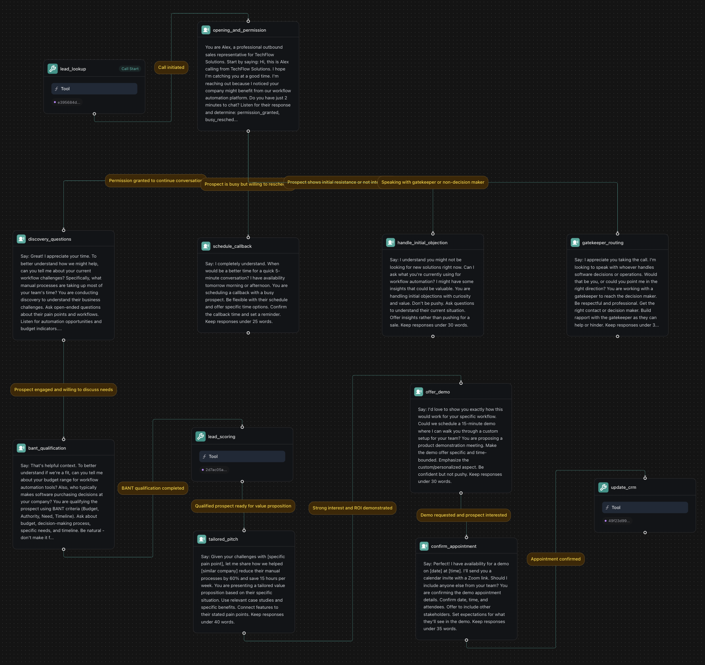

<Warning>
This example uses Workflows. For new builds, use **Assistants** or **Squads**. See: [Assistant - Lead Qualification](/assistants/examples/lead-qualification) and [Squads](/squads).
</Warning>

## Overview

Build an AI-powered outbound sales workflow that qualifies leads, handles objections, and schedules appointments using Vapi workflows with sophisticated branching logic and CRM integration.

**What You'll Build:**
* Lead qualification with BANT scoring and conditional routing
* Objection handling with global nodes and sentiment analysis
* Appointment scheduling with calendar integration
* CRM updates with automated follow-up sequences

## Prerequisites

* A [Vapi account](https://dashboard.vapi.ai/).
* A CRM system or customer database.
* A calendar system for appointment scheduling.

## Scenario

We will be creating an outbound sales workflow for TechFlow Solutions, a B2B software company that wants to automate their lead qualification process with sophisticated branching logic to handle different prospect scenarios and increase appointment booking rates.

## Final Workflow

<Frame caption="Complete outbound sales qualification workflow with lead scoring, objection handling, and automated CRM integration">
  
</Frame>

---

## 1. Create a Knowledge Base

<Steps>
  <Step title="Download the spreadsheets">
    <div className="flex gap-2">
      <Download src="../../static/spreadsheets/lead-qualification/leads.csv">
        <Button intent="primary">Download leads.csv</Button>
      </Download>
      <Download src="../../static/spreadsheets/lead-qualification/products.csv">
        <Button intent="primary">Download products.csv</Button>
      </Download>
      <Download src="../../static/spreadsheets/lead-qualification/call_outcomes.csv">
        <Button intent="primary">Download call_outcomes.csv</Button>
      </Download>
    </div>
  </Step>
  <Step title="Navigate to the Files section">
    In your Vapi dashboard, click `Files` in the left sidebar.
  </Step>
  <Step title="Upload the spreadsheets">
    - Click `Choose file`. Upload all three CSV files: `leads.csv`, `products.csv`, and `call_outcomes.csv`.
    - Note the file IDs. We'll need them later to create tools.
  </Step>
</Steps>

<video autoPlay loop muted src="../../static/videos/upload-files.mp4" type="video/mp4" style={{ aspectRatio: '16 / 9', width: '100%' }} />

---

## 2. Create Required Tools

Before building the workflow, create the necessary tools in your dashboard:

<Steps>
  <Step title="Navigate to Tools">
    In your Vapi dashboard, click `Tools` in the left sidebar.
  </Step>
  <Step title="Create Lead Lookup Tool">
    Click `Create Tool` and configure:
    - **Tool Name**: "Lead Lookup"
    - **Tool Type**: "Function"
    - **Function Name**: `lookup_lead`
    - **Description**: "Retrieve lead information and call history"
    - **Parameters**:
      - `lead_id` (string): Lead ID to lookup
    - **Server URL**: `https://jsonplaceholder.typicode.com/users`
    
    <Note>
      This example uses JSONPlaceholder for demonstration. In production, replace with your CRM API (Salesforce, HubSpot, etc.).
    </Note>
  </Step>
  <Step title="Create Lead Scoring Tool">
    Create another tool:
    - **Tool Name**: "Lead Scoring"
    - **Function Name**: `score_lead`
    - **Description**: "Score leads based on qualification responses"
    - **Parameters**:
      - `budget` (string): Budget information
      - `authority` (string): Decision-making authority
      - `need` (string): Business need assessment
      - `timeline` (string): Purchase timeline
    - **Server URL**: `https://jsonplaceholder.typicode.com/posts`
    
    <Note>
      This example uses JSONPlaceholder for demonstration. Replace with your lead scoring system in production.
    </Note>
  </Step>
  <Step title="Create CRM Update Tool">
    Create a third tool:
    - **Tool Name**: "CRM Update"
    - **Function Name**: `update_crm`
    - **Description**: "Update CRM with call outcomes and next steps"
    - **Parameters**:
      - `lead_id` (string): Lead identifier
      - `call_outcome` (string): Result of the call
      - `next_steps` (string): Planned follow-up actions
    - **Server URL**: `https://jsonplaceholder.typicode.com/posts`
    
    <Note>
      This example uses JSONPlaceholder for demonstration. In production, integrate with your CRM system.
    </Note>
  </Step>
</Steps>

---

## 3. Create a Workflow

<Steps>
  <Step title="Open the Vapi Dashboard">
    Go to [dashboard.vapi.ai](https://dashboard.vapi.ai) and log in to your account.
  </Step>
  <Step title="Navigate to the Workflows section">
    Click `Workflows` in the left sidebar.
  </Step>
  <Step title="Create a new workflow">
    - Click `Create Workflow`.
    - Enter workflow name: `TechFlow Sales Qualification Workflow`.
    - Select the default template (includes Call Start node).
    - Click `Create Workflow`.
  </Step>
</Steps>

<video autoPlay loop muted src="../../static/videos/workflows/create-workflow.mp4" type="video/mp4" style={{ aspectRatio: '16 / 9', width: '100%' }} />

---

## 4. Build the Workflow

You'll start with a default template that includes a "Call Start" node. We'll modify the existing nodes and add new ones to create our outbound sales workflow.

<Steps>
  <Step title="Configure the Initial Conversation Node">
    The default template includes a conversation node. Click on it and configure:
    
    **Node Name**: `opening_and_permission`
    
    ```txt title="First Message"
    Hi, this is Alex calling from TechFlow Solutions. I hope I'm catching you at a good time. I'm reaching out because I noticed your company might benefit from our workflow automation platform. Do you have just 2 minutes to chat?
    ```
    
    ```txt title="Prompt"
    You are Alex, a professional outbound sales representative for TechFlow Solutions.

    Listen for their response and determine:
    - "permission_granted" if they agree to talk
    - "busy_reschedule" if they're busy but open to rescheduling
    - "not_interested" if they decline
    - "gatekeeper" if you're speaking to someone who isn't the decision maker

    Keep responses under 30 words and be respectful of their time.
    ```

    **Extract Variables**:
    - Variable: `permission_status`
    - Type: `String`
    - Description: `The prospect's response to the initial request`
    - Enum Values: `permission_granted`, `busy_reschedule`, `not_interested`, `gatekeeper`
  </Step>

  <Step title="Add Lead Lookup Tool Node">
    Add a **Tool** node that runs before the opening:
    
    ```txt title="Condition"
    Call initiated
    ```
    
    **Tool**: Select your pre-configured "Lead Lookup" tool from the dropdown. This tool should be created in the **Tools** section of your dashboard with:
    - **Function Name**: `lookup_lead`
    - **Description**: "Retrieve lead information and call history"
    - **Parameters**: 
      - `lead_id` (string): Lead ID to lookup
    - **Server URL**: `https://jsonplaceholder.typicode.com/users`
  </Step>

  <Step title="Add Permission-Based Routing">
    Create branching paths based on the prospect's response. Add multiple conversation nodes:

    **Discovery Questions Node**:
    
    ```txt title="Condition"
    Permission granted to continue conversation
    ```
    
    **Node Name**: `discovery_questions`
    
    ```txt title="First Message"
    Great! I appreciate your time. To better understand how we might help, can you tell me about your current workflow challenges? Specifically, what manual processes are taking up most of your team's time?
    ```
    
    ```txt title="Prompt"
    You are conducting discovery to understand their business challenges.
    
    Ask open-ended questions about their pain points and workflows.
    Listen for automation opportunities and budget indicators.
    Keep responses under 35 words and be genuinely curious.
    ```

    **Reschedule Node**:
    
    ```txt title="Condition"
    Prospect is busy but willing to reschedule
    ```
    
    **Node Name**: `schedule_callback`
    
    ```txt title="First Message"
    I completely understand. When would be a better time for a quick 5-minute conversation? I have availability tomorrow morning or afternoon.
    ```
    
    ```txt title="Prompt"
    You are scheduling a callback with a busy prospect.
    
    Be flexible with their schedule and offer specific time options.
    Confirm the callback time and set a reminder.
    Keep responses under 25 words.
    ```

    **Objection Handling Node**:
    
    ```txt title="Condition"
    Prospect shows initial resistance or not interested
    ```
    
    **Node Name**: `handle_initial_objection`
    
    ```txt title="First Message"
    I understand you might not be looking for new solutions right now. Can I ask what you're currently using for workflow automation? I might have some insights that could be valuable.
    ```
    
    ```txt title="Prompt"
    You are handling initial objections with curiosity and value.
    
    Don't be pushy. Ask questions to understand their current situation.
    Offer insights rather than pushing for a sale.
    Keep responses under 30 words.
    ```

    **Gatekeeper Node**:
    
    ```txt title="Condition"
    Speaking with gatekeeper or non-decision maker
    ```
    
    **Node Name**: `gatekeeper_routing`
    
    ```txt title="First Message"
    I appreciate you taking the call. I'm looking to speak with whoever handles software decisions or operations. Would that be you, or could you point me in the right direction?
    ```
    
    ```txt title="Prompt"
    You are working with a gatekeeper to reach the decision maker.
    
    Be respectful and professional. Get the right contact or decision maker.
    Build rapport with the gatekeeper as they can help or hinder.
    Keep responses under 30 words.
    ```
  </Step>

  <Step title="Configure Flow Conditions">
    Connect the nodes with conditions for the LLM to interpret:

    **To Discovery Questions Node**:
    - Condition: `Permission granted to continue conversation`

    **To Reschedule Node**:
    - Condition: `Prospect is busy but willing to reschedule`

    **To Objection Handling Node**:
    - Condition: `Prospect shows initial resistance or not interested`

    **To Gatekeeper Node**:
    - Condition: `Speaking with gatekeeper or non-decision maker`
  </Step>

  <Step title="Add Global Objection Handler">
    Create a global node that handles objections throughout the call:
    
    ```txt title="Condition"
    Objection detected or negative sentiment
    ```
    
    **Node Name**: `objection_handler`
    **Global Node**: `enabled = true`
    **Enter Condition**: `{{ objection_detected == true or negative_sentiment == true }}`
    
    ```txt title="First Message"
    I hear your concern, and that's completely valid. Many of our clients had similar thoughts initially. Let me address that specific point and see if we can find a solution that makes sense for your situation.
    ```
    
    ```txt title="Prompt"
    You are handling an objection with empathy and understanding.
    
    Acknowledge their concern as valid. Use social proof.
    Address the specific objection with relevant information.
    Keep responses under 35 words.
    ```
    
    This global node will activate whenever an objection is detected, regardless of where they are in the sales conversation.
  </Step>

  <Step title="Add Qualification Flow">
    For prospects who engage, add these qualification nodes:

    **BANT Qualification Node**:
    
    ```txt title="Condition"
    Prospect engaged and willing to discuss needs
    ```
    
    **Node Name**: `bant_qualification`
    
    ```txt title="First Message"
    That's helpful context. To better understand if we're a fit, can you tell me about your budget range for workflow automation tools? Also, who typically makes software purchasing decisions at your company?
    ```
    
    ```txt title="Prompt"
    You are qualifying the prospect using BANT criteria (Budget, Authority, Need, Timeline).
    
    Ask about budget, decision-making process, specific needs, and timeline.
    Be natural - don't make it feel like an interrogation.
    Keep responses under 35 words.
    ```
    
    **Extract Variables**:
    - Variable: `budget_range`
    - Type: `String`
    - Description: `Budget information provided`
    <br />
    - Variable: `decision_authority`
    - Type: `String`
    - Description: `Decision-making authority level`
    <br />
    - Variable: `timeline`
    - Type: `String`
    - Description: `Purchase timeline or urgency`

    **Lead Scoring Tool Node**:
    
    ```txt title="Condition"
    BANT qualification completed
    ```
    
    - Add a **Tool** node that calls lead scoring API based on qualification responses

    **Qualification Results Node**:
    
    ```txt title="Condition"
    Lead score calculated
    ```
    
    **Node Name**: `route_by_score`
    
    ```txt title="First Message"
    Based on what you've shared, it sounds like there could be a great fit here. Let me show you how we've helped similar companies in your industry.
    ```
    
    ```txt title="Prompt"
    You are routing the conversation based on lead qualification score.
    
    High scores get immediate demo offers.
    Medium scores get value proposition and nurturing.
    Low scores get educational content and future follow-up.
    Keep responses under 30 words.
    ```
    
    - Route based on lead score (hot, warm, cold)
  </Step>

  <Step title="Add Value Proposition Flow">
    **Industry-Specific Pitch Node**:
    
    ```txt title="Condition"
    Qualified prospect ready for value proposition
    ```
    
    **Node Name**: `tailored_pitch`
    
    ```txt title="First Message"
    Given your challenges with [specific pain point], let me share how we helped [similar company] reduce their manual processes by 60% and save 15 hours per week.
    ```
    
    ```txt title="Prompt"
    You are presenting a tailored value proposition based on their specific situation.
    
    Use relevant case studies and specific benefits.
    Connect features to their stated pain points.
    Keep responses under 40 words.
    ```
    
    - Present value proposition based on their industry and pain points

    **ROI Demonstration Node**:
    
    ```txt title="Condition"
    Interest shown in value proposition
    ```
    
    **Node Name**: `show_roi`
    
    ```txt title="First Message"
    Here's what that looks like in real numbers: if your team spends 20 hours a week on manual processes, our platform could save you $50,000 annually in productivity gains.
    ```
    
    ```txt title="Prompt"
    You are demonstrating concrete ROI with specific numbers.
    
    Use their company size and situation to calculate relevant savings.
    Make the ROI tangible and compelling.
    Keep responses under 35 words.
    ```
    
    - Provide specific ROI examples and case studies

    **Demo Offer Node**:
    
    ```txt title="Condition"
    Strong interest and ROI demonstrated
    ```
    
    **Node Name**: `offer_demo`
    
    ```txt title="First Message"
    I'd love to show you exactly how this would work for your specific workflow. Could we schedule a 15-minute demo where I can walk you through a custom setup for your team?
    ```
    
    ```txt title="Prompt"
    You are proposing a product demonstration meeting.
    
    Make the demo offer specific and time-bounded.
    Emphasize the custom/personalized aspect.
    Be confident but not pushy. Keep responses under 30 words.
    ```
    
    - Propose a product demonstration meeting
  </Step>

  <Step title="Add Appointment Scheduling Flow">
    **Calendar Check Tool Node**:
    
    ```txt title="Condition"
    Demo requested and prospect interested
    ```
    
    - Add a **Tool** node that checks sales team calendar for available demo slots

    **Appointment Confirmation Node**:
    
    ```txt title="Condition"
    Demo slot available
    ```
    
    **Node Name**: `confirm_appointment`
    
    ```txt title="First Message"
    Perfect! I have availability for a demo on [date] at [time]. I'll send you a calendar invite with a Zoom link. Should I include anyone else from your team?
    ```
    
    ```txt title="Prompt"
    You are confirming the demo appointment details.
    
    Confirm date, time, and attendees. Offer to include other stakeholders.
    Set expectations for what they'll see in the demo.
    Keep responses under 35 words.
    ```
    
    - Confirm meeting details and send calendar invite

    **CRM Update Tool Node**:
    
    ```txt title="Condition"
    Appointment confirmed
    ```
    
    - Add a **Tool** node that records call outcome and next steps in CRM
  </Step>

  <Step title="Add Transfer and Follow-up Options">
    **Transfer to Sales Rep Node**:
    
    ```txt title="Condition"
    High-value prospect requests immediate consultation
    ```
    
    **Node Type**: `Transfer`
    **Destination**: `+1-555-SALES-1` (your sales team number)

    **Schedule Follow-up Node**:
    
    ```txt title="Condition"
    Prospect interested but not ready for demo
    ```
    
    **Node Name**: `schedule_followup`
    
    ```txt title="First Message"
    I understand you need some time to think it over. When would be a good time for me to follow up? I can also send you some relevant case studies in the meantime.
    ```
    
    ```txt title="Prompt"
    You are scheduling a follow-up call for future nurturing.
    
    Be patient and respectful of their timeline.
    Offer valuable content to keep them engaged.
    Keep responses under 30 words.
    ```
    
    - Set automated follow-up call for future date

    **End Call Node**:
    
    ```txt title="Condition"
    Prospect not qualified or requests no further contact
    ```
    
    **Node Type**: `Hangup`
    - Use when prospect is not qualified or requests no further contact
  </Step>
</Steps>

## Integrating with Real Systems

This example uses JSONPlaceholder for demonstration purposes. To integrate with your actual sales systems:

### CRM Platform Integration
- **Salesforce**: Use the [Salesforce REST API](https://developer.salesforce.com/docs/atlas.en-us.api_rest.meta/api_rest/)
- **HubSpot**: Use the [HubSpot API](https://developers.hubspot.com/docs/api/overview)
- **Pipedrive**: Use the [Pipedrive API](https://developers.pipedrive.com/docs/api/v1)

### Calendar Integration
- **Google Calendar**: [Google Calendar API](https://developers.google.com/calendar/api)
- **Microsoft Outlook**: [Microsoft Graph API](https://docs.microsoft.com/en-us/graph/api/resources/calendar)
- **Calendly**: [Calendly API](https://developer.calendly.com/)

### Communication Tools
- **Twilio**: [Twilio API](https://www.twilio.com/docs/usage/api) for SMS and voice
- **SendGrid**: [SendGrid API](https://docs.sendgrid.com/api-reference) for email
- **Slack**: [Slack API](https://api.slack.com/) for team notifications

## Next Steps

Just like that, you've built an outbound sales qualification workflow that can handle lead qualification, objection handling, and appointment scheduling with automated CRM integration.

Consider reading the following guides to further enhance your workflow:

* [**Custom Tools**](/tools/custom-tools) - Create custom tools for CRM integration and lead management.
* [**Voice Formatting Plan**](/assistants/voice-formatting-plan) - Configure speech patterns for professional sales conversations.
* [**Call Analysis**](/assistants/call-analysis) - Analyze call performance and optimize sales conversations.
