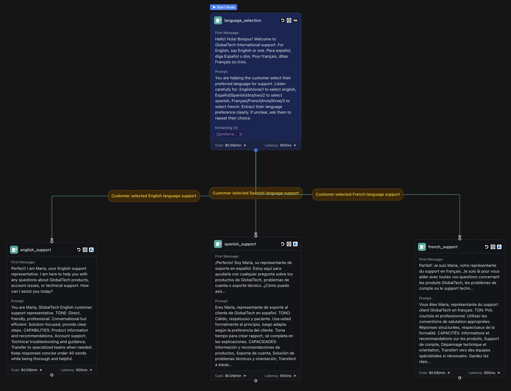

<Warning>
This example uses Workflows. For new builds, use a **Squad** with language‑specific assistants. See: [Squad - Multilingual Support](/squads/examples/multilingual-support).
</Warning>

## Overview

Build a structured multilingual customer support workflow that guides customers through language selection at the start of the call, then routes them to dedicated conversation paths optimized for English, Spanish, and French support.

**What You'll Build:**
* Visual workflow with language selection and routing logic
* Dedicated conversation nodes for each language with cultural context
* Language-specific voice and prompt configurations
* Multilingual knowledge base integration with customer data
* 24/7 international phone support with optimal user experience

## Prerequisites

* A [Vapi account](https://dashboard.vapi.ai/).

## Scenario

We will be creating a multilingual support workflow for GlobalTech International, a technology company serving customers across North America, Europe, and Latin America. Instead of trying to detect language automatically, the workflow provides a clear language selection menu and routes customers to dedicated support paths optimized for each language and culture.

## Final Workflow

<Frame caption="Complete multilingual support workflow with language selection and dedicated conversation paths for English, Spanish, and French">
  
</Frame>

---

## 1. Create a Multilingual Knowledge Base

<Tabs>
  <Tab title="Dashboard">
    <Steps>
      <Step title="Download the spreadsheets">
        <div className="flex gap-2">
          <Download src="../../static/spreadsheets/multilingual-support/customers.csv">
            <Button intent="primary">Download customers.csv</Button>
          </Download>
          <Download src="../../static/spreadsheets/multilingual-support/products.csv">
            <Button intent="primary">Download products.csv</Button>
          </Download>
          <Download src="../../static/spreadsheets/multilingual-support/support_articles.csv">
            <Button intent="primary">Download support_articles.csv</Button>
          </Download>
        </div>
      </Step>
      <Step title="Navigate to the Files section">
        In your Vapi dashboard, click `Files` in the left sidebar.
      </Step>
      <Step title="Upload the spreadsheets">
        - Click `Choose file`. Upload all three CSV files: `customers.csv`, `products.csv`, and `support_articles.csv`.
        - Note the file IDs. We'll need them later to create multilingual tools.

        <video autoPlay loop muted src="../../static/videos/upload-files.mp4" type="video/mp4" style={{ aspectRatio: '16 / 9', width: '100%' }} />
      </Step>
    </Steps>
  </Tab>
  <Tab title="TypeScript (Server SDK)">
    ```typescript
    import { VapiClient } from "@vapi-ai/server-sdk";
    import fs from 'fs';

    const vapi = new VapiClient({ token: "YOUR_VAPI_API_KEY" });

    async function uploadMultilingualFiles() {
      try {
        // Upload customers file
        const customersFile = await vapi.files.create({
          file: fs.createReadStream("customers.csv")
        });

        // Upload products file  
        const productsFile = await vapi.files.create({
          file: fs.createReadStream("products.csv")
        });

        // Upload support articles file
        const supportFile = await vapi.files.create({
          file: fs.createReadStream("support_articles.csv")
        });

        console.log(`Customers file ID: ${customersFile.id}`);
        console.log(`Products file ID: ${productsFile.id}`);
        console.log(`Support articles file ID: ${supportFile.id}`);

        return {
          customersFileId: customersFile.id,
          productsFileId: productsFile.id,
          supportFileId: supportFile.id
        };
      } catch (error) {
        console.error('Error uploading files:', error);
        throw error;
      }
    }

    // Upload all files for multilingual workflow
    const fileIds = await uploadMultilingualFiles();
    ```
  </Tab>
  <Tab title="Python (Server SDK)">
    ```python
    import requests

    def upload_multilingual_file(file_path):
        """Upload a CSV file for multilingual support data"""
        url = "https://api.vapi.ai/file"
        headers = {"Authorization": f"Bearer {YOUR_VAPI_API_KEY}"}
        
        try:
            with open(file_path, 'rb') as file:
                files = {'file': file}
                response = requests.post(url, headers=headers, files=files)
                response.raise_for_status()
                return response.json()
        except requests.exceptions.RequestException as error:
            print(f"Error uploading {file_path}: {error}")
            raise

    # Upload all required files for multilingual workflow
    customers_file = upload_multilingual_file("customers.csv")
    products_file = upload_multilingual_file("products.csv")
    support_file = upload_multilingual_file("support_articles.csv")

    print(f"Customers file ID: {customers_file['id']}")
    print(f"Products file ID: {products_file['id']}")
    print(f"Support articles file ID: {support_file['id']}")
    ```
  </Tab>
  <Tab title="cURL">
    ```bash
    # Upload customers.csv
    curl -X POST https://api.vapi.ai/file \
         -H "Authorization: Bearer YOUR_VAPI_API_KEY" \
         -F "file=@customers.csv"

    # Upload products.csv
    curl -X POST https://api.vapi.ai/file \
         -H "Authorization: Bearer YOUR_VAPI_API_KEY" \
         -F "file=@products.csv"

    # Upload support_articles.csv
    curl -X POST https://api.vapi.ai/file \
         -H "Authorization: Bearer YOUR_VAPI_API_KEY" \
         -F "file=@support_articles.csv"
    ```
  </Tab>
</Tabs>

---

## 2. Create a Multilingual Workflow

<Tabs>
  <Tab title="Dashboard">
    <Steps>
      <Step title="Open the Vapi Dashboard">
        Go to [dashboard.vapi.ai](https://dashboard.vapi.ai) and log in to your account.
      </Step>
      <Step title="Navigate to the Workflows section">
        Click `Workflows` in the left sidebar.
      </Step>
      <Step title="Create a new workflow">
        - Click `Create Workflow`.
        - Enter workflow name: `GlobalTech Multilingual Support Workflow`.
        - Select the default template (includes Call Start node).
        - Click "Create Workflow".
      </Step>
      <Step title="Configure Workflow Settings">
        - Set up workflow variables for customer language preference and support context
        - Configure global settings for the multilingual workflow

        <video autoPlay loop muted src="../../static/videos/workflows/create-workflow.mp4" type="video/mp4" style={{ aspectRatio: '16 / 9', width: '100%' }} />
      </Step>
    </Steps>
  </Tab>
  <Tab title="TypeScript (Server SDK)">
    ```typescript
    import { VapiClient } from "@vapi-ai/server-sdk";

    const vapi = new VapiClient({ token: "YOUR_VAPI_API_KEY" });

    async function createMultilingualWorkflow() {
      try {
        // Create workflow with language selection node
        const workflow = await vapi.workflows.create({
          name: "GlobalTech Multilingual Support Workflow",
          nodes: [
            {
              id: "language_selection",
              type: "conversation",
              firstMessage: "Hello! Hola! Bonjour! Welcome to GlobalTech International support. For English, say 'English' or 'one'. Para español, diga 'Español' o 'dos'. Pour français, dites 'Français' ou 'trois'.",
              systemPrompt: "You are helping the customer select their preferred language. Listen for 'English', 'Español', 'Français', or numbers 1, 2, 3. Extract their language preference clearly.",
              extractVariables: [
                {
                  name: "preferred_language",
                  type: "string",
                  description: "Customer's preferred language choice",
                  enum: ["english", "spanish", "french"]
                }
              ]
            }
          ],
          edges: []
        });

        console.log(`Multilingual workflow created with ID: ${workflow.id}`);
        return workflow;
      } catch (error) {
        console.error('Error creating workflow:', error);
        throw error;
      }
    }

    // Create the multilingual workflow
    const workflow = await createMultilingualWorkflow();
    ```
  </Tab>
  <Tab title="Python (Server SDK)">
    ```python
    import requests

    def create_multilingual_workflow():
        """Create a new multilingual support workflow"""
        url = "https://api.vapi.ai/workflow"
        headers = {
            "Authorization": f"Bearer {YOUR_VAPI_API_KEY}",
            "Content-Type": "application/json"
        }
        
        data = {
            "name": "GlobalTech Multilingual Support Workflow",
            "nodes": [
                {
                    "id": "language_selection",
                    "type": "conversation",
                    "firstMessage": "Hello! Hola! Bonjour! Welcome to GlobalTech International support. For English, say 'English' or 'one'. Para español, diga 'Español' o 'dos'. Pour français, dites 'Français' ou 'trois'.",
                    "systemPrompt": "You are helping the customer select their preferred language. Listen for 'English', 'Español', 'Français', or numbers 1, 2, 3. Extract their language preference clearly.",
                    "extractVariables": [
                        {
                            "name": "preferred_language",
                            "type": "string",
                            "description": "Customer's preferred language choice",
                            "enum": ["english", "spanish", "french"]
                        }
                    ]
                }
            ],
            "edges": []
        }
        
        try:
            response = requests.post(url, headers=headers, json=data)
            response.raise_for_status()
            return response.json()
        except requests.exceptions.RequestException as error:
            print(f"Error creating workflow: {error}")
            raise

    # Create the multilingual workflow
    workflow = create_multilingual_workflow()
    print(f"Multilingual workflow created with ID: {workflow['id']}")
    ```
  </Tab>
  <Tab title="cURL">
    ```bash
    # Create the complete multilingual workflow with all conversation nodes
    curl -X POST https://api.vapi.ai/workflow \
         -H "Authorization: Bearer YOUR_VAPI_API_KEY" \
         -H "Content-Type: application/json" \
         -d '{
           "name": "GlobalTech Multilingual Support Workflow",
           "transcriber": {
             "provider": "deepgram",
             "model": "nova-2",
             "language": "multi"
           },
           "voice": {
             "provider": "azure",
             "voiceId": "en-US-AriaNeural"
           },
           "globalPrompt": "GlobalTech International is a technology company specializing in workflow automation and productivity solutions. Always be helpful, professional, and solution-focused when assisting customers.",
           "nodes": [
             {
               "name": "language_selection",
               "type": "conversation",
               "prompt": "You are helping the customer select their preferred language for support. Listen carefully for: English/one/1 to select english, Español/Spanish/dos/two/2 to select spanish, Français/French/trois/three/3 to select french. Extract their language preference clearly. If unclear, ask them to repeat their choice.",
               "isStart": true,
               "messagePlan": {
                 "firstMessage": "Hello! Hola! Bonjour! Welcome to GlobalTech International support. For English, say English or one. Para español, diga Español o dos. Pour français, dites Français ou trois."
               },
               "variableExtractionPlan": {
                 "output": [
                   {
                     "type": "string",
                     "title": "preferred_language",
                     "description": "Customer preferred language choice",
                     "enum": ["english", "spanish", "french"]
                   }
                 ]
               }
             },
             {
               "name": "english_support",
               "type": "conversation",
               "voice": {
                 "provider": "azure",
                 "voiceId": "en-US-AriaNeural"
               },
               "prompt": "You are Maria, GlobalTech English customer support representative. TONE: Direct, friendly, professional. Conversational but efficient. Solution-focused, provide clear steps. CAPABILITIES: Product information and recommendations, Account support, Technical troubleshooting and guidance, Transfer to specialized teams when needed. Keep responses concise under 40 words while being thorough and helpful.",
               "messagePlan": {
                 "firstMessage": "Perfect! I am Maria, your English support representative. I am here to help you with any questions about GlobalTech products, account issues, or technical support. How can I assist you today?"
               }
             },
             {
               "name": "spanish_support",
               "type": "conversation",
               "voice": {
                 "provider": "azure",
                 "voiceId": "es-ES-ElviraNeural"
               },
               "prompt": "Eres María, representante de soporte al cliente de GlobalTech en español. TONO: Cálido, respetuoso y paciente. Usa usted formalmente al principio, luego adapta según la preferencia del cliente. Toma tiempo para crear rapport, sé completa en las explicaciones. CAPACIDADES: Información y recomendaciones de productos, Soporte de cuenta, Solución de problemas técnicos y orientación, Transferir a equipos especializados cuando sea necesario. Mantén las respuestas concisas menos de 40 palabras mientras eres completa y útil.",
               "messagePlan": {
                 "firstMessage": "¡Perfecto! Soy María, su representante de soporte en español. Estoy aquí para ayudarle con cualquier pregunta sobre los productos de GlobalTech, problemas de cuenta o soporte técnico. ¿Cómo puedo asistirle hoy?"
               }
             },
             {
               "name": "french_support",
               "type": "conversation",
               "voice": {
                 "provider": "azure",
                 "voiceId": "fr-FR-DeniseNeural"
               },
               "prompt": "Vous êtes Maria, représentante du support client GlobalTech en français. TON: Poli, courtois et professionnel. Utilisez les conventions de salutation appropriées. Réponses structurées, respectueux de la formalité. CAPACITÉS: Informations et recommandations sur les produits, Support de compte, Dépannage technique et orientation, Transfert vers des équipes spécialisées si nécessaire. Gardez les réponses concises moins de 40 mots tout en étant complète et utile.",
               "messagePlan": {
                 "firstMessage": "Parfait! Je suis Maria, votre représentante du support en français. Je suis là pour vous aider avec toutes vos questions concernant les produits GlobalTech, les problèmes de compte ou le support technique. Comment puis-je vous aider aujourd hui?"
               }
             }
           ],
           "edges": [
             {
               "from": "language_selection",
               "to": "english_support",
               "condition": {
                 "type": "ai",
                 "prompt": "Customer selected English language support"
               }
             },
             {
               "from": "language_selection",
               "to": "spanish_support",
               "condition": {
                 "type": "ai",
                 "prompt": "Customer selected Spanish language support"
               }
             },
             {
               "from": "language_selection",
               "to": "french_support",
               "condition": {
                 "type": "ai",
                 "prompt": "Customer selected French language support"
               }
             }
           ]
         }'
    ```
  </Tab>
</Tabs>

<Note>
**Complete Workflow JSON**: You can download the complete workflow configuration as a JSON file and use it with any HTTP client or save it for version control:

```bash
# Save the workflow JSON to a file
cat > multilingual_workflow.json << 'EOF'
{
  "name": "GlobalTech Multilingual Support Workflow",
  "transcriber": {
    "provider": "deepgram",
    "model": "nova-2", 
    "language": "multi"
  },
  "voice": {
    "provider": "azure",
    "voiceId": "en-US-AriaNeural"
  },
  "globalPrompt": "GlobalTech International is a technology company specializing in workflow automation and productivity solutions. Always be helpful, professional, and solution-focused when assisting customers.",
  "nodes": [
    {
      "name": "language_selection",
      "type": "conversation", 
      "prompt": "You are helping the customer select their preferred language for support. Listen carefully for: English/one/1 to select english, Español/Spanish/dos/two/2 to select spanish, Français/French/trois/three/3 to select french. Extract their language preference clearly. If unclear, ask them to repeat their choice.",
      "isStart": true,
      "messagePlan": {
        "firstMessage": "Hello! Hola! Bonjour! Welcome to GlobalTech International support. For English, say English or one. Para español, diga Español o dos. Pour français, dites Français ou trois."
      },
      "variableExtractionPlan": {
        "output": [
          {
            "type": "string",
            "title": "preferred_language",
            "description": "Customer preferred language choice",
            "enum": ["english", "spanish", "french"]
          }
        ]
      }
    },
    {
      "name": "english_support",
      "type": "conversation",
      "voice": {
        "provider": "azure",
        "voiceId": "en-US-AriaNeural"
      },
      "prompt": "You are Maria, GlobalTech English customer support representative. TONE: Direct, friendly, professional. Conversational but efficient. Solution-focused, provide clear steps. CAPABILITIES: Product information and recommendations, Account support, Technical troubleshooting and guidance, Transfer to specialized teams when needed. Keep responses concise under 40 words while being thorough and helpful.",
      "messagePlan": {
        "firstMessage": "Perfect! I am Maria, your English support representative. I am here to help you with any questions about GlobalTech products, account issues, or technical support. How can I assist you today?"
      }
    },
    {
      "name": "spanish_support", 
      "type": "conversation",
      "voice": {
        "provider": "azure",
        "voiceId": "es-ES-ElviraNeural"
      },
      "prompt": "Eres María, representante de soporte al cliente de GlobalTech en español. TONO: Cálido, respetuoso y paciente. Usa usted formalmente al principio, luego adapta según la preferencia del cliente. Toma tiempo para crear rapport, sé completa en las explicaciones. CAPACIDADES: Información y recomendaciones de productos, Soporte de cuenta, Solución de problemas técnicos y orientación, Transferir a equipos especializados cuando sea necesario. Mantén las respuestas concisas menos de 40 palabras mientras eres completa y útil.",
      "messagePlan": {
        "firstMessage": "¡Perfecto! Soy María, su representante de soporte en español. Estoy aquí para ayudarle con cualquier pregunta sobre los productos de GlobalTech, problemas de cuenta o soporte técnico. ¿Cómo puedo asistirle hoy?"
      }
    },
    {
      "name": "french_support",
      "type": "conversation",
      "voice": {
        "provider": "azure", 
        "voiceId": "fr-FR-DeniseNeural"
      },
      "prompt": "Vous êtes Maria, représentante du support client GlobalTech en français. TON: Poli, courtois et professionnel. Utilisez les conventions de salutation appropriées. Réponses structurées, respectueux de la formalité. CAPACITÉS: Informations et recommandations sur les produits, Support de compte, Dépannage technique et orientation, Transfert vers des équipes spécialisées si nécessaire. Gardez les réponses concises moins de 40 mots tout en étant complète et utile.",
      "messagePlan": {
        "firstMessage": "Parfait! Je suis Maria, votre représentante du support en français. Je suis là pour vous aider avec toutes vos questions concernant les produits GlobalTech, les problèmes de compte ou le support technique. Comment puis-je vous aider aujourd hui?"
      }
    }
  ],
  "edges": [
    {
      "from": "language_selection",
      "to": "english_support",
      "condition": {
        "type": "ai",
        "prompt": "Customer selected English language support"
      }
    },
    {
      "from": "language_selection",
      "to": "spanish_support",
      "condition": {
        "type": "ai", 
        "prompt": "Customer selected Spanish language support"
      }
    },
    {
      "from": "language_selection",
      "to": "french_support",
      "condition": {
        "type": "ai",
        "prompt": "Customer selected French language support"
      }
    }
  ]
}
EOF

# Then create the workflow using the JSON file
curl -X POST https://api.vapi.ai/workflow \
     -H "Authorization: Bearer YOUR_VAPI_API_KEY" \
     -H "Content-Type: application/json" \
     -d @multilingual_workflow.json
```
</Note>

---

## 3. Build the Multilingual Workflow

You'll start with a language selection node and then create dedicated conversation paths for each language with appropriate cultural context and voices.

<Steps>
  <Step title="Configure the Language Selection Node">
    The workflow starts with a language selection node. Click on it and configure:
    
    ```txt title="First Message"
    Hello! Hola! Bonjour! Welcome to GlobalTech International support. For English, say 'English' or 'one'. Para español, diga 'Español' o 'dos'. Pour français, dites 'Français' ou 'trois'.
    ```
    
    ```txt title="Prompt"
    You are helping the customer select their preferred language for support.

    Listen carefully for:
    - "English" or "one" or "1" → english
    - "Español" or "Spanish" or "dos" or "two" or "2" → spanish  
    - "Français" or "French" or "trois" or "three" or "3" → french

    Extract their language preference clearly. If unclear, ask them to repeat their choice.
    ```

    **Extract Variables**:
    - Variable: `preferred_language`
    - Type: `String`
    - Description: `Customer's preferred language choice`
    - Enum Values: `english`, `spanish`, `french`
  </Step>

  <Step title="Add English Support Path">
    Click the + button and add a new **Conversation** node:
    
    ```txt title="Condition"
    preferred_language == "english"
    ```

    ```txt title="First Message"
    Perfect! I'm Maria, your English support representative. I'm here to help you with any questions about GlobalTech products, account issues, or technical support. How can I assist you today?
    ```
    
    ```txt title="Prompt"
    You are Maria, GlobalTech's English customer support representative.

    TONE & STYLE:
    - Direct, friendly, and professional
    - Conversational but efficient
    - Solution-focused, provide clear steps

    CAPABILITIES:
    - Product information and recommendations
    - Account support (billing, subscriptions, access)
    - Technical troubleshooting and guidance
    - Transfer to specialized teams when needed

    Keep responses concise (under 40 words) while being thorough and helpful.
    Use tools to look up customer information and provide accurate support.
    ```

    **Voice Configuration**:
    - Provider: `Azure`
    - Voice: `en-US-AriaNeural`

    **Extract Variables**:
    - Variable: `customer_inquiry_type`
    - Type: `String`
    - Description: `Type of support needed`
    - Enum Values: `product_info`, `account_support`, `technical_help`, `billing_question`
  </Step>

  <Step title="Add Spanish Support Path">
    Add another **Conversation** node:
    
    ```txt title="Condition"
    preferred_language == "spanish"
    ```

    ```txt title="First Message"
    ¡Perfecto! Soy María, su representante de soporte en español. Estoy aquí para ayudarle con cualquier pregunta sobre los productos de GlobalTech, problemas de cuenta o soporte técnico. ¿Cómo puedo asistirle hoy?
    ```
    
    ```txt title="Prompt"
    Eres María, representante de soporte al cliente de GlobalTech en español.

    TONO Y ESTILO:
    - Cálido, respetuoso y paciente
    - Usa "usted" formalmente al principio, luego adapta según la preferencia del cliente
    - Toma tiempo para crear rapport, sé completa en las explicaciones

    CAPACIDADES:
    - Información y recomendaciones de productos
    - Soporte de cuenta (facturación, suscripciones, acceso)
    - Solución de problemas técnicos y orientación
    - Transferir a equipos especializados cuando sea necesario

    Mantén las respuestas concisas (menos de 40 palabras) mientras eres completa y útil.
    Usa las herramientas para buscar información del cliente y brindar soporte preciso.
    ```

    **Voice Configuration**:
    - Provider: `Azure`
    - Voice: `es-ES-ElviraNeural` (or `es-MX-DaliaNeural` for Mexican Spanish)

    **Extract Variables**:
    - Variable: `customer_inquiry_type`
    - Type: `String`
    - Description: `Tipo de soporte necesario`
    - Enum Values: `informacion_producto`, `soporte_cuenta`, `ayuda_tecnica`, `pregunta_facturacion`
  </Step>

  <Step title="Add French Support Path">
    Add another **Conversation** node:
    
    ```txt title="Condition"
    preferred_language == "french"
    ```

    ```txt title="First Message"
    Parfait! Je suis Maria, votre représentante du support en français. Je suis là pour vous aider avec toutes vos questions concernant les produits GlobalTech, les problèmes de compte ou le support technique. Comment puis-je vous aider aujourd'hui?
    ```
    
    ```txt title="Prompt"
    Vous êtes Maria, représentante du support client GlobalTech en français.

    TON ET STYLE:
    - Poli, courtois et professionnel
    - Utilisez les conventions de salutation appropriées ("Bonjour/Bonsoir")
    - Réponses structurées, respectueux de la formalité

    CAPACITÉS:
    - Informations et recommandations sur les produits
    - Support de compte (facturation, abonnements, accès)
    - Dépannage technique et orientation
    - Transfert vers des équipes spécialisées si nécessaire

    Gardez les réponses concises (moins de 40 mots) tout en étant complète et utile.
    Utilisez les outils pour rechercher les informations client et fournir un support précis.
    ```

    **Voice Configuration**:
    - Provider: `Azure`
    - Voice: `fr-FR-DeniseNeural` (or `fr-CA-SylvieNeural` for Canadian French)

    **Extract Variables**:
    - Variable: `customer_inquiry_type`
    - Type: `String`
    - Description: `Type de support nécessaire`
    - Enum Values: `info_produit`, `support_compte`, `aide_technique`, `question_facturation`
  </Step>

  <Step title="Add Customer Lookup Flow">
    For each language path, add a **Tool** node to look up customer information:

    **English Customer Lookup**:
    ```txt title="Condition"
    preferred_language == "english" AND customer_inquiry_type identified
    ```
    
    **Tool**: Select your pre-configured `lookup_customer` tool
    
    **Follow-up Conversation Node**:
    ```txt title="First Message"
    I found your account information. Let me help you with your [inquiry_type]. What specific issue are you experiencing?
    ```

    **Spanish Customer Lookup**:
    ```txt title="Condition"
    preferred_language == "spanish" AND customer_inquiry_type identified
    ```
    
    **Tool**: Select your pre-configured `lookup_customer` tool
    
    **Follow-up Conversation Node**:
    ```txt title="First Message"
    Encontré la información de su cuenta. Permíteme ayudarle con su [inquiry_type]. ¿Qué problema específico está experimentando?
    ```

    **French Customer Lookup**:
    ```txt title="Condition"
    preferred_language == "french" AND customer_inquiry_type identified
    ```
    
    **Tool**: Select your pre-configured `lookup_customer` tool
    
    **Follow-up Conversation Node**:
    ```txt title="First Message"
    J'ai trouvé les informations de votre compte. Laissez-moi vous aider avec votre [inquiry_type]. Quel problème spécifique rencontrez-vous?
    ```
  </Step>

  <Step title="Add Support Resolution Flows">
    Create specialized flows for different inquiry types in each language:

    **Product Information Flow** (for each language):
    - **Tool Node**: Use `get_product_info` tool
    - **Conversation Node**: Present product information in customer's language
    - **Follow-up**: Ask if they need additional assistance

    **Technical Support Flow** (for each language):
    - **Tool Node**: Use `search_support_articles` tool
    - **Conversation Node**: Guide through troubleshooting in customer's language
    - **Follow-up**: Verify issue resolution or escalate if needed

    **Account Support Flow** (for each language):
    - **Conversation Node**: Collect account details in customer's language
    - **Tool Node**: Look up account information
    - **Conversation Node**: Resolve account issues or transfer to billing team
  </Step>

  <Step title="Add Transfer and Completion Nodes">
    **Transfer to Human Agent** (language-specific):
    
    **English Transfer**:
    ```txt title="Condition"
    Issue requires human assistance
    ```
    **Node Type**: `Transfer Call`
    **First Message**: `I'm connecting you to one of our English-speaking specialists who can better assist you. Please hold for just a moment.`
    **Phone**: `+1-555-SUPPORT`

    **Spanish Transfer**:
    ```txt title="Condition"
    Issue requires human assistance AND preferred_language == "spanish"
    ```
    **Node Type**: `Transfer Call`
    **First Message**: `Le estoy conectando con uno de nuestros especialistas de habla hispana que puede ayudarle mejor. Por favor, manténgase en línea por un momento.`
    **Phone**: `+1-555-SOPORTE`

    **French Transfer**:
    ```txt title="Condition"
    Issue requires human assistance AND preferred_language == "french"
    ```
    **Node Type**: `Transfer Call`
    **First Message**: `Je vous mets en relation avec l'un de nos spécialistes francophones qui pourra mieux vous aider. Veuillez patienter un instant.`
    **Phone**: `+1-555-SOUTIEN`

    **End Call Node** (language-specific):
    
    **English**: `Thank you for contacting GlobalTech International. Have a great day!`
    **Spanish**: `Gracias por contactar a GlobalTech International. ¡Que tenga un excelente día!`
    **French**: `Merci d'avoir contacté GlobalTech International. Passez une excellente journée!`
  </Step>
</Steps>

---

## 4. Configure Phone Number

<Tabs>
  <Tab title="Dashboard">
    <Steps>
      <Step title="Navigate to Phone Numbers">
        Click `Phone Numbers` in the left sidebar of your dashboard.
      </Step>
      <Step title="Create or Import Phone Number">
        - Click `Create Phone Number` for a new Vapi number, or
        - Click `Import Phone Number` to use your existing number from Twilio/Telnyx
      </Step>
      <Step title="Configure Inbound Settings">
        **Workflow**: Select your `GlobalTech Multilingual Support Workflow`
        
        **Advanced Settings**:
        - Enable call recording for quality assurance
        - Set maximum call duration (e.g., 20 minutes)
        - Configure voicemail detection if needed
      </Step>
      <Step title="Test Your Multilingual Workflow">
        Call your Vapi phone number to test the complete workflow:
        - Test language selection with different inputs
        - Verify each language path works correctly
        - Test customer lookup and support tools
        - Ensure transfers work for each language
      </Step>
    </Steps>
  </Tab>
  <Tab title="TypeScript (Server SDK)">
    ```typescript
    import { VapiClient } from "@vapi-ai/server-sdk";

    const vapi = new VapiClient({ token: "YOUR_VAPI_API_KEY" });

    async function createMultilingualPhoneNumber(workflowId: string) {
      try {
        // Create phone number for multilingual workflow
        const phoneNumber = await vapi.phoneNumbers.create({
          name: "GlobalTech International Support Line",
          workflowId: workflowId,
          inboundSettings: {
            maxCallDurationMinutes: 20,
            recordingEnabled: true,
            voicemailDetectionEnabled: true
          }
        });

        console.log(`Multilingual support phone number created: ${phoneNumber.number}`);
        return phoneNumber;
      } catch (error) {
        console.error('Error creating phone number:', error);
        throw error;
      }
    }

    async function testMultilingualWorkflow(workflowId: string, testNumber: string) {
      try {
        // Test the multilingual workflow with an outbound call
        const call = await vapi.calls.create({
          workflowId: workflowId,
          customer: {
            number: testNumber
          }
        });

        console.log(`Multilingual workflow test call created: ${call.id}`);
        return call;
      } catch (error) {
        console.error('Error testing workflow:', error);
        throw error;
      }
    }

    // Create phone number and test workflow
    const phoneNumber = await createMultilingualPhoneNumber('YOUR_WORKFLOW_ID');
    const testCall = await testMultilingualWorkflow('YOUR_WORKFLOW_ID', '+1234567890');
    ```
  </Tab>
  <Tab title="Python (Server SDK)">
    ```python
    import requests

    def create_multilingual_phone_number(workflow_id):
        """Create phone number for multilingual workflow"""
        url = "https://api.vapi.ai/phone-number"
        headers = {
            "Authorization": f"Bearer {YOUR_VAPI_API_KEY}",
            "Content-Type": "application/json"
        }
        
        data = {
            "name": "GlobalTech International Support Line",
            "workflowId": workflow_id,
            "inboundSettings": {
                "maxCallDurationMinutes": 20,
                "recordingEnabled": True,
                "voicemailDetectionEnabled": True
            }
        }
        
        try:
            response = requests.post(url, headers=headers, json=data)
            response.raise_for_status()
            return response.json()
        except requests.exceptions.RequestException as error:
            print(f"Error creating phone number: {error}")
            raise

    def test_multilingual_workflow(workflow_id, test_number):
        """Test multilingual workflow with outbound call"""
        url = "https://api.vapi.ai/call"
        headers = {
            "Authorization": f"Bearer {YOUR_VAPI_API_KEY}",
            "Content-Type": "application/json"
        }
        
        data = {
            "workflowId": workflow_id,
            "customer": {
                "number": test_number
            }
        }
        
        try:
            response = requests.post(url, headers=headers, json=data)
            response.raise_for_status()
            return response.json()
        except requests.exceptions.RequestException as error:
            print(f"Error testing workflow: {error}")
            raise

    # Create phone number and test
    phone_number = create_multilingual_phone_number('YOUR_WORKFLOW_ID')
    test_call = test_multilingual_workflow('YOUR_WORKFLOW_ID', '+1234567890')

    print(f"Phone number: {phone_number['number']}")
    print(f"Test call ID: {test_call['id']}")
    ```
  </Tab>
  <Tab title="cURL">
    ```bash
    # Create phone number with workflow
    curl -X POST https://api.vapi.ai/phone-number \
         -H "Authorization: Bearer YOUR_VAPI_API_KEY" \
         -H "Content-Type: application/json" \
         -d '{
           "name": "GlobalTech International Support Line",
           "workflowId": "YOUR_WORKFLOW_ID",
           "inboundSettings": {
             "maxCallDurationMinutes": 20,
             "recordingEnabled": true,
             "voicemailDetectionEnabled": true
           }
         }'

    # Test the workflow with an outbound call
    curl -X POST https://api.vapi.ai/call \
         -H "Authorization: Bearer YOUR_VAPI_API_KEY" \
         -H "Content-Type: application/json" \
         -d '{
           "workflowId": "YOUR_WORKFLOW_ID",
           "customer": {
             "number": "+1234567890"
           }
         }'
    ```
  </Tab>
</Tabs>

## Benefits of Workflow-Based Multilingual Support

### **Structured Language Selection**
- **Clear menu**: Customers explicitly choose their language
- **No guesswork**: Eliminates language detection errors
- **Better UX**: Customers know exactly what to expect

### **Optimized Conversation Paths**
- **Dedicated nodes**: Each language has its own conversation flow
- **Cultural context**: Language-specific tone and formality levels
- **Native voices**: Optimal voice selection for each language

### **Easier Maintenance**
- **Separate logic**: Independent conversation flows for each language
- **Clear analytics**: Track usage and success by language
- **Scalable**: Easy to add new languages without affecting existing flows

### **Enhanced Performance**
- **No real-time detection**: Faster response times
- **Optimized prompts**: Language-specific system prompts
- **Better accuracy**: Eliminates language switching confusion

<Note>
**Alternative Approach**: For automatic language detection during conversation, see our [Assistant-based multilingual agent](../../assistants/examples/multilingual-agent) that detects and switches languages dynamically within a single conversation flow.
</Note>

## Next Steps

Just like that, you've built a structured multilingual support workflow that provides clear language selection and optimal conversation paths for each language.

Consider reading the following guides to further enhance your workflow:

* [**Assistant-based Multilingual Agent**](../../assistants/examples/multilingual-agent) - Compare with automatic language detection approach
* [**Custom Tools**](../../tools/custom-tools) - Create advanced multilingual tools and integrations
* [**Advanced Workflows**](../overview) - Learn about complex workflow patterns and conditional logic

<Callout>
Need help with multilingual workflows? Chat with the team on our [Discord](https://discord.com/invite/pUFNcf2WmH) or mention us on [X/Twitter](https://x.com/Vapi_AI).
</Callout> 