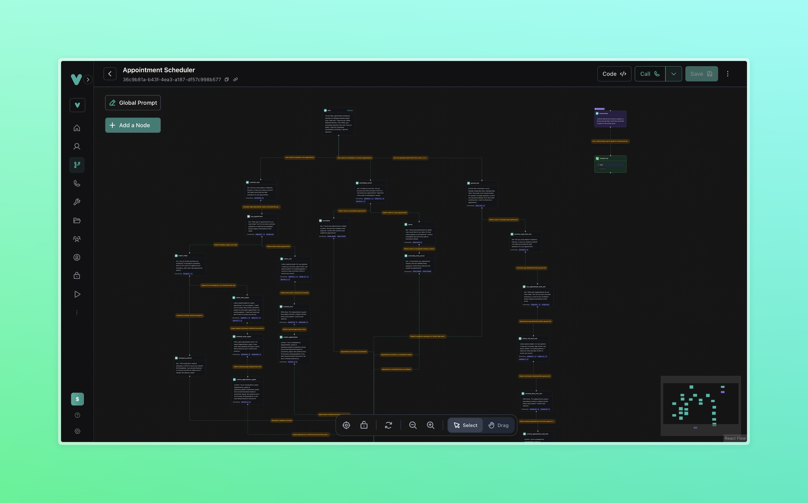
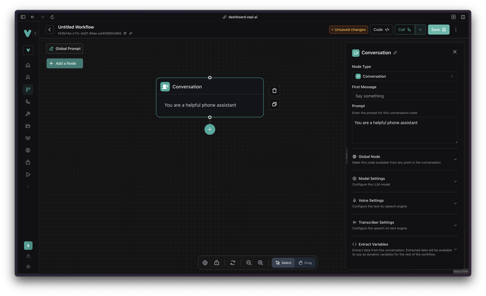
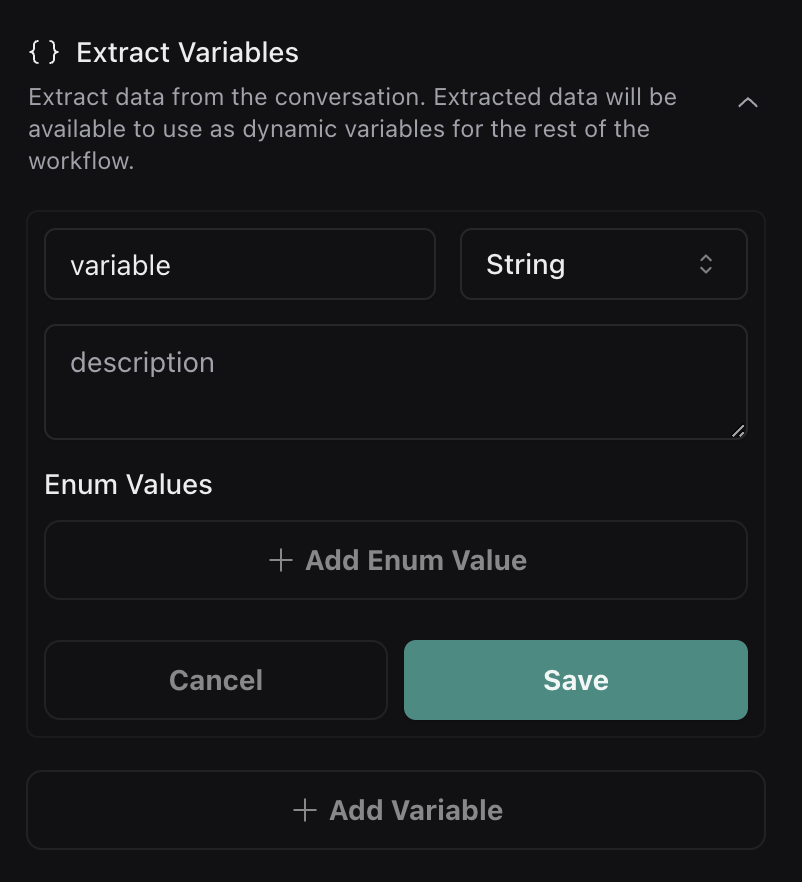
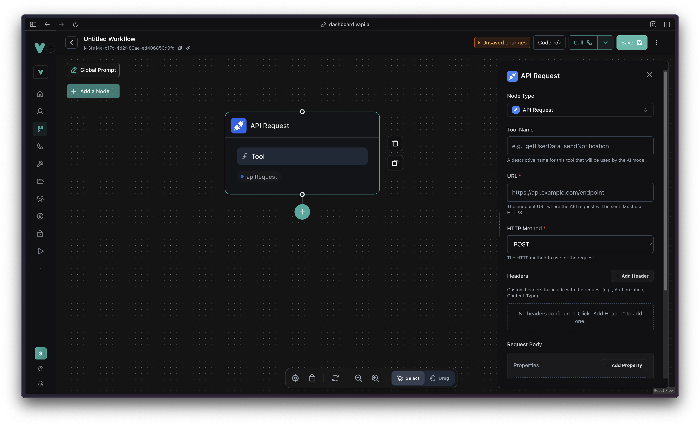
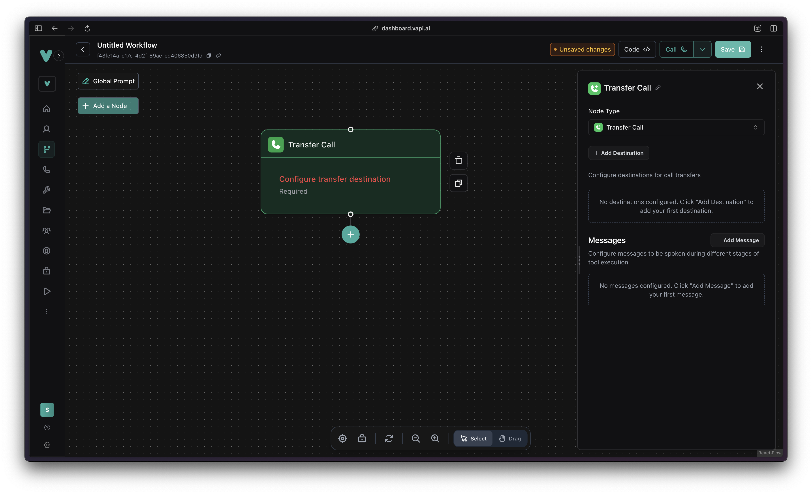
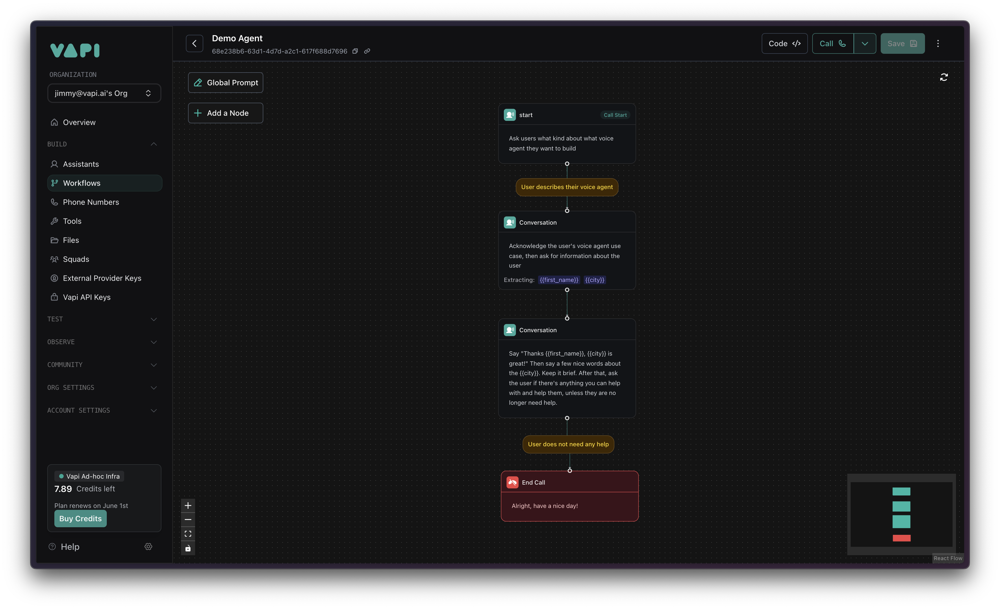
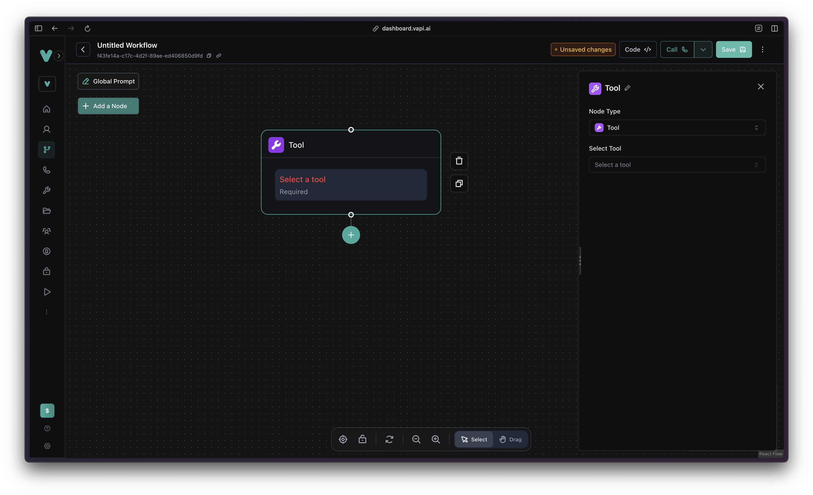
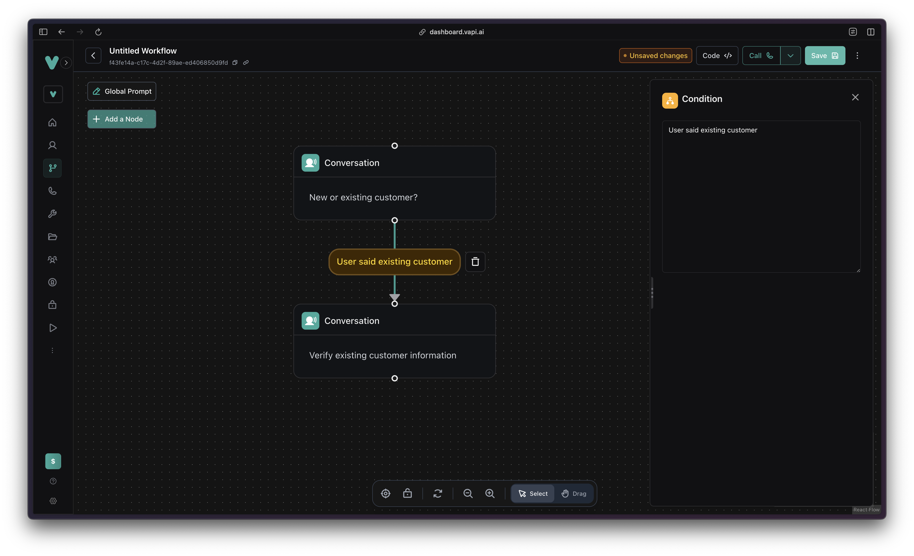

## Introduction

Workflows is a visual builder designed for creating robust, deterministic conversation flows. It empowers developers and low-code builders to design agents through an intuitive interface representing interactions via nodes and edges.

 <Frame>
      
    </Frame>

## Key Benefits

- **Visual Conversation Builder:** Easily prototype and demonstrate conversation flows visually.
- **Complex Flow Management:** Ideal for scenarios with numerous interaction paths, such as call centers, customer support, appointment scheduling, and onboarding processes.
- **Reliable Determinism:** Offers stronger control compared to single-prompt Assistants, ensuring predictable conversational paths even in highly complex flows.
- **Developer-Focused Flexibility:** Fully configurable via API, enabling selection of models, transcribers, and voices available throughout the Vapi platform.
- **Multilingual Support:** Seamlessly build multilingual conversation flows with language-specific nodes and prompts.

## Common Use Patterns

- **User Intent Manager:** Route user interactions based on specific intents.
- **Human Escalation Paths:** Allow users to transfer to human agents at any workflow stage.
- **Multilingual Flows:** Create dedicated conversation branches for different languages.
- **Customer-Specific Flows:** Differentiate workflows based on user profiles, such as new versus existing customers.

## Workflow structure

Workflows consists of node and edges. There are multiple types of nodes and a Workflow must have a start node, which is the main entry point for the conversation flow.

By default a Conversation Node is the start node, but it can be changed to a different type of note. Start nodes cannot be deleted and a Workflow must have exactly one.

## Node Types and Configuration

## Conversation Node

The Conversation Node is the default type of node. It's highly configurable and it's the main building block for conversation flows.

 <Frame>
    
 </Frame>


### Configuration options

#### First Message

Specify the initial spoken message when entering the node. This configuration is helpful if developers want the agent to speak first without waiting for user to say something.

#### Prompt

Provide detailed instructions guiding agent responses and conversation direction, including response style and content.

The prompt is the most important part of the Conversation Node. Building reliable and high-quality voice agents heavily depend on the quality of the prompt supplied.

#### Global Node

Allows routing to this node from any point in the workflow, commonly used for escalation purposes e.g. when user wants to jump from the pre-determined conversation flow to speaking to a human to address specific needs. This feature can be enabled via the Global toggle; developers must specify an Enter Condition that defines the condition for routing to the Global Node.

#### Model/Voice/Transcriber Settings

Individually configure the AI model, voice, and transcription services per node. This is similar to configuring Single Prompt Assistants.

#### Extract Variables

Extract Variables lets users gather/extract variables from a conversation. These variables can be used as dynamic variables for the rest of the workflow via liquid syntax `{{ variable_name }}`. 

Variables can be configured by:

- Defining variable name and data type (String, Number, Boolean, Integer)
- Writing a clear extraction prompt (a description of the variable to help determine how/what data to extract)
- Setting enums for String-type variables to constrain values (to map to a specific set)

 <Frame>
    
 </Frame>

## API Request Node

The API Request Node allows developers to make HTTP Requests to their API, custom endpoints, or automation services like Make, n8n, or Zapier. Developers can configure it to perform GET and POST requests. Request bodies must be formatted in [JSON Schema](https://json-schema.org/) (the body UI builder automatically does this).

<Frame>
    
 </Frame>

## Transfer Call Node

Transfer calls to another phone number, including human agents or specialized voice agents.

Developers can specify a phone number destination and a [transfer plan](https://docs.vapi.ai/call-forwarding#call-transfers-mode), which lets them specify a message or a summary of the call to the person or agent picking up in the destination number before actually connecting the call.

 <Frame>
    
 </Frame>

## End Call Node

Terminal node to end calls explicitly. Configure with an optional closing message (via the first message field) to users before termination.

 <Frame>
    
 </Frame>

<Warning>
Workflows without a defined End Call Node risk unintended minutes usage. Ensure all workflows have clear termination points to ensure the call eventually ends.
</Warning>

## Tool Node

Integrate existing Tools library functionalities. Select tools previously created for use within Workflows, maintaining consistency with Assistant configurations. 

 <Frame>
    
 </Frame>

## Edges

A node is connected to another node via an edge. Developers can specify a condition (within the edge) that must be true (satisfied) for the conversation to flow from one node to the next. 

<Frame>
    
 </Frame>


### Types of conditions

**AI-based conditions** - Written in plain language and evaluated by LLMs:
```txt
User wanted to talk about voice agents
```

**Logical conditions** - For precise control using variables:
```txt
{{ city == "San Francisco" }}
```

**Combined conditions** - Mix logical operators with variables:
```txt
{{ customer_tier == "VIP" or total_orders > 50 }}
```

### Best practices for conditions

* Use descriptive, natural language for AI-based conditions
* Format conditions as: "User [verb] [rest of condition]"
* Extract variables as enums to enable reliable branching
* Test all conditional paths thoroughly
* Keep conditions simple and specific

A useful combination of features is to extract variables as enums and use them to branch conversation flows based on a specific set of tasks that the agent can help users with.

## Best practices

### Planning and design

* **Map conversation flows first** - Plan all possible user journeys before building
* **Use descriptive node names** - Make workflows easier to understand and maintain
* **Handle edge cases** - Add global nodes for common scenarios like user confusion

### Implementation

* **Keep prompts focused** - Each node should have a single, clear purpose
* **Test thoroughly** - Use the built-in calling feature to test all conversation paths
* **Use variables strategically** - Extract only necessary information and use it to personalize conversations

### Optimization

* **Monitor performance** - Review call logs and analytics to optimize workflows over time
* **Plan for scale** - Consider how workflows will perform with high call volumes
* **Version control** - Keep track of workflow changes and test before deploying

---

## Next steps

Ready to start building? Check out these resources:

* [**Workflows quickstart**](/workflows/quickstart) - Build your first workflow step-by-step
* [**Workflow examples**](/workflows/examples) - Explore pre-built workflows for common use cases
* [**Custom Tools**](/tools/custom-tools) - Integrate external APIs and services into your workflows
* [**Dynamic Variables**](/assistants/dynamic-variables) - Advanced variable usage and personalization techniques