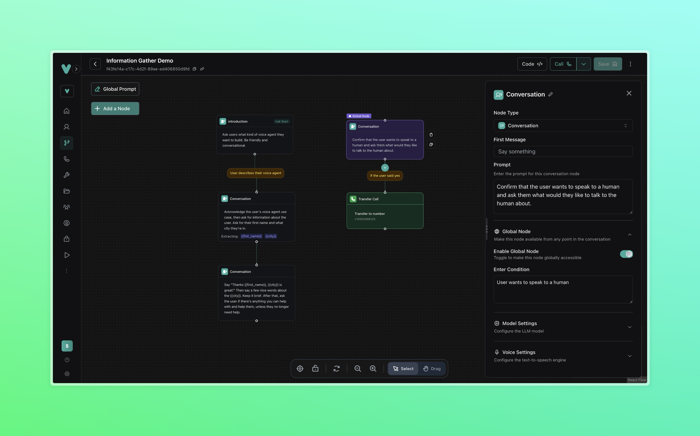

## Overview

Build a simple voice agent using Vapi's visual workflow builder that greets users, collects their information, and demonstrates core workflow concepts like variable extraction, conditional routing, and global nodes.

<Frame>
  
</Frame>

**Agent Capabilities:**
* Greet users and ask about their voice agent needs
* Extract and store user information (name and city)
* Use variables in dynamic responses
* Handle escalation to human agents at any point

**What You'll Build:**
* Multi-node conversation flow with branching logic
* Variable extraction and liquid template usage
* Global escalation nodes for human transfer
* End-call automation with natural conversation termination

## Prerequisites

* A [Vapi account](https://dashboard.vapi.ai/).

## Scenario

We will create a simple information-gathering agent that demonstrates the core features of Vapi's workflow builder. This agent will showcase conversation flow, variable extraction, and escalation patterns that form the foundation of more complex workflows.

---

## 1. Create a Workflow

<Tabs>
  <Tab title="Dashboard">
    <Steps>
      <Step title="Open the Vapi Dashboard">
        Go to [dashboard.vapi.ai](https://dashboard.vapi.ai) and log in to your account.
      </Step>
      <Step title="Navigate to the Workflows section">
        Click `Workflows` in the left sidebar.
      </Step>
      <Step title="Create a new workflow">
        - Click `Create Workflow`.
        - Enter workflow name: `Information Gathering Demo`.
        - Select the blank template.
        - Click **Create Workflow**.

        <video autoPlay loop muted src="../static/videos/workflows/create-workflow.mp4" type="video/mp4" style={{ aspectRatio: '16 / 9', width: '100%' }} />
      </Step>
    </Steps>
  </Tab>
  <Tab title="Web SDK + TypeScript">
    For web applications, create workflow interactions:

    ```bash
    npm install @vapi-ai/web
    ```

    ```typescript
    import Vapi from '@vapi-ai/web';

    interface WorkflowConfig {
      publicApiKey: string;
      workflowId: string;
    }

    function createWorkflowManager(config: WorkflowConfig) {
      const vapi = new Vapi(config.publicApiKey);
      let isConnected = false;

      // Setup event listeners
      vapi.on('call-start', () => {
        isConnected = true;
        console.log('Workflow call started');
      });

      vapi.on('call-end', () => {
        isConnected = false;
        console.log('Workflow call ended');
      });

      vapi.on('message', (message) => {
        if (message.type === 'transcript') {
          console.log(`${message.role}: ${message.transcript}`);
        } else if (message.type === 'workflow-step') {
          console.log('Workflow step:', message.step);
        }
      });

      vapi.on('error', (error) => {
        console.error('Workflow error:', error);
      });

      return {
        startWorkflow: () => {
          if (!isConnected) {
            vapi.start(config.workflowId);
          }
        },
        endWorkflow: () => {
          if (isConnected) {
            vapi.stop();
          }
        },
        isConnected: () => isConnected
      };
    }

    // Usage
    const workflowManager = createWorkflowManager({
      publicApiKey: 'YOUR_PUBLIC_API_KEY',
      workflowId: 'YOUR_WORKFLOW_ID'
    });

    // Start workflow
    workflowManager.startWorkflow();
    ```

    <Note>
      For web calls, workflows are executed through the assistant configuration. Use Server SDK for phone-based workflow calls.
    </Note>
  </Tab>
  <Tab title="Server SDK + TypeScript">
    ```typescript
    import { Vapi } from "@vapi-ai/server-sdk";

    const vapi = new Vapi({ apiKey: "YOUR_VAPI_API_KEY" });

    const workflow = await vapi.workflows.create({
      name: "Information Gathering Demo",
      nodes: [
        {
          id: "start",
          type: "conversation",
          firstMessage: "Hey there!",
          systemPrompt: "Ask users what kind of voice agent they want to build. Be friendly and conversational."
        }
      ],
      edges: []
    });

    console.log(`Workflow created with ID: ${workflow.id}`);
    ```
  </Tab>
  <Tab title="Server SDK + Python">
    ```python
    import requests

    def create_workflow(name):
        url = "https://api.vapi.ai/workflow"
        headers = {
            "Authorization": f"Bearer {YOUR_VAPI_API_KEY}",
            "Content-Type": "application/json"
        }
        
        data = {
            "name": name,
            "nodes": [
                {
                    "id": "start",
                    "type": "conversation",
                    "firstMessage": "Hey there!",
                    "systemPrompt": "Ask users what kind of voice agent they want to build. Be friendly and conversational."
                }
            ],
            "edges": []
        }
        
        response = requests.post(url, headers=headers, json=data)
        return response.json()

    # Create the workflow
    workflow = create_workflow("Information Gathering Demo")
    print(f"Workflow created with ID: {workflow['id']}")
    ```
  </Tab>
  <Tab title="cURL">
    ```bash
    curl -X POST https://api.vapi.ai/workflow \
         -H "Authorization: Bearer YOUR_VAPI_API_KEY" \
         -H "Content-Type: application/json" \
         -d '{
           "name": "Information Gathering Demo",
           "nodes": [
             {
               "id": "start",
               "type": "conversation",
               "firstMessage": "Hey there!",
               "systemPrompt": "Ask users what kind of voice agent they want to build. Be friendly and conversational."
             }
           ],
           "edges": []
         }'
    ```
  </Tab>
</Tabs>

---

## 2. Configure the Start Node

<Tabs>
  <Tab title="Dashboard">
    <Steps>
      <Step title="Configure the conversation node">
        The blank template includes a conversation node. Click on it and configure:
        
        **First Message**:
        ```txt
        Hey there!
        ```

        **Prompt**:
        ```txt
        Ask users what kind of voice agent they want to build. Be friendly and conversational.
        ```
      </Step>
      <Step title="Test the basic setup">
        Click **Call** in the top right to test your initial setup. The agent should greet you and ask about voice agents.

        <video autoPlay loop muted src="../static/videos/workflows/configure-start-node.mp4" type="video/mp4" style={{ aspectRatio: '16 / 9', width: '100%' }} />
      </Step>
    </Steps>
  </Tab>
  <Tab title="Web SDK + TypeScript">
    Configure the start node through a web interface:

    ```typescript
    import Vapi from '@vapi-ai/web';

    function configureStartNode(publicApiKey: string, workflowId: string) {
      const vapi = new Vapi(publicApiKey);

      // Note: Node configuration is typically done through Dashboard or Server SDK
      // Web SDK manages live workflow conversations
      
      vapi.on('call-start', () => {
        console.log('Start node configured, workflow call began');
      });

      vapi.on('message', (message) => {
        if (message.type === 'workflow-step') {
          console.log('Workflow step:', message.step);
        }
      });

      return {
        testStartNode: () => vapi.start(workflowId)
      };
    }

    // Usage for testing start node
    const startNodeTester = configureStartNode('YOUR_PUBLIC_API_KEY', 'YOUR_WORKFLOW_ID');
    startNodeTester.testStartNode();
    ```

    <Note>
      Web SDK is primarily for live workflow interactions. Use Dashboard or Server SDK for node configuration.
    </Note>
  </Tab>
  <Tab title="Server SDK + TypeScript">
    ```typescript
    import { Vapi } from "@vapi-ai/server-sdk";

    const vapi = new Vapi({ apiKey: "YOUR_VAPI_API_KEY" });

    async function updateStartNode(workflowId: string) {
      const updatedWorkflow = await vapi.workflows.update(workflowId, {
        nodes: [
          {
            id: "start",
            type: "conversation",
            firstMessage: "Hey there!",
            systemPrompt: "Ask users what kind of voice agent they want to build. Be friendly and conversational."
          }
        ]
      });

      console.log('Start node configured successfully');
      return updatedWorkflow;
    }

    // Update the start node
    const workflow = await updateStartNode('YOUR_WORKFLOW_ID');
    ```
  </Tab>
  <Tab title="Server SDK + Python">
    ```python
    import requests

    def update_start_node(workflow_id):
        url = f"https://api.vapi.ai/workflow/{workflow_id}"
        headers = {
            "Authorization": f"Bearer {YOUR_VAPI_API_KEY}",
            "Content-Type": "application/json"
        }
        
        data = {
            "nodes": [
                {
                    "id": "start",
                    "type": "conversation",
                    "firstMessage": "Hey there!",
                    "systemPrompt": "Ask users what kind of voice agent they want to build. Be friendly and conversational."
                }
            ]
        }
        
        response = requests.patch(url, headers=headers, json=data)
        return response.json()

    # Update the start node
    workflow = update_start_node('YOUR_WORKFLOW_ID')
    print("Start node configured successfully")
    ```
  </Tab>
  <Tab title="cURL">
    ```bash
    curl -X PATCH https://api.vapi.ai/workflow/YOUR_WORKFLOW_ID \
         -H "Authorization: Bearer YOUR_VAPI_API_KEY" \
         -H "Content-Type: application/json" \
         -d '{
           "nodes": [
             {
               "id": "start",
               "type": "conversation",
               "firstMessage": "Hey there!",
               "systemPrompt": "Ask users what kind of voice agent they want to build. Be friendly and conversational."
             }
           ]
         }'
    ```
  </Tab>
</Tabs>

<Note>
You can change the node type by selecting a different type from the dropdown at the top of the node configuration panel. For example, you can change the start node type to API Request to trigger an HTTP request as soon as the call is connected.
</Note>

---

## 3. Add Information Collection Flow

<Tabs>
  <Tab title="Dashboard">
    <Steps>
      <Step title="Add a second conversation node">
        - Click the **+** button below the first node
        - Select **Conversation Node**
        - Configure the new node:

        **Prompt**:
        ```txt
        Acknowledge the user's voice agent use case, then ask for information about the user. Ask for their first name and what city they're in.
        ```

        **Extract Variables** (expand this section):
        - Variable 1:
          - Name: `first_name`
          - Type: `string`
          - Description: `the user's first name`
        - Variable 2:
          - Name: `city`
          - Type: `string`
          - Description: `the user's city`
      </Step>
      <Step title="Configure the connecting edge">
        Click on the edge between the two nodes and configure:
        - **Condition**: `User describes their voice agent`
        - Click **Save**

        <video autoPlay loop muted src="../static/videos/workflows/create-conversation-node.mp4" type="video/mp4" style={{ aspectRatio: '16 / 9', width: '100%' }} />
      </Step>
    </Steps>
  </Tab>
  <Tab title="Web SDK + TypeScript">
    Monitor information collection in real-time:

    ```typescript
    import Vapi from '@vapi-ai/web';

    function monitorInformationCollection(publicApiKey: string, workflowId: string) {
      const vapi = new Vapi(publicApiKey);
      let extractedVariables: Record<string, string> = {};

      vapi.on('message', (message) => {
        if (message.type === 'workflow-step') {
          console.log('Information collection step:', message.step);
        } else if (message.type === 'variable-extracted') {
          // Handle extracted variables
          extractedVariables[message.variable.name] = message.variable.value;
          console.log('Variable extracted:', message.variable.name, '=', message.variable.value);
          
          if (message.variable.name === 'first_name') {
            console.log('First name collected:', message.variable.value);
          } else if (message.variable.name === 'city') {
            console.log('City collected:', message.variable.value);
          }
        }
      });

      return {
        startCollection: () => vapi.start(workflowId),
        getExtractedVariables: () => extractedVariables
      };
    }

    // Usage for monitoring variable extraction
    const collector = monitorInformationCollection('YOUR_PUBLIC_API_KEY', 'YOUR_WORKFLOW_ID');
    collector.startCollection();
    ```
  </Tab>
  <Tab title="Server SDK + TypeScript">
    ```typescript
    import { Vapi } from "@vapi-ai/server-sdk";

    const vapi = new Vapi({ apiKey: "YOUR_VAPI_API_KEY" });

    async function addInformationCollectionNode(workflowId: string) {
      // Get current workflow
      const currentWorkflow = await vapi.workflows.get(workflowId);
      
      // Add information collection node
      const updatedNodes = [
        ...currentWorkflow.nodes,
        {
          id: "collect_info",
          type: "conversation",
          systemPrompt: "Acknowledge the user's voice agent use case, then ask for information about the user. Ask for their first name and what city they're in.",
          extractVariables: [
            {
              name: "first_name",
              type: "string",
              description: "the user's first name"
            },
            {
              name: "city",
              type: "string",
              description: "the user's city"
            }
          ]
        }
      ];

      // Add connecting edge
      const updatedEdges = [
        ...currentWorkflow.edges,
        {
          from: "start",
          to: "collect_info",
          condition: "User describes their voice agent"
        }
      ];

      const updatedWorkflow = await vapi.workflows.update(workflowId, {
        nodes: updatedNodes,
        edges: updatedEdges
      });

      console.log('Information collection node added successfully');
      return updatedWorkflow;
    }

    // Add information collection flow
    const workflow = await addInformationCollectionNode('YOUR_WORKFLOW_ID');
    ```
  </Tab>
  <Tab title="Server SDK + Python">
    ```python
    import requests

    def add_information_collection_node(workflow_id):
        # First get the current workflow
        get_url = f"https://api.vapi.ai/workflow/{workflow_id}"
        headers = {"Authorization": f"Bearer {YOUR_VAPI_API_KEY}"}
        
        response = requests.get(get_url, headers=headers)
        current_workflow = response.json()
        
        # Add information collection node
        updated_nodes = current_workflow.get('nodes', []) + [
            {
                "id": "collect_info",
                "type": "conversation",
                "systemPrompt": "Acknowledge the user's voice agent use case, then ask for information about the user. Ask for their first name and what city they're in.",
                "extractVariables": [
                    {
                        "name": "first_name",
                        "type": "string",
                        "description": "the user's first name"
                    },
                    {
                        "name": "city",
                        "type": "string",
                        "description": "the user's city"
                    }
                ]
            }
        ]
        
        # Add connecting edge
        updated_edges = current_workflow.get('edges', []) + [
            {
                "from": "start",
                "to": "collect_info",
                "condition": "User describes their voice agent"
            }
        ]
        
        # Update workflow
        update_url = f"https://api.vapi.ai/workflow/{workflow_id}"
        headers["Content-Type"] = "application/json"
        
        data = {
            "nodes": updated_nodes,
            "edges": updated_edges
        }
        
        response = requests.patch(update_url, headers=headers, json=data)
        return response.json()

    # Add information collection flow
    workflow = add_information_collection_node('YOUR_WORKFLOW_ID')
    print("Information collection node added successfully")
    ```
  </Tab>
  <Tab title="cURL">
    ```bash
    # First get current workflow to preserve existing nodes/edges
    CURRENT_WORKFLOW=$(curl -s https://api.vapi.ai/workflow/YOUR_WORKFLOW_ID \
         -H "Authorization: Bearer YOUR_VAPI_API_KEY")

    # Update workflow with information collection node
    curl -X PATCH https://api.vapi.ai/workflow/YOUR_WORKFLOW_ID \
         -H "Authorization: Bearer YOUR_VAPI_API_KEY" \
         -H "Content-Type: application/json" \
         -d '{
           "nodes": [
             {
               "id": "start",
               "type": "conversation",
               "firstMessage": "Hey there!",
               "systemPrompt": "Ask users what kind of voice agent they want to build. Be friendly and conversational."
             },
             {
               "id": "collect_info",
               "type": "conversation",
               "systemPrompt": "Acknowledge the user'\''s voice agent use case, then ask for information about the user. Ask for their first name and what city they'\''re in.",
               "extractVariables": [
                 {
                   "name": "first_name",
                   "type": "string",
                   "description": "the user'\''s first name"
                 },
                 {
                   "name": "city",
                   "type": "string",
                   "description": "the user'\''s city"
                 }
               ]
             }
           ],
           "edges": [
             {
               "from": "start",
               "to": "collect_info",
               "condition": "User describes their voice agent"
             }
           ]
         }'
    ```
  </Tab>
</Tabs>

---

## 4. Add Dynamic Response Node

<Tabs>
  <Tab title="Dashboard">
    <Steps>
      <Step title="Add a third conversation node">
        Add another **Conversation Node** with this prompt:

        ```txt
        Say "Thanks {{first_name}}, {{city}} is great!"

        Then say a few nice words about the {{city}}. Keep it brief. After that, ask the user if there's anything you can help with and help them, unless they no longer need help.
        ```
      </Step>
      <Step title="Remove the edge condition">
        Click on the edge leading to this node and:
        - Remove any condition text (leave it blank)
        - Click **Save**
        
        This allows automatic flow after the variables are extracted.
      </Step>
    </Steps>
  </Tab>
  <Tab title="API Update">
    ```bash
    curl -X PATCH https://api.vapi.ai/workflow/YOUR_WORKFLOW_ID \
         -H "Authorization: Bearer YOUR_VAPI_API_KEY" \
         -H "Content-Type: application/json" \
         -d '{
           "nodes": [
             {
               "id": "start",
               "type": "conversation",
               "firstMessage": "Hey there!",
               "systemPrompt": "Ask users what kind of voice agent they want to build. Be friendly and conversational."
             },
             {
               "id": "collect_info",
               "type": "conversation",
               "systemPrompt": "Acknowledge the user'\''s voice agent use case, then ask for information about the user. Ask for their first name and what city they'\''re in.",
               "extractVariables": [
                 {
                   "name": "first_name",
                   "type": "string",
                   "description": "the user'\''s first name"
                 },
                 {
                   "name": "city",
                   "type": "string", 
                   "description": "the user'\''s city"
                 }
               ]
             },
             {
               "id": "dynamic_response",
               "type": "conversation",
               "systemPrompt": "Say \"Thanks {{first_name}}, {{city}} is great!\" Then say a few nice words about the {{city}}. Keep it brief. After that, ask the user if there'\''s anything you can help with and help them, unless they no longer need help."
             }
           ],
           "edges": [
             {
               "from": "start", 
               "to": "collect_info",
               "condition": "User describes their voice agent"
             },
             {
               "from": "collect_info",
               "to": "dynamic_response"
             }
           ]
         }'
    ```
  </Tab>
</Tabs>

---

## 5. Add Global Escalation Node

<Tabs>
  <Tab title="Dashboard">
    <Steps>
      <Step title="Create a global node for human escalation">
        Add a new **Conversation Node** and configure:

        **Global Node**: Toggle this **ON**

        **Conversation Prompt**:
        ```txt
        Confirm that the user wants to speak to a human and ask them what would they like to talk to the human about.
        ```

        **Condition Prompt**:
        ```txt
        User wants to speak to a human
        ```
      </Step>
      <Step title="Add transfer call node">
        Add a **Transfer Call Node** below the global node:
        - **Destination**: Enter your phone number or `+1-555-DEMO-123`
        - Configure **Transfer Plan** with a brief summary message

        <video autoPlay loop muted src="../static/videos/workflows/create-and-connect-nodes.mp4" type="video/mp4" style={{ aspectRatio: '16 / 9', width: '100%' }} />
      </Step>
    </Steps>
  </Tab>
  <Tab title="API Update">
    ```bash
    curl -X PATCH https://api.vapi.ai/workflow/YOUR_WORKFLOW_ID \
         -H "Authorization: Bearer YOUR_VAPI_API_KEY" \
         -H "Content-Type: application/json" \
         -d '{
           "nodes": [
             {
               "id": "start",
               "type": "conversation",
               "firstMessage": "Hey there!",
               "systemPrompt": "Ask users what kind of voice agent they want to build. Be friendly and conversational."
             },
             {
               "id": "collect_info", 
               "type": "conversation",
               "systemPrompt": "Acknowledge the user'\''s voice agent use case, then ask for information about the user. Ask for their first name and what city they'\''re in.",
               "extractVariables": [
                 {
                   "name": "first_name",
                   "type": "string",
                   "description": "the user'\''s first name"
                 },
                 {
                   "name": "city",
                   "type": "string",
                   "description": "the user'\''s city"
                 }
               ]
             },
             {
               "id": "dynamic_response",
               "type": "conversation", 
               "systemPrompt": "Say \"Thanks {{first_name}}, {{city}} is great!\" Then say a few nice words about the {{city}}. Keep it brief. After that, ask the user if there'\''s anything you can help with and help them, unless they no longer need help."
             },
             {
               "id": "escalation",
               "type": "conversation",
               "isGlobal": true,
               "systemPrompt": "Confirm that the user wants to speak to a human and ask them what would they like to talk to the human about.",
               "condition": "User wants to speak to a human"
             },
             {
               "id": "transfer",
               "type": "transferCall",
               "destination": "+1-555-DEMO-123",
               "transferPlan": {
                 "message": "The user wants to speak with a human agent."
               }
             }
           ],
           "edges": [
             {
               "from": "start",
               "to": "collect_info", 
               "condition": "User describes their voice agent"
             },
             {
               "from": "collect_info",
               "to": "dynamic_response"
             },
             {
               "from": "escalation",
               "to": "transfer"
             }
           ]
         }'
    ```
  </Tab>
</Tabs>

<Note>
Developers can specify a phone number destination and a [transfer plan](/call-forwarding#call-transfers-mode), which lets them specify a message or a summary of the call to the person or agent picking up in the destination number before actually connecting the call.
</Note>

---

## 6. Add Call Termination

<Tabs>
  <Tab title="Dashboard">
    <Steps>
      <Step title="Add an End Call node">
        Add an **End Call Node** at the end of your main flow:
        
        **First Message**:
        ```txt
        Alright, have a nice day!
        ```
      </Step>
      <Step title="Configure the final edge">
        Update the edge leading to the End Call node:
        - **Condition**: `User does not need any help`
        - Click **Save**
      </Step>
    </Steps>
  </Tab>
  <Tab title="Final API Update">
    ```bash
    curl -X PATCH https://api.vapi.ai/workflow/YOUR_WORKFLOW_ID \
         -H "Authorization: Bearer YOUR_VAPI_API_KEY" \
         -H "Content-Type: application/json" \
         -d '{
           "nodes": [
             {
               "id": "start",
               "type": "conversation",
               "firstMessage": "Hey there!",
               "systemPrompt": "Ask users what kind of voice agent they want to build. Be friendly and conversational."
             },
             {
               "id": "collect_info",
               "type": "conversation",
               "systemPrompt": "Acknowledge the user'\''s voice agent use case, then ask for information about the user. Ask for their first name and what city they'\''re in.",
               "extractVariables": [
                 {
                   "name": "first_name",
                   "type": "string",
                   "description": "the user'\''s first name"
                 },
                 {
                   "name": "city",
                   "type": "string",
                   "description": "the user'\''s city"
                 }
               ]
             },
             {
               "id": "dynamic_response",
               "type": "conversation",
               "systemPrompt": "Say \"Thanks {{first_name}}, {{city}} is great!\" Then say a few nice words about the {{city}}. Keep it brief. After that, ask the user if there'\''s anything you can help with and help them, unless they no longer need help."
             },
             {
               "id": "escalation",
               "type": "conversation",
               "isGlobal": true,
               "systemPrompt": "Confirm that the user wants to speak to a human and ask them what would they like to talk to the human about.",
               "condition": "User wants to speak to a human"
             },
             {
               "id": "transfer",
               "type": "transferCall",
               "destination": "+1-555-DEMO-123",
               "transferPlan": {
                 "message": "The user wants to speak with a human agent."
               }
             },
             {
               "id": "end_call",
               "type": "endCall",
               "firstMessage": "Alright, have a nice day!"
             }
           ],
           "edges": [
             {
               "from": "start",
               "to": "collect_info",
               "condition": "User describes their voice agent"
             },
             {
               "from": "collect_info",
               "to": "dynamic_response"
             },
             {
               "from": "dynamic_response",
               "to": "end_call",
               "condition": "User does not need any help"
             },
             {
               "from": "escalation",
               "to": "transfer"
             }
           ]
         }'
    ```
  </Tab>
</Tabs>

---

## 7. Test Your Workflow

<Tabs>
  <Tab title="Dashboard Testing">
    <Steps>
      <Step title="Test the complete flow">
        Click **Call** in the top right to test your workflow:
        - Verify the greeting works
        - Test variable extraction by providing your name and city
        - Confirm the dynamic response uses your information
        - Test the global escalation by saying "I want to speak to a human"
      </Step>
      <Step title="Review your workflow structure">
        Your final workflow should have:
        - **Start Node**: Greeting and use case inquiry
        - **Collection Node**: Information gathering with variable extraction
        - **Response Node**: Dynamic response using extracted variables
        - **Global Node**: Human escalation available from anywhere
        - **Transfer Node**: Routes to human agent when needed
        - **End Node**: Natural conversation termination
      </Step>
    </Steps>
  </Tab>
  <Tab title="API Testing">
    Create a phone number and test the workflow:

    ```bash
    # Create phone number with workflow
    curl -X POST https://api.vapi.ai/phone-number \
         -H "Authorization: Bearer YOUR_VAPI_API_KEY" \
         -H "Content-Type: application/json" \
         -d '{
           "name": "Workflow Test Number",
           "workflowId": "YOUR_WORKFLOW_ID"
         }'

    # Make an outbound test call
    curl -X POST https://api.vapi.ai/call \
         -H "Authorization: Bearer YOUR_VAPI_API_KEY" \
         -H "Content-Type: application/json" \
         -d '{
           "workflowId": "YOUR_WORKFLOW_ID",
           "customer": {
             "number": "+1234567890"
           }
         }'
    ```
  </Tab>
  <Tab title="Python Testing">
    ```python
    def create_phone_number_for_workflow(workflow_id):
        url = "https://api.vapi.ai/phone-number"
        headers = {
            "Authorization": f"Bearer {YOUR_VAPI_API_KEY}",
            "Content-Type": "application/json"
        }
        
        data = {
            "name": "Workflow Test Number",
            "workflowId": workflow_id
        }
        
        response = requests.post(url, headers=headers, json=data)
        return response.json()

    def test_workflow_call(workflow_id, customer_number):
        url = "https://api.vapi.ai/call"
        headers = {
            "Authorization": f"Bearer {YOUR_VAPI_API_KEY}",
            "Content-Type": "application/json"
        }
        
        data = {
            "workflowId": workflow_id,
            "customer": {
                "number": customer_number
            }
        }
        
        response = requests.post(url, headers=headers, json=data)
        return response.json()

    # Create phone number and test
    phone_number = create_phone_number_for_workflow(workflow_id)
    test_call = test_workflow_call(workflow_id, "+1234567890")

    print(f"Phone number: {phone_number['number']}")
    print(f"Test call ID: {test_call['id']}")
    ```
  </Tab>
</Tabs>

## Next Steps

* [**Workflows overview**](/workflows/overview) - Learn about all node types and advanced configuration options
* [**Workflow examples**](/workflows/examples) - Explore pre-built workflows for common business use cases
* [**Custom Tools**](/tools/custom-tools) - Integrate external APIs and services into your workflows
* [**Dynamic Variables**](/assistants/dynamic-variables) - Advanced variable usage and personalization techniques
